# C4 Component Level: Accounting integration

What the accounting integration is made of, one level inside the **Central API**
and **Worker** containers from the [container view](c4-container.md) (system
level: [context](c4-context.md)). Stocdup is the product name; `wholo` is the
internal identifier. The integration connects a distributor to an accounting
provider, caches the provider's contacts, products and tax rates and matches
them to Stocdup records, exports each accepted order as an invoice, and reads
invoice payment status back. Stocdup is the pricing authority; the provider
(Xero today) is the system of record for invoices and payments. Stocdup always
initiates the calls; the provider never calls in, apart from the browser
redirect that ends the OAuth consent, which arrives through the Admin app.

**Scope.** Only the Central API and the Worker are covered. They are the same
`apps/api` image run as two Deployments, and `AccountingModule` is imported by
both root modules, so many classes are constructed in both processes. Each
component is drawn in the process where it does its work; where the same code
does a different job in each process it is drawn in both and the tables say so.
The Admin app is one external box that calls in. Postgres, Redis and Xero are
external boxes.

Code level, one document per directory:

- [c4-code-accounting.md](code/c4-code-accounting.md): the files in `apps/api/src/accounting/` (connection and OAuth, call control, organisation scope, contacts / products / tax types, invoice export, invoice payment state, scheduling, module wiring, DTOs)
- [c4-code-accounting-adapters.md](code/c4-code-accounting-adapters.md): provider contract, registry, errors, Xero adapter
- [c4-code-accounting-sync.md](code/c4-code-accounting-sync.md): pull and sync base processors, sync service, constants
- [c4-code-accounting-matching.md](code/c4-code-accounting-matching.md): matchers
- [c4-code-accounting-processors.md](code/c4-code-accounting-processors.md): the six queue processors

Three diagrams:

1. [Framework: connection and inbound sync](#1-framework-connection-and-inbound-sync)
2. [Framework: bulk import, invoice export and payment status](#2-framework-bulk-import-invoice-export-and-payment-status)
3. [The Xero implementation](#3-the-xero-implementation)

**Editing the diagrams.** Mermaid's C4 renderer places elements on a grid in
declaration order and draws straight lines between them; it does no edge
routing. Every diagram is a 3-column grid
(`UpdateLayoutConfig($c4ShapeInRow="3", $c4BoundaryInRow="1")`) and starts with
the same `init` line as the container diagrams (`wrap` keeps every box the same
width). Shapes outside any boundary are laid out first, then each boundary below
it, stacked; inside a boundary shapes fill the 3-column grid in declaration
order, so every row but the last holds three shapes. Only draw a relationship
between **neighbouring** grid cells (horizontal, vertical or diagonal); anything
longer passes through a box, so list it under "Not drawn". Put hubs in the
middle column and arrange the grid so the important relationships are
neighbours and no two lines cross. Label positions are set per relationship with
`UpdateRelStyle` offsets (the label's left edge sits at the line's midpoint plus
`offsetX`): lift labels on horizontal lines about 35-40 up and shift them left
by half their width, give vertical lines `$offsetX="10"`, and keep labels clear
of boundary titles. Keep labels to about 30 characters (technology in the 4th
argument of `Rel`, detail in the tables). Keep the shape count of each boundary
a multiple of 3 where a boundary follows it, and re-render after every change.
`C4Component` takes `Component`, `Component_Ext`, `ComponentDb_Ext`,
`Container_Boundary` and `System_Boundary`.

Reading the diagrams: blue boxes are accounting components, grey boxes are
outside the accounting code. A box drawn in both containers (for example
"Provider port and registry") is the same code constructed in both processes.
Lines between components in different containers (for example Central API to
Outbox relay) are not network calls: the Central API writes an outbox row in
Postgres and the Worker's relay puts it on a queue (ADR-034, ADR-047).

## 1. Framework: connection and inbound sync

```mermaid
%%{init: {"wrap": true, "c4": {"c4ShapeMargin": 110, "diagramMarginX": 40, "diagramMarginY": 20}}}%%
C4Component
    title Accounting framework: connection and inbound sync

    Component_Ext(admin, "Admin app", "Next.js + NestJS BFF", "Distributor admin")

    Container_Boundary(api, "Central API") {
        Component(review, "Mapping review API", "NestJS controllers, services", "Review, link, import records")
        Component(connapi, "Connection and OAuth", "NestJS controller, service", "Connect, status, settings")
        Component(portapi, "Provider port and registry", "TypeScript interface, registry", "Resolves the adapter")
    }

    Container_Boundary(worker, "Worker") {
        Component(sched, "Sync scheduling", "NestJS scheduler, service", "Decides which pulls are due")
        Component(pulls, "Inbound pull processors", "BullMQ processors", "Contacts, products, tax types")
        Component(match, "Matching", "Pure services", "Ranks match candidates")
        Component(budget, "Provider call control", "Redis, BullMQ settings", "Budget, backoff, failures")
        Component(token, "Token gateway", "NestJS service, scheduler", "Valid token, serialised refresh")
        Component(portw, "Provider port and registry", "TypeScript interface, registry", "Resolves the adapter")
    }

    System_Boundary(ext, "External systems and stores") {
        ComponentDb_Ext(redis, "Redis", "Redis", "Lock, call budget")
        ComponentDb_Ext(pg, "Postgres", "TimescaleDB 16", "Connections, cache, runs")
        System_Ext(prov, "Accounting provider", "Any provider behind the port")
    }

    Rel(admin, review, "Reviews records", "HTTP/JSON")
    Rel(admin, connapi, "Connects, syncs", "HTTP/JSON")
    Rel(connapi, portapi, "Builds consent URL", "port")
    Rel(sched, pulls, "Requests pulls", "outbox, BullMQ")
    Rel(pulls, match, "Ranks candidates", "calls")
    Rel(pulls, budget, "Classifies failures", "calls")
    Rel(pulls, token, "Gets a valid token", "calls")
    Rel(pulls, portw, "Fetches records", "port")
    Rel(token, portw, "Refreshes tokens", "port")
    Rel(budget, redis, "Counts calls", "Redis")
    Rel(token, pg, "Reads, writes tokens", "SQL")
    Rel(portw, prov, "Calls via adapter", "HTTPS")

    UpdateRelStyle(admin, review, $offsetX="-120", $offsetY="-60")
    UpdateRelStyle(admin, connapi, $offsetX="10", $offsetY="-60")
    UpdateRelStyle(connapi, portapi, $offsetX="-40", $offsetY="-40")
    UpdateRelStyle(sched, pulls, $offsetX="-40", $offsetY="-40")
    UpdateRelStyle(pulls, match, $offsetX="-40", $offsetY="-40")
    UpdateRelStyle(pulls, budget, $offsetX="-90", $offsetY="0")
    UpdateRelStyle(pulls, token, $offsetX="10", $offsetY="0")
    UpdateRelStyle(pulls, portw, $offsetX="10", $offsetY="0")
    UpdateRelStyle(token, portw, $offsetX="-40", $offsetY="-40")
    UpdateRelStyle(budget, redis, $offsetX="10", $offsetY="0")
    UpdateRelStyle(token, pg, $offsetX="10", $offsetY="0")
    UpdateRelStyle(portw, prov, $offsetX="10", $offsetY="0")

    UpdateLayoutConfig($c4ShapeInRow="3", $c4BoundaryInRow="1")
```

Grid, row by row: outside, Admin app. Central API: Mapping review API /
Connection and OAuth / Provider port and registry. Worker: Sync scheduling /
Inbound pull processors / Matching, then Provider call control / Token gateway /
Provider port and registry. External systems and stores: Redis / Postgres /
Accounting provider (any provider, reached through the port).

### Components

| Component | Container (process) | Responsibility | Code elements | ADRs |
|---|---|---|---|---|
| Connection and OAuth | Central API. The connection service class is constructed in both processes; the Worker's use is "Token gateway" | Starts and completes the OAuth handshake through the port, stores the encrypted token set on a new `AccountingConnection`, reports status, changes the invoice target status, disconnects, and triggers a manual sync. Never knows which provider it is talking to except where the Xero edges are (diagram 3). | `AccountingConnectionController` (framework routes), `AccountingConnectionService` (`createAuthorizationUrl`, `handleCallback`, `getConnectionStatus`, `updateConnectionSettings`, `disconnect`), `TokenEncryptionService`, `AccountingOAuthError`, `accounting-organisation.ts`, `UpdateConnectionSettingsDto`: [c4-code-accounting.md](code/c4-code-accounting.md) section 1 and 3 | ADR-051, ADR-074 |
| Token gateway | Worker (connection service, `TokenEncryptionService` and `AccountingRefreshLockService` are also constructed in the Central API) | The only way to get a usable token: `getValidTokenSet` returns the stored set while more than 5 minutes remain, otherwise refreshes under a per-connection Redis lock (15 s TTL, renewed), compare-and-sets the new ciphertext, marks the connection ERROR on a permanent failure and notifies the distributor's admins. A daily sweep refreshes CONNECTED connections not synced for 25 days. | `AccountingConnectionService.getValidTokenSet`, `AccountingRefreshLockService` / `AccountingRefreshLock`, `AccountingTokenRefreshScheduler` (Worker only), `TokenEncryptionService`: [c4-code-accounting.md](code/c4-code-accounting.md) section 1 | ADR-051 (the lock is Redis in the code), ADR-071 |
| Provider port and registry | Both (registered in `AccountingModule`, imported by both root modules); drawn in each | The provider boundary. `AccountingConnectionAdapter` is the only type the framework uses to talk to a provider; `AccountingAdapterRegistry.get(provider)` resolves the adapter; `AccountingProviderError` is the one failure type; neutral data shapes cross the port. | `accounting-connection-adapter.interface.ts`, `accounting-provider.error.ts`, `accounting-adapter.registry.ts`: [c4-code-accounting-adapters.md](code/c4-code-accounting-adapters.md) "Framework" | ADR-051, ADR-071, ADR-073 |
| Provider call control | Worker (`AccountingCallBudgetService` is constructed in both; the adapter calls it) | Keeps provider traffic within each organisation's limit and decides what a failed job does next: a Redis sliding-window call budget per provider and organisation (waits up to 20 s, then raises a transient `CALL_BUDGET_EXHAUSTED` error carrying `retryAfterMs`), the BullMQ backoff (`Retry-After` plus jitter, otherwise 30 s doubling, at least 120 s after an unknown write outcome) and the classification of a job failure (permanent, last attempt, budget wait). | `AccountingCallBudgetService`, `accounting-backoff.ts`, `accounting-job-failure.ts`: [c4-code-accounting.md](code/c4-code-accounting.md) section 2 | ADR-071, ADR-073 |
| Sync scheduling | Worker (`AccountingSyncScheduler` Worker only; `AccountingSyncService` constructed in both) | Every 60 s decides which `(connection, resource type)` pulls are due (contact 30 min, product 30 min, tax type 6 h, invoice 15 min, and only when unsettled invoices exist), writes the sync outbox event and advances the schedule in one transaction; skips an invoice slot with no provider call. The same service queues all four resource types for the manual "Sync" route that the Central API's Connection and OAuth exposes, and reports sync status. | `AccountingSyncScheduler`, `AccountingSyncService`, `accounting-sync.constants.ts`: [c4-code-accounting.md](code/c4-code-accounting.md) section 7, [c4-code-accounting-sync.md](code/c4-code-accounting-sync.md) | ADR-061, ADR-072 |
| Inbound pull processors | Worker | One lifecycle for every pull (claim the ingestion run, preflight, get a token, pull, record `lastSyncedAt`, finalise, apply the failure policy). For contacts, products and tax types the sync base adds the cache, match and suggestion pipeline; a match is always a suggestion, never a mapping. Change detection flags a changed field on a mapped record and notifies admins without changing Stocdup data. | `AccountingPullProcessorBase`, `AccountingSyncProcessorBase`, `AccountingChangeDetectionService`, `AccountingContactSyncProcessor`, `AccountingProductSyncProcessor`, `AccountingTaxTypeSyncProcessor`: [c4-code-accounting-sync.md](code/c4-code-accounting-sync.md), [c4-code-accounting-processors.md](code/c4-code-accounting-processors.md) sections 1-3 | ADR-061, ADR-071, ADR-074 |
| Matching | Worker (the three services are constructed in both) | Pure ranking of the unmapped Stocdup candidates for one cached provider record; returns at most one `AccountingMatchResult` (candidate, confidence 25-95, method, reason). | `AccountingRecordMatcher`, `AccountingContactMatcherService`, `AccountingProductMatcherService`, `AccountingTaxTypeMatcherService`, `similarity`, `normalizeSku`: [c4-code-accounting-matching.md](code/c4-code-accounting-matching.md) | ADR-074 |
| Mapping review API | Central API (the three services are also constructed in the Worker, where bulk import uses them) | The distributor's review of cached provider records: list with derived status, needs-attention counts, import as a new Stocdup customer / product / tax type, confirm a suggestion, match, ignore, unlink, acknowledge a change, and request a bulk import (creates an `AccountingBulkImportJob`, writes `AccountingBulkImportRequested`). Creating Stocdup records goes through the admin customer, product and tax type services. | `AccountingContactController` / `Service`, `AccountingProductController` / `Service`, `AccountingTaxTypeController` / `Service`, the contact / product / tax type DTOs: [c4-code-accounting.md](code/c4-code-accounting.md) sections 4 and 9 | ADR-074, ADR-061 |

### Interfaces

| Component | Exposes |
|---|---|
| Connection and OAuth | HTTP under `/api/v1/distributors/:distributorId/accounting`, guards `JwtAuthGuard`, `DistributorAccessGuard`, `PermissionsGuard`: `GET connection` (`ACCOUNTING_READ`, 204 when none); `PATCH connection` (`ACCOUNTING_MANAGE`, body `invoiceExportTargetStatus`); `DELETE connection` (`ACCOUNTING_MANAGE`); `POST sync` (`ACCOUNTING_IMPORT`, queues every resource type, manual trigger); `GET sync/status` (`ACCOUNTING_READ`). The Xero-named `POST connections/xero/authorization-url` is in diagram 3. Service methods listed above. |
| Token gateway | `getValidTokenSet(distributorId, provider): AccountingTokenSet`. Throws `NotFoundException` when there is no connected connection, a permanent `AccountingProviderError` for an ERROR or REVOKED connection (no provider call), a transient one on a lock timeout (45 s). Notification `ACCOUNTING_CONNECTION_NEEDS_RECONNECT` plus an email to each DISTRIBUTOR_ADMIN (not for `invalid_client`). Redis key `wholo:accounting-refresh:<connectionId>`. |
| Provider port and registry | Port members: `displayName`; `buildAuthorizationUrl(state)`; `exchangeCodeForToken(callbackUrl, expectedState)`; `listAvailableOrganisations(tokenSet)`; `refreshAccessToken(tokenSet)`; `listContacts` / `listProducts(tokenSet, externalOrganisationId, cursor?)` returning `AccountingFetchResult`; `listTaxRates(tokenSet, externalOrganisationId)`; `hasInvoiceCreationScope(scopes)`; `hasInvoiceReadScope(scopes)`; `listInvoiceStatuses(tokenSet, externalOrganisationId, cursor?)`; `findInvoiceByReference(tokenSet, externalOrganisationId, reference)`; `createInvoice(tokenSet, externalOrganisationId, request, idempotencyKey)`. Registry: `get(provider)`, `displayName(provider)`. Error: `AccountingProviderError(message, transient, cause?, code?, details)` with `statusCode`, `retryAfterMs`, `outcomeUnknown`. |
| Provider call control | `AccountingCallBudgetService.acquire(provider, externalOrgId, perMinute)` (Redis key `wholo:accounting-call-budget:<provider>:<externalOrgId>`; fails open on a Redis error); `ACCOUNTING_WORKER_SETTINGS` (BullMQ `backoffStrategy`); `classifyJobFailure(err, job): JobFailure`; `isLastAttempt(job)`. |
| Sync scheduling | `AccountingSyncService`: `requestSync(distributorId, trigger)`, `requestSyncForConnection(...)`, `enqueueDue(...)`, `skipDue(...)`, `getStatus(distributorId)`. Outbox events written: `AccountingContactSyncRequested`, `AccountingProductSyncRequested`, `AccountingTaxTypeSyncRequested`, `AccountingInvoiceSyncRequested`, each with payload `{ runId }` on aggregate `AccountingConnection`. |
| Inbound pull processors | Queues (concurrency 2, 3 attempts, `accounting` backoff): `accounting-contact-sync`, `accounting-product-sync`, `accounting-tax-type-sync`. Job payload `OutboxEventJobData { eventId, aggregateType, aggregateId (connection id), payload: { runId? } }`. Hooks a subclass supplies: `pull`, `fetchExternalRecords`, `upsertCacheRecord`, `loadMatchCandidates`, `shouldMatch`, `hasActiveMapping`, the suggestion methods; `handleStaleRecords` (products and tax types) and `preflight` are optional. Admin notifications `ACCOUNTING_PRODUCT_CHANGED`, `ACCOUNTING_TAX_TYPE_CHANGED` and the contact equivalent. |
| Matching | `AccountingRecordMatcher.findBestMatch(record, candidates): AccountingMatchResult \| null`. Rule order: contact (account code 95, email 80, exact name 70, name plus postcode 60, fuzzy 25-40); product (SKU exact 95, SKU normalised 75, exact name 65, fuzzy 25-40); tax type (exact name 90, normalised name 75, fuzzy 25-40). |
| Mapping review API | HTTP under `/api/v1/distributors/:distributorId/accounting/{contacts,products,tax-types}`, same three guards. Read (`ACCOUNTING_READ`): `GET /`, `GET /needs-attention-count`, and for contacts and products `GET /bulk-import-jobs/:jobId`. Write (`ACCOUNTING_IMPORT`): `POST /:externalId/import`, `POST /suggestions/:suggestionId/confirm`, `POST /:externalId/match`, `POST /:externalId/ignore`, `POST /mappings/:mappingId/unlink`, `POST /:externalId/acknowledge-change`, and for contacts and products `POST /bulk-import`. Event written: `AccountingBulkImportRequested` (aggregate `AccountingBulkImportJob`, payload `{}`). Errors: `ConflictException` (`TAX_TYPE_CONFLICT`, SKU exists, already mapped), `BadRequestException`, `NotFoundException`. |

### Relationships

| From → To | Protocol | Notes |
|---|---|---|
| Admin app → Mapping review API | HTTP/JSON | Review screens; the BFF relays the user's JWT. |
| Admin app → Connection and OAuth | HTTP/JSON | Status, settings, disconnect, manual Sync. |
| Connection and OAuth → Provider port and registry | in-process, port | `buildAuthorizationUrl`, `exchangeCodeForToken`, `listAvailableOrganisations`, `displayName`. |
| Sync scheduling → Inbound pull processors | outbox, BullMQ | Writes the sync event; the relay queues it (see diagram 2 for the relay). |
| Inbound pull processors → Matching | in-process | `findBestMatch` per cached record. |
| Inbound pull processors → Provider call control | in-process | `classifyJobFailure` and the backoff on every pull failure. |
| Inbound pull processors → Token gateway | in-process | `getValidTokenSet` before every pull. |
| Inbound pull processors → Provider port and registry | in-process, port | `list*` calls through the adapter the registry returns. |
| Token gateway → Provider port and registry | in-process, port | `refreshAccessToken`. |
| Provider call control → Redis | Redis | Sliding-window call budget. |
| Token gateway → Postgres | SQL | Reads and writes the connection row (encrypted token JSON, status, `lastSyncedAt`, error fields). |
| Provider port and registry → Accounting provider | HTTPS | Through whichever adapter is registered; the adapter itself is in diagram 3. |

### Not drawn

- **Connection and OAuth → Sync scheduling's `AccountingSyncService`** (Central API instance): the manual Sync route writes the sync events and ingestion runs in Postgres.
- **Every Central API component → Postgres** (connection, organisation and OAuth-state rows, cached records, mappings, suggestions, bulk-import jobs, outbox rows) and **Sync scheduling, Inbound pull processors, Matching → Postgres** (ingestion runs, schedules, cache tables, suggestions, outbox rows). Only the Token gateway line is drawn.
- **Token gateway → Redis**: the refresh lock.
- **Provider port and registry (Central API) → Accounting provider**: the OAuth calls; the Xero case is in diagram 3.
- **Mapping review API → admin customer, product and tax type services** (`AdminCustomersService`, `AdminProductsService`, `TaxTypesService`, outside the accounting code) and **→ Outbox relay** (diagram 2).
- **Inbound pull processors → Admin notifications and Ingestion run service** (outside the accounting code); **Connection and OAuth, Token gateway → Mail and Admin notifications** (reconnect notice).
- **Provider port and registry (Worker) → Provider call control**: the budget is acquired by the adapter, not the port (diagram 3).
- **Outbox relay** between Sync scheduling and the pull processors (diagram 2).

## 2. Framework: bulk import, invoice export and payment status

```mermaid
%%{init: {"wrap": true, "c4": {"c4ShapeMargin": 110, "diagramMarginX": 40, "diagramMarginY": 20}}}%%
C4Component
    title Accounting framework: bulk import, invoice export and payment status

    Component_Ext(admin, "Admin app", "Next.js + NestJS BFF", "Distributor admin")

    Container_Boundary(api, "Central API") {
        Component_Ext(orders, "Orders module", "NestJS", "Accepts orders (not accounting)")
        Component(retry, "Invoice export retry", "NestJS controller, service", "Retries a failed export")
        Component(review, "Mapping review API", "NestJS controllers, services", "Requests bulk imports")
    }

    Container_Boundary(worker, "Worker") {
        Component(bulk, "Bulk import", "BullMQ processor", "Imports or links in bulk")
        Component_Ext(relay, "Outbox relay", "NestJS, BullMQ", "Outbox rows onto queues")
        Component(exp, "Invoice export processor", "BullMQ processor", "One invoice per order")
        Component(sched, "Sync scheduling", "NestJS scheduler, service", "Decides which pulls are due")
        Component(stat, "Invoice status pull", "BullMQ processor", "Reads invoice payment facts")
        Component(portw, "Provider port and registry", "TypeScript interface, registry", "Resolves the adapter")
        Component(pay, "Payment state writer", "NestJS service", "Single writer of payment state")
    }

    Rel(admin, orders, "Accepts orders", "HTTP/JSON")
    Rel(admin, retry, "Retries export", "HTTP/JSON")
    Rel(orders, relay, "OrderAccepted event", "outbox")
    Rel(retry, relay, "Export retry event", "outbox")
    Rel(review, relay, "Bulk import event", "outbox")
    Rel(sched, relay, "Sync events", "outbox")
    Rel(relay, bulk, "Queues bulk import", "BullMQ")
    Rel(relay, exp, "Queues export", "BullMQ")
    Rel(relay, stat, "Queues status pull", "BullMQ")
    Rel(exp, portw, "Looks up, then creates", "port")
    Rel(stat, portw, "Lists statuses", "port")
    Rel(stat, pay, "Applies state", "calls")

    UpdateRelStyle(admin, orders, $offsetX="10", $offsetY="-50")
    UpdateRelStyle(admin, retry, $offsetX="10", $offsetY="-50")
    UpdateRelStyle(orders, relay, $offsetX="-40", $offsetY="-10")
    UpdateRelStyle(retry, relay, $offsetX="10", $offsetY="0")
    UpdateRelStyle(review, relay, $offsetX="60", $offsetY="-10")
    UpdateRelStyle(sched, relay, $offsetX="-90", $offsetY="0")
    UpdateRelStyle(relay, bulk, $offsetX="-40", $offsetY="-40")
    UpdateRelStyle(relay, exp, $offsetX="-40", $offsetY="-40")
    UpdateRelStyle(relay, stat, $offsetX="10", $offsetY="0")
    UpdateRelStyle(exp, portw, $offsetX="10", $offsetY="0")
    UpdateRelStyle(stat, portw, $offsetX="-40", $offsetY="-40")
    UpdateRelStyle(stat, pay, $offsetX="-90", $offsetY="0")

    UpdateLayoutConfig($c4ShapeInRow="3", $c4BoundaryInRow="1")
```

Grid, row by row: outside, Admin app. Central API: Orders module / Invoice
export retry / Mapping review API. Worker: Bulk import / Outbox relay / Invoice
export processor, then Sync scheduling / Invoice status pull / Provider port and
registry, then Payment state writer. The Orders module and the Outbox relay are
grey: they are not accounting code and are drawn only because they trigger and
deliver the accounting work.

### Components

| Component | Container (process) | Responsibility | Code elements | ADRs |
|---|---|---|---|---|
| Orders module | Central API (outside the accounting code) | Writes `OrderAccepted` when an order is accepted (auto-accept at submission, or the distributor accepts). Its order read models use the payment status derivation. | `orders/orders.service.ts`, `admin-orders/admin-orders.service.ts`; accounting side: `invoice-payment-status.ts`, `order-invoice-payment.ts`: [c4-code-accounting.md](code/c4-code-accounting.md) section 6 | ADR-072 |
| Invoice export retry | Central API | Lets a distributor retry a FAILED export: checks the export row belongs to the distributor and is FAILED, then in one transaction writes `AccountingInvoiceExportRequested` and an audit row. Does not touch a queue. | `AccountingInvoiceExportController`, `AccountingInvoiceExportService`: [c4-code-accounting.md](code/c4-code-accounting.md) section 5 | ADR-073 |
| Mapping review API | Central API | As in diagram 1; here only its bulk-import request. | see diagram 1 | ADR-061 |
| Outbox relay | Worker (outside the accounting code) | `OutboxPublisherService` reads pending outbox rows every 5 s and adds a job per `EVENT_ROUTES` entry to the queue named for the event. | `outbox/outbox-publisher.service.ts`, `queues/queue.constants.ts`: [c4-code-accounting-processors.md](code/c4-code-accounting-processors.md) "Shared flow" | ADR-034, ADR-047 |
| Bulk import | Worker | Processes one `AccountingBulkImportJob`: resolves the selected ids (or re-runs the filter), then for each record imports it as new or confirms its suggestion through the contact or product service, skipping linked, archived, inactive or not-sold records; writes progress and a final report and a completion notification. Makes no provider call. | `AccountingBulkImportProcessor`: [c4-code-accounting-processors.md](code/c4-code-accounting-processors.md) section 6 | ADR-061, ADR-074 |
| Invoice export processor | Worker | Creates at most one invoice per order, one job per order, concurrency 1, 5 attempts. Skips if any export for the order is COMPLETED on any connection; claims the export row; checks scope, invoiceable lines and the customer's contact mapping; builds the request; always asks the provider for an existing invoice with the order number as reference before creating one, and adopts it if found. | `AccountingInvoiceExportProcessor`, `invoiceIdempotencyKey`: [c4-code-accounting-processors.md](code/c4-code-accounting-processors.md) section 5; mapping lookups use `AccountingTaxTypeService.resolveExternalCodeForTaxType` | ADR-073, ADR-071, ADR-074 |
| Sync scheduling | Worker | As in diagram 1; here it enqueues the invoice status pull only for organisations with an exported invoice not yet settled. | see diagram 1 | ADR-072 |
| Invoice status pull | Worker | A pull on the pull base (not the cache and match pipeline): checks the read scope, lists invoice statuses for invoices the application created, and for each known export applies the provider's state, skipping stale snapshots; one transaction per record. | `AccountingInvoiceSyncProcessor`: [c4-code-accounting-processors.md](code/c4-code-accounting-processors.md) section 4 | ADR-072, ADR-074 |
| Provider port and registry | Both | As in diagram 1. | see diagram 1 | ADR-073 |
| Payment state writer | Worker (constructed in both) | The single writer of invoice payment columns on `AccountingInvoiceExport`. In the caller's transaction: lock the order, re-compare, update the columns, and only when the derived payment status changes write `InvoicePaymentStatusChanged`, an audit row and an order completion reconcile. Also holds the pure derivation (`NOT_SYNCED`, `UNPAID`, `PART_PAID`, `PAID`, `VOID`, overdue). | `InvoicePaymentStateService`, `invoice-payment-status.ts`: [c4-code-accounting.md](code/c4-code-accounting.md) section 6 | ADR-072 |

### Interfaces

| Component | Exposes |
|---|---|
| Invoice export retry | `POST /api/v1/distributors/:distributorId/accounting/invoice-exports/:exportId/retry`, 202, `ACCOUNTING_IMPORT`, guards as above. 404 for an unknown export, 422 unless the export is FAILED. Event `AccountingInvoiceExportRequested` (aggregate `Order`, payload `{ orderId, distributorId, exportId }`). |
| Bulk import | Queue `accounting-bulk-import` (5 attempts, exponential 5 s, concurrency 1); job `{ eventId, aggregateType: AccountingBulkImportJob, aggregateId: jobId, payload: {} }`. Result on the `AccountingBulkImportJob` row (counts and per-record outcome); notification `ACCOUNTING_BULK_IMPORT_COMPLETED`. |
| Invoice export processor | Queue `accounting-invoice-export`; job `{ eventId, aggregateType, aggregateId, payload: { orderId?, distributorId? } }`; triggers `OrderAccepted` and `AccountingInvoiceExportRequested`. Port calls: `hasInvoiceCreationScope`, `findInvoiceByReference`, `createInvoice(…, invoiceIdempotencyKey(exportId, request))`. Result on the `AccountingInvoiceExport` row (PENDING, PROCESSING, COMPLETED, FAILED with error code). Events written: `AccountingInvoiceExportProcessed`, `AccountingInvoiceExportFailed`; audit `INVOICE_EXPORT_COMPLETED`, `INVOICE_EXPORT_FAILED`; admin notifications. |
| Invoice status pull | Queue `accounting-invoice-sync` (concurrency 2, 3 attempts); job `OutboxEventJobData`. Port calls: `hasInvoiceReadScope`, `listInvoiceStatuses`. Calls `InvoicePaymentStateService.apply`. Not shown in the sync status panel. |
| Payment state writer | `apply(tx, current, next, ctx): { changed }`; `derivePaymentStatus(facts)`, `isOverdue(facts, today)`, `SETTLED_INVOICE_STATES`. Event `InvoicePaymentStatusChanged` (aggregate `AccountingInvoiceExport`) routed to `analytics-facts`; audit `INVOICE_PAYMENT_STATUS_CHANGED`. |

### Relationships

| From → To | Protocol | Notes |
|---|---|---|
| Admin app → Orders module | HTTP/JSON | Distributor accepts an order. |
| Admin app → Invoice export retry | HTTP/JSON | Retry of a FAILED export. |
| Orders module → Outbox relay | outbox | `OrderAccepted`, in the order's transaction (also reaches analytics and delivery run allocation, not accounting). |
| Invoice export retry → Outbox relay | outbox | `AccountingInvoiceExportRequested`. |
| Mapping review API → Outbox relay | outbox | `AccountingBulkImportRequested`. |
| Sync scheduling → Outbox relay | outbox | `AccountingInvoiceSyncRequested` (and the other sync events). |
| Outbox relay → Bulk import / Invoice export processor / Invoice status pull | BullMQ | One queue per concern (ADR-047). |
| Invoice export processor → Provider port and registry | in-process, port | `findInvoiceByReference`, then `createInvoice` only if nothing was found. |
| Invoice status pull → Provider port and registry | in-process, port | `listInvoiceStatuses`. |
| Invoice status pull → Payment state writer | in-process | One `apply` per changed record, in its own transaction. |

### Not drawn

- **Invoice export processor, Invoice status pull → Token gateway and Provider call control** (diagram 1): `getValidTokenSet`, `classifyJobFailure`, the backoff.
- **Invoice status pull → Inbound pull processors' pull base**: it extends `AccountingPullProcessorBase` (diagram 1 lists the base).
- **Outbox relay → Payment state writer's consumers**: `InvoicePaymentStatusChanged` goes to `analytics-facts`.
- **Payment state writer → Order completion** (`OrderCompletionService.lockOrder`, `reconcile`) and **→ Orders module read models**.
- **Invoice export processor → Postgres** (export row with the unique key on `(accountingOrganisationId, orderId)`, mappings, orders), **Payment state writer → Postgres**, **Bulk import → Contact / product / tax type services** (the Worker instance of Mapping review's services), **Invoice export processor → `AccountingTaxTypeService`** and **→ Admin notifications, Audit**.
- **Provider port and registry → Accounting provider** and the adapter (diagram 3).

## 3. The Xero implementation

```mermaid
%%{init: {"wrap": true, "c4": {"c4ShapeMargin": 110, "diagramMarginX": 40, "diagramMarginY": 20}}}%%
C4Component
    title Xero implementation of the accounting framework

    Person(staff, "Distributor staff", "Owner connecting Xero")
    Component_Ext(admin, "Admin app", "Next.js + NestJS BFF", "Distributor admin")
    System_Ext(consent, "Xero consent page", "Login and consent")

    Container_Boundary(api, "Central API") {
        Component(cb, "Xero OAuth callback", "NestJS controller, DTO", "POST accounting/xero/callback")
        Component(conn, "Connection and OAuth", "NestJS controller, service", "Framework: connect, status")
        Component(cr, "Xero connect route", "Route in framework controller", "authorization-url for XERO")
        Component(portapi, "Provider port and registry", "TypeScript interface, registry", "Registers the Xero adapter")
        Component(xapi, "Xero adapter", "XeroAccountingAdapter", "OAuth methods used here")
        Component(xerrapi, "Xero error mapping", "xero-errors.ts", "Parses SDK failures")
    }

    Container_Boundary(worker, "Worker") {
        Component(token, "Token gateway", "NestJS service, scheduler", "Valid token, serialised refresh")
        Component(portw, "Provider port and registry", "TypeScript interface, registry", "Registers the Xero adapter")
        Component(procs, "Pull and export processors", "BullMQ processors", "Framework callers of the port")
        Component(budget, "Provider call control", "Redis, BullMQ settings", "Budget, backoff, failures")
        Component(xw, "Xero adapter", "XeroAccountingAdapter", "All Accounting API calls")
        Component(xerrw, "Xero error mapping", "xero-errors.ts", "Parses SDK failures")
    }

    System_Boundary(ext, "External systems and stores") {
        ComponentDb_Ext(redis, "Redis", "Redis", "Call budget")
        System_Ext(xero, "Xero", "Accounting API, token endpoint")
    }

    Rel(staff, admin, "Connects Xero", "HTTPS")
    Rel(consent, admin, "Redirects browser back", "HTTPS")
    Rel(admin, cb, "Forwards redirect", "HTTP/JSON")
    Rel(admin, cr, "Asks for consent URL", "HTTP/JSON")
    Rel(cb, conn, "handleCallback", "calls")
    Rel(cr, conn, "createAuthorizationUrl", "calls")
    Rel(conn, portapi, "OAuth via the port", "port")
    Rel(portapi, xapi, "Registers XERO", "module wiring")
    Rel(xapi, xerrapi, "Maps errors", "calls")
    Rel(token, portw, "Refreshes tokens", "port")
    Rel(procs, portw, "Lists, finds, creates", "port")
    Rel(portw, xw, "Registers XERO", "module wiring")
    Rel(xw, budget, "Acquires budget", "calls")
    Rel(xw, xerrw, "Maps errors", "calls")
    Rel(budget, redis, "Counts calls", "Redis")
    Rel(xw, xero, "Calls", "HTTPS, xero-node")

    UpdateRelStyle(staff, admin, $offsetX="-40", $offsetY="-40")
    UpdateRelStyle(consent, admin, $offsetX="-40", $offsetY="-40")
    UpdateRelStyle(admin, cb, $offsetX="-60", $offsetY="-70")
    UpdateRelStyle(admin, cr, $offsetX="0", $offsetY="-70")
    UpdateRelStyle(cb, conn, $offsetX="-40", $offsetY="-40")
    UpdateRelStyle(cr, conn, $offsetX="-40", $offsetY="-40")
    UpdateRelStyle(conn, portapi, $offsetX="-110", $offsetY="-10")
    UpdateRelStyle(portapi, xapi, $offsetX="-40", $offsetY="-40")
    UpdateRelStyle(xapi, xerrapi, $offsetX="-40", $offsetY="-40")
    UpdateRelStyle(token, portw, $offsetX="-40", $offsetY="-40")
    UpdateRelStyle(procs, portw, $offsetX="-40", $offsetY="-40")
    UpdateRelStyle(portw, xw, $offsetX="10", $offsetY="0")
    UpdateRelStyle(xw, budget, $offsetX="-40", $offsetY="-40")
    UpdateRelStyle(xw, xerrw, $offsetX="-40", $offsetY="-40")
    UpdateRelStyle(budget, redis, $offsetX="10", $offsetY="0")
    UpdateRelStyle(xw, xero, $offsetX="10", $offsetY="0")

    UpdateLayoutConfig($c4ShapeInRow="3", $c4BoundaryInRow="1")
```

Grid, row by row: outside, Distributor staff / Admin app / Xero consent page.
Central API: Xero OAuth callback / Connection and OAuth / Xero connect route,
then Provider port and registry / Xero adapter / Xero error mapping. Worker:
Token gateway / Provider port and registry / Pull and export processors, then
Provider call control / Xero adapter / Xero error mapping. External systems and
stores: Redis / Xero.

Everything named Xero is blue and sits on the edge of a framework component.
"Pull and export processors" stands for the Inbound pull processors, Invoice
status pull and Invoice export processor from diagrams 1 and 2.

### Components

| Component | Container (process) | Responsibility | Code elements | ADRs |
|---|---|---|---|---|
| Xero OAuth callback | Central API | Receives the consent redirect that `apps/admin-api` forwards server to server and hands it to the connection service. Unauthenticated by design: trust is the single-use `AccountingOAuthState` row. Returns `{ status: 'connected' }` or `{ status: 'error', reason }`. | `XeroCallbackController`, `XeroCallbackDto`: [c4-code-accounting.md](code/c4-code-accounting.md) sections 1 and 9 | ADR-051 |
| Xero connect route | Central API (a route inside the framework's `AccountingConnectionController`) | Starts the connect flow for the XERO provider: asks the connection service for an authorization URL. | `createXeroAuthorizationUrl` in `accounting-connection.controller.ts`: [c4-code-accounting.md](code/c4-code-accounting.md) section 1 | ADR-051 |
| Connection and OAuth | Central API (framework, diagram 1) | Shown here because the two Xero edges plug into it. | see diagram 1 | ADR-051 |
| Provider port and registry | Both (framework, diagram 1) | Where Xero is registered: `AccountingAdapterRegistry`'s constructor takes `XeroAccountingAdapter` and maps `AccountingProvider.XERO` to it, and `AccountingModule` provides the adapter. These two files are the registration edge. | `accounting-adapter.registry.ts`, `accounting.module.ts` line 28 and the provider list | ADR-051 |
| Xero adapter | Both (constructed in each process). Central API uses the OAuth methods (`buildAuthorizationUrl`, `exchangeCodeForToken`, `listAvailableOrganisations`); the Worker uses the rest | Implements the port with xero-node 18.1.0: consent URL, code exchange, tenant list, token refresh over `fetch` with a 10 s timeout, contacts (page size 1000, archived included), items, tax rates, invoice statuses (`ACCREC`, created by this app), invoice lookup by reference (live statuses only, oldest if several), invoice creation (`Exclusive` amounts, idempotency key, `outcomeUnknown` on a lost write). All Accounting API calls go through one private `call()`: budget of 50 per organisation per minute, 60 s timeout, one log line. The OAuth exchange and tenant list and the refresh do not go through `call()`. Scope checks accept `accounting.invoices` and the legacy `accounting.transactions`. Cursor is the newest `UpdatedDateUTC` minus 5 minutes. | `XeroAccountingAdapter`, `XERO_SCOPES`, `parseXeroCalendarDate`, `nextXeroCursor`: [c4-code-accounting-adapters.md](code/c4-code-accounting-adapters.md) "Xero implementation" | ADR-051, ADR-071, ADR-073 |
| Xero error mapping | Both (used by the adapter in each process) | Turns xero-node rejections into plain facts (status, validation messages, `Retry-After`, correlation id) and reads the rate-limit headers; the adapter then builds the `AccountingProviderError`: transient for no response, 401, 429 and 5xx, permanent otherwise. | `xero-errors.ts`: [c4-code-accounting-adapters.md](code/c4-code-accounting-adapters.md) "xero-errors.ts" | ADR-071 |
| Token gateway, Provider call control, Pull and export processors | Worker (framework, diagrams 1 and 2) | Callers of the adapter through the port, and the budget the adapter acquires. | see diagrams 1 and 2 | ADR-071 |

### Interfaces

| Component | Exposes |
|---|---|
| Xero OAuth callback | `POST /api/v1/accounting/xero/callback` (hidden from Swagger, no guards), body `XeroCallbackDto { callbackUrl: string, code?: string, state?: string }`. Failure reasons: `access_denied`, `invalid_state`, `expired_state`, `no_organisation`, `exchange_failed`, `unknown`. |
| Xero connect route | `POST /api/v1/distributors/:distributorId/accounting/connections/xero/authorization-url`, `ACCOUNTING_MANAGE`; returns `{ authorizationUrl }`. |
| Xero adapter | The port (diagram 1), `displayName = 'Xero'`. Configuration `XERO_CLIENT_ID`, `XERO_CLIENT_SECRET`, `XERO_REDIRECT_URI` (the Admin app's public callback URL). Per-organisation call budget 50 per minute. Scopes requested: `openid profile email accounting.contacts accounting.settings accounting.invoices offline_access`. |
| Xero error mapping | `parseXeroSdkError(err): ParsedXeroError`, `readRateLimitHeaders(headers)`, `parseRetryAfterMs(value, now)`. Module-internal to the adapter. |

### Relationships

| From → To | Protocol | Notes |
|---|---|---|
| Distributor staff → Admin app | HTTPS | Clicks Connect Xero. |
| Xero consent page → Admin app | HTTPS (browser redirect) | The only inbound step from the provider side: the browser, not Xero's servers, carries the code to the Admin app. |
| Admin app → Xero OAuth callback | HTTP/JSON | `apps/admin-api` forwards `callbackUrl`, `code`, `state`. |
| Admin app → Xero connect route | HTTP/JSON | Asks for the consent URL. |
| Xero OAuth callback → Connection and OAuth | in-process | `handleCallback(callbackUrl, code, state)`. |
| Xero connect route → Connection and OAuth | in-process | `createAuthorizationUrl(distributorId, userId, XERO)`. |
| Connection and OAuth → Provider port and registry | in-process, port | OAuth methods. |
| Provider port and registry → Xero adapter | module wiring | Registration of `XERO` (both containers). |
| Xero adapter → Xero error mapping | in-process | Maps SDK failures (both containers). |
| Token gateway / Pull and export processors → Provider port and registry | in-process, port | Refresh; list, find, create. |
| Xero adapter (Worker) → Provider call control | in-process | `acquire('XERO', externalOrganisationId, 50)` before each Accounting API call. |
| Provider call control → Redis | Redis | Call budget. |
| Xero adapter (Worker) → Xero | HTTPS, xero-node, `fetch` | Accounting API and the token endpoint. |

### Not drawn

- **Xero adapter (Central API) → Xero**: the consent URL is built locally, but the code exchange and tenant list call Xero's identity and connections endpoints. The Worker line is drawn.
- **Admin app → Connection and OAuth**: the generic routes (status, settings, Sync).
- **Staff browser → Xero consent page** (the redirect the consent URL causes) and **Xero consent page → Xero** internals.
- **Connection and OAuth → Postgres** (the new `AccountingConnection`, `AccountingOrganisation` upsert, `AccountingOAuthState`).
- **Xero adapter (Central API) → Provider call control**: the Central API instance's OAuth calls do not go through `call()`, so they do not acquire the budget.

## How the main flows cross the components

### Connecting a provider (OAuth)

1. Staff open the integrations page in the **Admin app** and press Connect; the Admin app calls the **Xero connect route** (`ACCOUNTING_MANAGE`).
2. The route calls **Connection and OAuth** `createAuthorizationUrl`, which stores a single-use `AccountingOAuthState` (random state, 10 minutes) and asks the **Provider port and registry** for the XERO adapter's `buildAuthorizationUrl`. The URL goes back to the browser.
3. The browser goes to the **Xero consent page**; Xero redirects the browser to the Admin app's callback route (`XERO_REDIRECT_URI`).
4. The Admin app forwards the redirect to the **Xero OAuth callback** (`POST accounting/xero/callback`), which calls **Connection and OAuth** `handleCallback`.
5. `handleCallback` deletes the state row first, checks expiry and the code, then through the port calls the **Xero adapter** `exchangeCodeForToken` and `listAvailableOrganisations`. Zero organisations is an error; with several it uses the first.
6. In one transaction it upserts the `AccountingOrganisation` (distributor, provider, external organisation id, ADR-074), retires the distributor's earlier CONNECTED or ERROR connections, and creates a new CONNECTED `AccountingConnection` holding the token set encrypted by `TokenEncryptionService` (AES-256-GCM).
7. From then on the **Token gateway** supplies tokens to the Worker and refreshes them under the Redis lock.

### Scheduled inbound sync

1. **Sync scheduling** ticks every 60 s (first after 90 s), lists CONNECTED connections and their ingestion-run schedules, and finds due `(connection, resource type)` pairs.
2. For each due pair `AccountingSyncService.enqueueDue` creates the run, writes the sync event to the outbox and moves the schedule on, in one transaction. The **Outbox relay** puts it on the queue for that resource type.
3. An **Inbound pull processor** claims the run, decides full or incremental (a full pull every 24 h, on a manual trigger, or without a cursor), checks the connection, calls `getValidTokenSet` on the **Token gateway**, and calls the list method through the **Provider port and registry**. The **Xero adapter** acquires the **Provider call control** budget, then calls Xero.
4. For contacts, products and tax types the sync base upserts the cache rows in batches of 25 (leaving `ignoredAt` alone), flags changes on mapped records, marks absent products and tax types inactive on a full pull, and asks **Matching** for the best candidate of each unmapped record; the result is stored as a suggestion for the distributor to confirm in **Mapping review API**.
5. On success it records `lastSyncedAt`, the cursor and counts. On failure **Provider call control** (`classifyJobFailure`) decides: permanent or last attempt finalises the run as failed; otherwise the job is requeued and BullMQ backs off.
6. For the invoice resource the scheduler enqueues only when the organisation has an exported invoice not yet settled; otherwise it advances the slot without any provider call.

### Exporting an invoice when an order is accepted

1. The **Orders module** writes `OrderAccepted` to the outbox in the order's transaction; the **Outbox relay** queues it on `accounting-invoice-export`.
2. The **Invoice export processor** skips if the order is not in an invoiceable status, there is no CONNECTED connection, or any export for the order is COMPLETED on any connection. It claims the export row (unique per organisation and order); a fresh PROCESSING row means another attempt is in flight.
3. It checks the connection's invoice scope through the port, the order's invoiceable lines, and that the customer's contact is mapped (otherwise the export is FAILED with `CUSTOMER_NOT_MAPPED`). Product mappings are best effort. Prices and quantities come from the Stocdup order lines.
4. It gets a token from the **Token gateway** and calls `findInvoiceByReference` with the order number **before every** `createInvoice` (ADR-073). If the provider already has the invoice it is adopted; otherwise `createInvoice` runs with an idempotency key derived from the export id and the request. The architecture spec checks that this is the only `createInvoice` call and that the lookup precedes it.
5. Success writes the export COMPLETED, `AccountingInvoiceExportProcessed`, an audit row and an admin notification. A transient failure or lost write outcome marks it FAILED and retries with backoff (at least 120 s after an unknown outcome), and the next attempt looks the invoice up first. Exhausted call budget with attempts left returns the row to PENDING instead of failing it. A permanent failure ends the job; **Invoice export retry** writes `AccountingInvoiceExportRequested` and the flow restarts at step 2.

### Invoice payment status coming back

1. **Sync scheduling** enqueues the invoice resource every 15 minutes for an organisation that has an exported invoice not PAID, VOIDED or DELETED (a manual Sync always includes it); the **Outbox relay** queues it on `accounting-invoice-sync`.
2. The **Invoice status pull** checks the read scope, gets a token, and calls `listInvoiceStatuses` through the port (the Xero adapter lists `ACCREC` invoices created by this app and returns neutral state, amounts and dates).
3. For each record that matches a COMPLETED export of this organisation (ADR-074) and is not older than the stored snapshot, it calls the **Payment state writer** `apply` in its own transaction.
4. The writer locks the order, updates the export's invoice columns, and only if the derived payment status changed writes `InvoicePaymentStatusChanged` (routed to `analytics-facts`), an audit row, and an order completion reconcile (ADR-072). Stocdup never changes order prices from this.

## Adding a second provider

From the checklist in the header of `accounting-connection-adapter.interface.ts` and `accounting-framework.arch.spec.ts`:

1. Add the value to the `AccountingProvider` enum (a Prisma migration; keep `apps/admin-api`'s schema copy in sync).
2. Write a class implementing `AccountingConnectionAdapter` under `accounting/adapters/`: every member of the port, `displayName`, the scope checks, opaque cursors (return `null` when it cannot do incremental pulls), neutral shapes (decimals as strings, dates as `YYYY-MM-DD`, provider vocabulary only in `raw`, `rawStatus`, `externalInvoiceStatus`), every failure as `AccountingProviderError` classified as the header says (transient: no response, rate limit with `retryAfterMs`, 5xx, invalid access token; permanent: other 4xx; `outcomeUnknown` on a write that may have gone through), `findInvoiceByReference` answering from live data and throwing rather than returning `null` when unsure. Route every provider API call through one private call path that acquires `AccountingCallBudgetService.acquire(provider, orgId, perMinute)`, applies a timeout and logs one line (`XeroAccountingAdapter.call()` is the reference). Unit-test it against a mocked SDK.
3. Register it in `AccountingAdapterRegistry` and `AccountingModule` (the registry takes one hard-wired adapter today).
4. Add its OAuth start route, its callback and its connection card in the Admin app; today these are Xero-named (the Xero connect route, `XeroCallbackController`, `XeroCallbackDto`) and are the known provider-specific edges outside the adapter.
5. Nothing in scheduling, sync, matching, export or payment status should change. `test/accounting-framework.integration-spec.ts` drives the framework through a fake provider; a new provider that needs changes there means the port is leaking.

`accounting-framework.arch.spec.ts` fails the build if code outside `accounting/adapters/` and the listed edge files (`accounting.module.ts`, `accounting-connection.controller.ts`, `xero-callback.controller.ts`, `dto/xero-callback.dto.ts`) imports a provider SDK or concrete adapter, branches on `AccountingProvider.<value>`, or hard-codes the provider name in user-facing text (`adapters.displayName(provider)` supplies it).

## Related documentation

- [C4 containers](c4-container.md), [C4 context](c4-context.md)
- Code level: [accounting](code/c4-code-accounting.md), [adapters](code/c4-code-accounting-adapters.md), [sync](code/c4-code-accounting-sync.md), [matching](code/c4-code-accounting-matching.md), [processors](code/c4-code-accounting-processors.md)
- [ADR-051](../adrs/ADR-051-accounting-integration-provider-neutral-oauth.md) provider-neutral model, OAuth callback, token lifecycle
- [ADR-071](../adrs/ADR-071-accounting-provider-call-budget-and-errors.md) call budget, `Retry-After`, safe errors
- [ADR-072](../adrs/ADR-072-invoice-payment-status-sync.md) invoice payment status sync-back
- [ADR-073](../adrs/ADR-073-invoice-export-never-duplicates.md) invoice export never duplicates
- [ADR-074](../adrs/ADR-074-accounting-data-belongs-to-the-organisation.md) accounting data belongs to the provider organisation
- Framework overview: header of `apps/api/src/accounting/adapters/accounting-connection-adapter.interface.ts`; pull guide: `apps/api/src/accounting/sync/accounting-pull-processor.base.ts`
