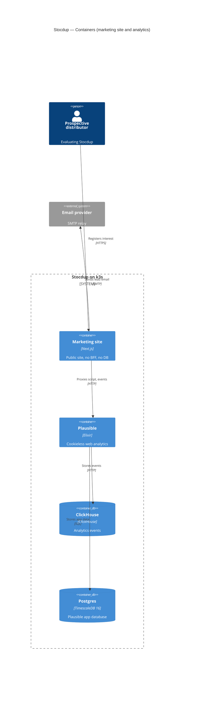
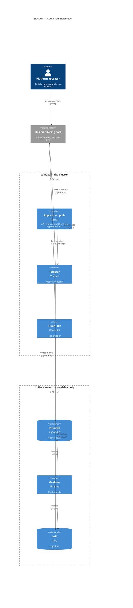

# C4 — Containers (Level 2)

What is running inside the Stocdup box from the [system context](c4-context.md):
every separately deployed pod, how they talk to each other, and which outside
systems they touch. Stocdup is the product name; `wholo` is the internal
identifier (repo, package scope, Helm release, `wholo-*` k8s resources).

This is the C4 **container** level. A container here is a separately
deployed/runnable unit — one Helm-managed pod (Deployment, DaemonSet or
CronJob). Inside a container (modules, services, controllers) is the component
level and is not documented. The deployed topology and hostnames are in
[`docs/runbook/url-map.md`](../runbook/url-map.md); the Helm templates in
`helm/wholo/templates/` are the source of truth.

Three diagrams, because one would be unreadable:

1. [Application containers](#1-application-containers) — what serves users:
   the three apps, the central API, the worker, Keycloak (and who talks to it),
   Postgres, Redis, and the off-site backup CronJob.
2. [Marketing site and analytics](#2-marketing-site-and-analytics) — the public
   site, Plausible and ClickHouse.
3. [Telemetry](#3-telemetry) — metrics and logs, for the operator.

**Editing the diagrams.** Mermaid's C4 renderer places elements on a grid in
declaration order and draws straight lines between them — it does no edge
routing. Every diagram is a 3-column grid
(`UpdateLayoutConfig($c4ShapeInRow="3", $c4BoundaryInRow="1")`; do not use 4,
it does not fit a laptop screen) and starts with the same `init` line (`wrap`
keeps every box the same width). Shapes outside any boundary are laid out
first, then each boundary below it, stacked; inside a boundary shapes fill the
3-column grid in declaration order. Only draw a relationship between
**neighbouring** grid cells (horizontal, vertical or diagonal) — anything longer
passes through a box, so list it under "Not drawn" instead. Put hubs (the API)
in the middle column and arrange the grid so the important relationships are
neighbours and no two lines cross. Label positions are set per relationship
with `UpdateRelStyle` offsets (the label's left edge sits at the line's midpoint
plus `offsetX`): lift labels on horizontal lines about 35-40 up and shift them
left by half their width, give vertical lines `$offsetX="10"`, and keep labels
clear of boundary titles. Keep labels short (about 30 characters; technology in
the 4th argument, detail in the tables) and re-render after every change.

**One container or frontend + BFF?** `admin-api`, `portal-api` and
`driver-api` each ship the Next.js frontend (`admin`, `portal`, `driver`) and
its BFF in **one image and one pod** (ADR-044, ADR-045): a custom NestJS server
serves the pages and the BFF endpoints on one origin. Because the container is
the deployable unit, each is drawn as **one** container named after the app
("Admin app"), not as a separate SPA and API. Likewise `wholo-api` and
`wholo-worker` are two Deployments of the same `apps/api` image and are two
containers.

## 1. Application containers

```mermaid
%%{init: {"wrap": true, "c4": {"c4ShapeMargin": 110, "diagramMarginX": 40, "diagramMarginY": 20}}}%%
C4Container
    title Stocdup — Containers (applications)

    Person(buyer, "Trade customer", "Buyer at a restaurant, bar, hotel or retailer")
    Container(keycloak, "Keycloak", "Keycloak", "Identity provider")
    Person(staff, "Distributor staff", "Owner, operations manager, warehouse staff")
    Container(portal, "Portal app", "Next.js + NestJS BFF", "Customer portal and its BFF")
    Container(api, "Central API", "NestJS, Prisma", "All business logic")
    Container(admin, "Admin app", "Next.js + NestJS BFF", "Distributor admin and its BFF")
    ContainerDb(redis, "Redis", "Redis", "BullMQ queues")
    ContainerDb(pg, "Postgres", "TimescaleDB 16", "System of record")
    Container(driverapp, "Driver app", "Next.js PWA + NestJS BFF", "Delivery-link PWA and its BFF")
    Container(worker, "Worker", "NestJS, BullMQ", "Outbox relay and queue processors")
    Container(backup, "pg-backup", "CronJob, pg_dumpall, rclone", "Encrypted off-site backup, every 6h")
    Person(driver, "Delivery driver", "Delivers orders from a printed manifest")

    System_Boundary(ext, "External systems") {
        System_Ext(xero, "Xero", "Accounting system of record")
        System_Ext(email, "Email provider", "SMTP relay")
        System_Ext(r2, "Cloudflare R2", "Off-site backup bucket")
    }

    Rel(buyer, keycloak, "Signs in, registers", "HTTPS, OIDC")
    Rel(staff, keycloak, "Signs in, registers", "HTTPS, OIDC")
    Rel(buyer, portal, "Orders in", "HTTPS")
    Rel(staff, admin, "Runs the business in", "HTTPS")
    Rel(driver, driverapp, "Opens delivery link", "HTTPS")
    Rel(portal, keycloak, "Verifies tokens", "JWKS")
    Rel(admin, keycloak, "Verifies tokens", "JWKS")
    Rel(api, keycloak, "Verifies tokens, disables users", "JWKS, admin API")
    Rel(portal, api, "Calls, relays JWT", "HTTP/JSON")
    Rel(admin, api, "Calls, relays JWT", "HTTP/JSON")
    Rel(driverapp, api, "Calls with link token", "HTTP/JSON")
    Rel(api, redis, "Enqueues jobs", "Redis")
    Rel(api, pg, "Reads and writes", "SQL")
    Rel(worker, redis, "Processes jobs", "Redis")
    Rel(worker, pg, "Outbox, reads, writes", "SQL")
    Rel(backup, pg, "Dumps all databases", "pg_dumpall")
    Rel(worker, xero, "Exports, pulls data", "HTTPS, OAuth")
    Rel(worker, email, "Sends email", "SMTP")
    Rel(backup, r2, "Uploads encrypted dump", "rclone crypt, S3")

    UpdateRelStyle(buyer, keycloak, $offsetX="-60", $offsetY="-40")
    UpdateRelStyle(staff, keycloak, $offsetX="-60", $offsetY="-40")
    UpdateRelStyle(buyer, portal, $offsetX="10", $offsetY="0")
    UpdateRelStyle(staff, admin, $offsetX="10", $offsetY="0")
    UpdateRelStyle(driver, driverapp, $offsetX="10", $offsetY="0")
    UpdateRelStyle(portal, keycloak, $offsetX="-90", $offsetY="-10")
    UpdateRelStyle(admin, keycloak, $offsetX="10", $offsetY="-10")
    UpdateRelStyle(api, keycloak, $offsetX="10", $offsetY="0")
    UpdateRelStyle(portal, api, $offsetX="-60", $offsetY="-40")
    UpdateRelStyle(admin, api, $offsetX="-60", $offsetY="-40")
    UpdateRelStyle(driverapp, api, $offsetX="40", $offsetY="0")
    UpdateRelStyle(api, redis, $offsetX="-60", $offsetY="-10")
    UpdateRelStyle(api, pg, $offsetX="10", $offsetY="0")
    UpdateRelStyle(worker, redis, $offsetX="10", $offsetY="0")
    UpdateRelStyle(worker, pg, $offsetX="30", $offsetY="0")
    UpdateRelStyle(backup, pg, $offsetX="10", $offsetY="0")
    UpdateRelStyle(worker, xero, $offsetX="10", $offsetY="-50")
    UpdateRelStyle(worker, email, $offsetX="-20", $offsetY="-50")
    UpdateRelStyle(backup, r2, $offsetX="10", $offsetY="-50")

    UpdateLayoutConfig($c4ShapeInRow="3", $c4BoundaryInRow="1")
```

Everything drawn in the open area is a pod in the Stocdup k3s cluster; only the
people and the "External systems" box are outside it. (The cluster is not drawn
as a boundary: a boundary would put the people and Keycloak in different boxes
and stop Keycloak sitting between the two people who sign in to it.)

Grid, row by row: row 1 Trade customer / Keycloak / Distributor staff; row 2
Portal app / Central API / Admin app; row 3 Redis / Postgres / Driver app; row 4
Worker / pg-backup / Delivery driver; below, the external systems: Xero / Email
provider / Cloudflare R2. Keycloak sits above the API, between the two people who
sign in to it and above the two apps that validate its tokens. The Driver app
and driver sit at the bottom right because neither touches Keycloak.
(Mermaid counts shapes across boundaries when wrapping rows, so the shape count
outside any boundary is a multiple of 3, or the next boundary starts mid-row.)

**How Keycloak is used.** Keycloak only proves *who* the user is. Distributor staff
and trade customers go to it directly in the browser to sign in, register from an
invitation and reset a password (OIDC, PKCE); delivery drivers never do. The
Central API and the Admin and Portal apps' BFFs each verify every inbound token's
signature against Keycloak's JWKS endpoint, using the in-cluster URL (ADR-049); the
Driver app does not use Keycloak at all (HMAC delivery-link token, ADR-059). The
token carries only `sub`: `apps/api` resolves organisation and role from its own
database (Membership). The only other call is `apps/api` using Keycloak's admin
API, through a service-account client limited to `manage-users`, to disable a
removed staff member (ADR-067).

### Containers

| Container | Type | Helm template | Port | Technology | Responsibility |
|---|---|---|---|---|---|
| Portal app | Web app + BFF | `portal-api/` | 3010 | Next.js frontend + NestJS BFF, one image | Customer portal at `portal.<domain>`. Browser calls its same-origin `/api/v1/*` BFF endpoints, which adapt user context into explicit calls to the Central API (ADR-026, ADR-044). |
| Admin app | Web app + BFF | `admin-api/` | 3020 (BFF code 3002) | Next.js frontend + NestJS BFF, one image | Distributor admin at `admin.<domain>`; same BFF role. Also serves the Xero OAuth callback route (ADR-051). |
| Driver app | PWA + BFF | `driver-api/` | 3030 | Next.js PWA + NestJS BFF, one image | Delivery PWA at `driver.<domain>/d#<token>` (ADR-059). No login: the HMAC-signed delivery-link token is relayed to the API, which verifies it. |
| Central API | API | `api/` | 3001 | NestJS, Prisma | The only place with business logic and the single auth authority. Reachable only via cluster DNS (no public ingress on live). Writes outbox rows in the same transaction as the change (ADR-034) and enqueues jobs. |
| Worker | Background processor | `worker/` | none (metrics only) | NestJS, BullMQ, same image as the Central API | Relays the outbox and runs every BullMQ processor, one queue per concern (ADR-047): accounting export/pull, email, scheduled work. Restart it as well as the API after backend changes. |
| Keycloak | Identity provider | `keycloak/` | 8080 | Keycloak | Identity for staff and trade customers at `auth.<domain>`. Browsers authenticate against it directly (PKCE); it proves who the user is, `apps/api` resolves organisation and role from its own DB. |
| Postgres | Database | `postgres/` | 5432 | TimescaleDB (Postgres 16) | System of record, including the fact hypertables. Also holds Keycloak's and Plausible's databases. |
| Redis | Queue store | `redis/` | 6379 | Redis | BullMQ queue state. |
| pg-backup | Scheduled job | `postgres/backup-cronjob.yaml` | none | CronJob (every 6 hours by default, `postgresql.backup.schedule`), `pg_dumpall`, rclone | Streams `pg_dumpall` through gzip and an rclone crypt remote straight to R2, so nothing unencrypted leaves the cluster (ADR-069). Separate bucket and credentials from image storage. Enabled on live only (`postgresql.backup.enabled`). Its status gauges go over StatsD to Telegraf (diagram 3). |

### Interfaces

What each container exposes and to whom. Every HTTP app serves under the global
prefix `/api/v1`. Resource names come from the controllers; there are no
OpenAPI files.

| Container | Exposed to | Auth | Main resource groups |
|---|---|---|---|
| Central API | The three app containers over cluster DNS (never browsers) | Keycloak JWT (relayed by the portal and admin BFFs), signature checked via JWKS; organisation and role from Membership. Path ids are checked against what the credential may access. `delivery-links` is instead authorised by the HMAC link token and throttled. | `distributors/:distributorId/...` (orders, customers, cart, catalogue and settings, delivery days/routes/runs/outcomes/overview, accounting contacts/products/tax-types/invoice-exports, members, staff-invitations, payment-terms, tax-types, customer-health, asset-images; a legacy `admin/distributors/...` prefix remains), `organisations/:organisationId`, `order-as`, `portal/invitations`, `staff-invitations`, `users/:userId/notifications`, `delivery-links`, `accounting/xero`, `auth`, `health`. |
| Admin app | Distributor staff's browser, same origin (`admin.<domain>`) | Keycloak JWT, verified locally against JWKS, then relayed to the API. | Pages plus BFF groups `products`, `price-lists`, `catalogues`, `customers`, `orders`, `delivery-days`/`-profiles`/`-routes`/`-runs`, `accounting` (incl. `accounting/xero` OAuth callback), `analytics`, `team`, `invitations`, `onboarding`, `settings`, `notifications`, `suppliers`, `tax-types`, `payment-terms`, `product-types`, `asset-images`, `auth`, `health`. |
| Portal app | Trade customers' browser, same origin (`portal.<domain>`) | Keycloak JWT, verified locally, then relayed. "Me" is resolved here into explicit calls to the API. | Pages plus BFF groups `portal`, `distributors`, `cart`, `orders`, `delivery`, `invitations`, `auth`, `health`. |
| Driver app | Driver's browser, same origin (`driver.<domain>`) | No account: HMAC-signed delivery-link token from the manifest QR code, relayed to the API. | Pages plus `delivery-links` (view, outcome, photos) and `health`. |
| Keycloak | Browsers (public `auth.<domain>`); the API and both BFFs (in-cluster) | Realm `wholo`; PKCE for browsers; a `manage-users`-only service-account client for the API. | OIDC login, registration and password reset; JWKS keys at `/realms/wholo/protocol/openid-connect/certs`; admin REST at `/admin/realms/wholo` (used only to disable a user). |
| Postgres, Redis | Central API and Worker (Postgres also Keycloak and pg-backup) | Credentials from Helm-managed Secrets. | SQL on 5432; Redis protocol on 6379. |
| Worker, pg-backup | Nothing (no inbound interface) | n/a | Worker exposes only Prometheus-format metrics (diagram 3). |

### Relationships

| From → To | Protocol | Notes |
|---|---|---|
| Trade customer / Distributor staff → Keycloak | HTTPS, OIDC with PKCE, via `auth.<domain>` | Sign in, register from an invitation, reset a password. The apps redirect the browser there and get the token back. Drivers never use Keycloak. |
| Person → Portal / Admin / Driver app | HTTPS via Traefik host routing | Browser sees only public hostnames. Live edge: Cloudflare → WAF appliance → Traefik. |
| Portal / Admin app → Keycloak | HTTP, in-cluster JWKS | Each BFF validates the signature of every inbound JWT locally (ADR-049). |
| Central API → Keycloak | HTTP, in-cluster JWKS and admin REST | Same JWKS check, and disables the Keycloak account of a removed staff member (ADR-067). One drawn line carries both. |
| Portal / Admin / Driver app → Central API | HTTP/JSON, `CENTRAL_API_URL` | The user's Keycloak JWT is relayed (ADR-046); the driver app relays the link token. The API checks the path ids against what the credential is authorised for. |
| Central API → Postgres / Redis | SQL / Redis | Domain data; queue producer. |
| Worker → Postgres / Redis | SQL / Redis | Outbox relay and queue consumer. API and worker never call each other directly: they meet through the outbox table and Redis. |
| Worker → Xero | HTTPS, OAuth 2.0 | Invoice export and polling pull, always initiated by Stocdup (the accounting framework is provider-neutral; Xero is its first provider, ADR-051). Each distributor connects their own Xero organisation. |
| Worker → Email provider | SMTP | Invitations and order/delivery notifications. Locally this is MailHog (in-cluster, local only). |
| pg-backup → Postgres / Cloudflare R2 | SQL dump / S3 API | Encrypted before upload. |

### Infrastructure

Deployment definitions are in `helm/wholo/templates/<dir>/`. Values are the
defaults in `helm/wholo/values.yaml`; every Deployment runs one replica
(`replicaCount: 1`), so scaling out is a values change, not a design.

| Container | Workload | Update strategy | Resources (request → limit) | Notes |
|---|---|---|---|---|
| Central API | Deployment `api/deployment.yaml`, Service `api/service.yaml` | RollingUpdate | 256Mi, 100m → 512Mi, 500m | Config in `api/configmap.yaml`, secrets in `api/secret.yaml`. No ingress route is given to it. |
| Worker | Deployment `worker/deployment.yaml` (`node dist/worker.js`) | Recreate | 128Mi, 50m → 256Mi, 250m | Same image as the API; only one processor instance runs. |
| Portal / Admin / Driver app | Deployment + Service in `portal-api/`, `admin-api/`, `driver-api/` | RollingUpdate | 384Mi, 100m → 768Mi, 500m each | Frontend baked into the BFF image; `NEXT_PUBLIC_KEYCLOAK_*` is fixed at build time, so live images are never reused locally. Public hosts are routed by `app-ingressroute.yaml` (health path is routed separately). |
| Keycloak | Deployment `keycloak/deployment.yaml`, realm import `realm-secret.yaml` | Kubernetes default (none set) | 768Mi, 250m → 2Gi, 1000m | Image built from `apps/keycloak`; published at `auth.<domain>` through `ingress.yaml`. |
| Postgres | Deployment `postgres/deployment.yaml`, PVC `pvc.yaml` | Recreate (node-local RWO volume) | 128Mi, 100m → 512Mi, 500m | Single instance; backup via the CronJob. |
| Redis | Deployment `redis/deployment.yaml`, PVC `pvc.yaml` | Recreate (node-local RWO volume) | 64Mi, 50m → 256Mi, 250m | |
| pg-backup | CronJob `postgres/backup-cronjob.yaml` (+ `backup-configmap.yaml`, `backup-secret.yaml`) | n/a | n/a | Live only. |

### Not drawn

True relationships left out because the cells are not neighbours or because
drawing them would cross other lines:

- **Keycloak → Postgres** — Keycloak's own `keycloak` database in the same
  Postgres pod.
- **Keycloak → Email provider** — account emails (generated from `apps/api`
  templates).
- **Central API → Xero** (the OAuth connect/callback flow; the sync work itself is the worker's) and **Central API → Email provider**
  (some mail is sent from the API process).
- **Central API → Cloudflare R2** — the API only issues presigned URLs; browsers
  upload and read images and delivery photos directly in R2 (ADR-016,
  ADR-038).
- **Browsers → OpenFreeMap** — map tiles for the admin app, browser-side.
- **All five application pods → Telegraf** — see diagram 3.
- **Marketing site (`www`)** — diagram 2.

## 2. Marketing site and analytics

| Container | Helm template | Port | Notes |
|---|---|---|---|
| Marketing site | `www/` | 3040 | Standalone Next.js at `www.<domain>` (ADR-060). `POST /api/register` turns a lead into an email (its own nodemailer, not `apps/api`'s mail module). Next rewrites proxy `/js/script.js` and `/api/event` to Plausible so analytics is first-party. Calls nothing else. |
| Plausible | `plausible/` | 8000 | No ingress; only reachable from `www` via `PLAUSIBLE_INTERNAL_URL`. Enabled on live and optionally locally (`plausible.enabled`). |
| ClickHouse | `clickhouse/` | 8123 | Plausible's event store (`plausible_events_db`). |
| Postgres | `postgres/` | 5432 | The same Postgres pod as diagram 1, drawn again as Plausible's app database. |

Lead emails go to the real SMTP provider on live and to MailHog locally.

## 3. Telemetry

For the operator, not for distributors: distributor-facing dashboards are
served from Stocdup's own fact tables (diagram 1). On live only Telegraf and
Fluent Bit run in the cluster; InfluxDB, Loki and Grafana are on the external
ops host. Locally all of them run in the cluster.

| Container | Helm template | Where | Notes |
|---|---|---|---|
| Application pods | (drawn once for legibility) | always | Stands for the five pods that emit telemetry: Central API, worker, and the admin, portal and driver apps. Order-activity counters and queue-depth gauges go over StatsD (UDP 8125, ADR-062/063); every pod also serves Prometheus-format `/metrics` on 9464 through a per-app `-metrics` ClusterIP Service (ADR-065). Structured JSON logs go to stdout. |
| Telegraf | `telegraf/` | live and local | Receives StatsD, scrapes the `/metrics` endpoints, polls `/api/v1/health` and the Kubernetes API (`kube_inventory`, read-only ServiceAccount). Drawn as one container but deployed as a Deployment **plus** a per-node DaemonSet (`telegraf-node`, node CPU/memory/disk from read-only hostPath mounts). |
| Fluent Bit | `fluent-bit/` | live and local | DaemonSet; tails the namespace's container logs from `/var/log/pods` and pushes them to Loki (ADR-064). |
| InfluxDB | `influxdb/` | local only | `influxdb.enabled`; on live this is the ops host. |
| Grafana | `grafana/` | local only | `grafana.enabled`; provisioned dashboards "Order Activity", "Platform Health", "Logs". |
| Loki | `loki/` | local only | `loki.enabled`; on live this is the ops host. |
| Ops monitoring host | external | live only | InfluxDB 2, Loki and Grafana outside the cluster; Telegraf and Fluent Bit push to it (`telegraf.influx.url`, `fluentBit.loki.host`). |

### Not drawn

- **Fluent Bit → Application pods** (tailing their logs) and **Telegraf →
  Application pods** for the `/metrics` scrape and health checks (the arrow is
  drawn in the emit direction only).
- **Telegraf → Kubernetes API server** and Fluent Bit's pod-metadata lookups.
- **Platform operator → Grafana** on local dev.
- **Ops host as the sink for both shippers** is drawn (Telegraf and Fluent Bit);
  the in-cluster stores and the ops host are alternatives, never both.

## Deliberately not containers

- **Traefik** — the cluster's ingress controller (host routing: `www`, `portal`,
  `admin`, `driver`, `auth`), shared infrastructure rather than part of the
  Stocdup release. On live the edge is Cloudflare → WAF appliance → Traefik.
- **MailHog** — local-only SMTP sink and UI; live uses an SMTP provider.
- **Seed Job** (`api/seed-job.yaml`) — local demo-data job, disabled on live.
- **Telegraf-node and Fluent Bit DaemonSets' hostPath mounts, ServiceAccounts**
  — implementation detail of diagram 3.
