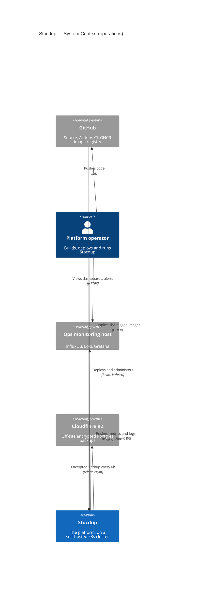

# C4 — System Context (Level 1)

Who uses Stocdup, what it does for them, and which outside systems it depends
on. Stocdup is the product name; `wholo` is the internal identifier (repo,
package scope, Helm release, k8s resources).

This is the C4 **context** level: the whole platform is one box. What is inside
the box (the apps, BFFs, worker, Postgres, Redis) belongs to the container
level — see [`docs/runbook/url-map.md`](../runbook/url-map.md) for the
current deployed topology.

## System Overview

### Short Description

Stocdup is a mobile-first platform where wholesale distributors run their
business and their trade customers order from them.

### Long Description

A distributor (the business that sells — wine is the first market, but the
platform is industry-agnostic) uses Stocdup to manage its products, prices,
customers, orders and deliveries. Its trade customers — restaurants, bars,
hotels and retailers — use a branded portal to browse that distributor's
catalogue, place orders and see what they owe. Delivery drivers confirm each
delivery from their phone, with no account.

Stocdup decides **what things cost**; the distributor's accounting system
(Xero today) is the system of record for **invoices and payments**. Stocdup
sends invoices to it and reads payment status back, so staff do not key the
same order twice. The accounting integration is a provider-neutral framework;
Xero is its first provider (ADR-051).

Everything inside the Stocdup box — the apps, central API, background worker,
database, queues and web analytics — is hosted and versioned together. The outside systems are listed under
[External Systems and Dependencies](#external-systems-and-dependencies).

## Personas

| Persona | Type | Goals | How they get in |
|---|---|---|---|
| Distributor staff | Human | Run the business day to day: catalogue, prices, customers, orders, deliveries, accounting. Three roles: **owner** (`DISTRIBUTOR_ADMIN`), `OPERATIONS_MANAGER` (day-to-day running, without company-level settings) and `WAREHOUSE_STAFF`. | Admin app (`admin.<domain>`). Keycloak login. Staff join by owner invitation (ADR-067); roles per ADR-066. |
| Trade customer | Human | Order from a distributor quickly and see order, delivery and invoice status. The logged-in portal user is always the buyer. | Customer portal (`portal.<domain>/{distributor-slug}`). Keycloak login. Access to a distributor requires an active trade relationship. |
| Delivery driver | Human, no account | Deliver the orders on a printed manifest and record each outcome from a phone. | Driver PWA (`driver.<domain>/d#<token>`). No login: an HMAC-signed, single-order link from the printed manifest's QR code (ADR-059). |
| Prospective distributor | Human, anonymous | Find out what Stocdup does and register interest. | Marketing site (`www.<domain>`). No login. |
| Platform operator | Human | Build, deploy, monitor and back up Stocdup. | Command line and the ops monitoring host — see the operations diagram. |

A distributor can also place an order **on behalf of** a trade customer
("order-as", ADR-041) — that is distributor staff acting through the portal, not
a separate persona.

The external systems below (Xero, email provider, Cloudflare R2, OpenFreeMap,
GitHub, ops monitoring host) are the programmatic counterparts: they are never
signed in as a person.

**Producers / suppliers** are not users of the system and have no entry point.
Stocdup holds only a simple supplier name that staff can attach to products.

## System Features

| Feature | What it does | Users |
|---|---|---|
| Sign-in and invitations | Staff and customers are invited by email, register and sign in through Keycloak. A customer can also ask a distributor for access, which the distributor approves. | Staff, trade customer |
| Catalogue and pricing | Products with images, catalogues assigned to customers, price lists with rules, tax types and payment terms. Price authority is always Stocdup (ADR-007, ADR-036, ADR-075). | Staff |
| Ordering | Browse a distributor's catalogue, build a cart, check out, track and view past orders. Distributors accept orders manually or automatically, by default or per customer (ADR-029, ADR-033). | Trade customer, staff |
| Order on behalf | Staff place an order for a customer through the portal (ADR-041). | Staff |
| Delivery planning | Delivery profiles with cut-offs and availability rules, routes, delivery runs and a printable manifest with a QR code per order (ADR-056). | Staff |
| Delivery confirmation | The driver records delivered (with signature or safe-place drop) or unable-to-deliver with a reason, optionally with photos (ADR-059). Staff and the customer are notified. | Driver, staff |
| Accounting sync | Invoices are exported to the connected accounting system; contacts, items, tax types and payment status are pulled back and matched. Customers see invoice and payment position (ADR-051, ADR-072, ADR-073, ADR-074). | Staff, trade customer |
| Dashboards | Delivery, Customers and Sales dashboards from Stocdup's own data (ADR-068, ADR-070). | Staff |
| Team management | The owner invites, re-roles and removes staff (ADR-067). | Owner |
| Notifications | Email for invitations, order placed and delivery outcomes; in-app notifications for staff. | Staff, trade customer |
| Marketing site | Public site with a contact form that emails the lead; cookieless analytics (ADR-060). | Prospective distributor |
| Operations telemetry, logs and backups | Metrics, logs and encrypted off-site database backups (ADR-062 to ADR-065, ADR-069). | Platform operator |

## User Journeys

### Place an order — trade customer

1. Receive an invitation email from the distributor (or ask for access from the portal; the distributor approves).
2. Register or sign in through Keycloak.
3. Open the distributor's storefront and browse the products and prices assigned to this customer.
4. Add items to the cart and check out, choosing a delivery date from those the distributor offers.
5. The distributor is notified; the order is accepted automatically or by staff, depending on the distributor's setting (ADR-033).
6. Follow the order status, delivery outcome and invoice payment position in the portal.

### Fulfil and invoice an order — distributor staff

1. See new orders in the admin app and accept or reject them (unless auto-accepted).
2. Accepted orders are exported to the accounting system as invoices, once only (ADR-073).
3. Allocate the order to a delivery run and print the manifest.
4. After delivery, review the outcome and photos; payment status arrives from the accounting system on its own (ADR-072).

### Set up the business — distributor owner

1. Sign in and complete onboarding.
2. Connect the distributor's accounting system (Xero) by consent.
3. Import or create products; match contacts and items to the accounting system.
4. Build price lists and catalogues, set payment terms, tax types and delivery profiles.
5. Invite customers and staff by email (ADR-067).

### Deliver an order — driver

1. Scan the QR code on the printed manifest. No login is needed (ADR-059).
2. See the one order's delivery details.
3. Record **delivered** (with a signature or a safe-place drop) or **unable to deliver** with a reason, optionally with photos.
4. The outcome is stored once and the distributor and customer are notified. A recorded outcome cannot be changed through the link.

### Place an order on behalf of a customer — distributor staff

1. In the admin app, choose "Order as" on a customer.
2. The portal opens as that customer, within the distributor's own storefront (ADR-041, ADR-042).
3. Staff build and submit the order; the customer receives it as normal.

### Register interest — prospective distributor

1. Visit the marketing site and submit the contact form.
2. The lead is emailed to the Stocdup team; no account is created.

### Accounting integration — Xero (programmatic)

1. A distributor consents to Xero access once; tokens are stored per connected company (ADR-051, ADR-074).
2. Stocdup exports each accepted order's invoice, after first checking Xero does not already hold one (ADR-073).
3. Stocdup polls Xero for contacts, items, tax types and invoice payment status. Xero never calls Stocdup (ADR-071, ADR-072).
4. Prices stay as set in Stocdup; Xero never overrides them (ADR-006, ADR-007).

### Deploy an update — platform operator

1. Push code to GitHub; CI runs unit and integration tests and, only if both pass, publishes images tagged `sha-<shortsha>`.
2. Update the image tags and run the Helm upgrade — deployment is manual (ADR-048).
3. Watch metrics and logs on the ops monitoring host; encrypted database backups go off-site every six hours (ADR-062 to ADR-065, ADR-069).

## External Systems and Dependencies

### Keycloak (identity)

Keycloak is self-hosted in the same cluster and deployed with the platform, but
it is a separate system that people use directly, so it has its own box.

| Relationship | What happens |
|---|---|
| Distributor staff and trade customers → Keycloak | The admin app and portal send the browser to Keycloak to sign in, register (from an invitation) and reset a password. Keycloak issues the token the apps then present. Drivers and prospective distributors never touch it. |
| Stocdup → Keycloak | `apps/api` and both BFFs verify the signature of every token against Keycloak's published signing keys (JWKS). `apps/api` also calls Keycloak's admin API to disable the account of a removed staff member (ADR-067). |

Keycloak only proves **who** the user is; the token carries only the user's
identity (`sub`). Which organisation they belong to and what role they hold is
resolved by `apps/api` from its own database (Membership), never read from the
token (ADR-009, ADR-049).

Keycloak sends its own account emails (verify email, reset password) through
the same email provider. That line is left off the diagram because it would run
straight through the Stocdup box.

### Business systems

| System | Type | Direction | What crosses the boundary | Notes |
|---|---|---|---|---|
| Xero | Accounting system (first provider of a provider-neutral framework) | Both, always initiated by Stocdup | Out: invoices. In: contacts, items, tax types, invoice/payment status. | Stocdup is the **pricing authority** — Xero never overrides prices (ADR-006, ADR-007). Stocdup polls; Xero does not call in. Each distributor connects their own Xero organisation by OAuth consent (ADR-051, ADR-074). |
| Email provider | SMTP relay | Out | Customer and staff invitations, order-placed and delivery-outcome notifications, Keycloak account emails, marketing-site lead emails. | Plain SMTP, so the provider is swappable. |
| Cloudflare R2 | Object storage | Both | Product/brand images, delivery proof photos. | Browsers upload and read directly via presigned URLs (ADR-016, ADR-038). |
| OpenFreeMap | Map tiles | In (browser only) | Map style and tiles. | Fetched by the admin app in the browser; the backend never calls it. |

### Operations systems

| System | Type | Direction | What crosses the boundary | Notes |
|---|---|---|---|---|
| GitHub | Source, CI, image registry | In | Container images tagged `sha-<shortsha>`. | A push to `master` builds images only if unit and integration tests pass. Deploying is a separate, manual `helm upgrade` (ADR-048). |
| Ops monitoring host | InfluxDB, Loki, Grafana | Out | Order-activity counters, platform-health metrics, JSON application logs. | Stocdup holds no InfluxDB credentials beyond Telegraf's write token and never reads back (ADR-062 to ADR-065). Locally, InfluxDB/Loki/Grafana run inside the cluster instead. |
| Cloudflare R2 | Object storage | Out | `pg_dumpall` output, encrypted before it leaves the cluster. | Separate bucket and credentials from the application's image storage (ADR-069). |

This telemetry is for the operator. Distributor-facing dashboards (delivery,
customers, sales) are served from Stocdup's own fact tables and never leave the
system.

### Deliberately inside the boundary

These are self-hosted in the same cluster and versioned with the platform, so
they are part of the Stocdup system, not external dependencies:

- **Plausible** (with ClickHouse) — cookieless web analytics for the marketing
  site.
- **Postgres (TimescaleDB)** and **Redis** — system of record and queues.

## System Context Diagram

Two diagrams, because the platform has two distinct audiences:

1. [Business context](#business-context) — the people trading through
   Stocdup and the business systems it integrates with.
2. [Operations context](#operations-context) — the platform operator and the
   systems used to build, observe and back up Stocdup.

**Editing the diagrams.** Mermaid's C4 renderer places elements on a grid in
declaration order and draws straight lines between them — it does no edge
routing. Both diagrams are a 3-column grid (`$c4ShapeInRow="3"`) with Stocdup
declared so that it lands in the middle column, which is what keeps lines from
crossing. In the business diagram Keycloak sits directly above Stocdup, between
the two people who sign in to it. Label positions are set per relationship with `UpdateRelStyle`
offsets. When adding an element, place its declaration deliberately, keep
relationship labels short (about 30 characters — the detail belongs in the
tables), and re-check the offsets.

### Business context

```mermaid
%%{init: {"wrap": true, "c4": {"c4ShapeMargin": 110, "diagramMarginX": 40, "diagramMarginY": 20}}}%%
C4Context
    title Stocdup — System Context (business)

    Person(staff, "Distributor staff", "Owner, operations manager, warehouse staff")
    System(keycloak, "Keycloak", "Identity provider: sign-in, registration, account security")
    Person(buyer, "Trade customer", "Buyer at a restaurant, bar, hotel or retailer")

    Person(driver, "Delivery driver", "Delivers orders from a printed manifest")
    System(stocdup, "Stocdup", "Mobile-first wholesale commerce and operations platform")
    Person(prospect, "Prospective distributor", "Evaluating Stocdup")

    System_Ext(xero, "Xero", "Accounting system of record: invoices, payments, balances")
    System_Ext(email, "Email provider", "SMTP relay")
    System_Ext(r2, "Cloudflare R2", "Object storage for images and delivery photos")

    System_Ext(tiles, "OpenFreeMap", "Map tiles")

    Rel(staff, keycloak, "Signs in with", "browser, OIDC")
    Rel(buyer, keycloak, "Signs in with", "browser, OIDC")
    Rel(stocdup, keycloak, "Verifies tokens with", "JWKS, admin API")
    Rel(staff, stocdup, "Runs the business in", "admin app")
    Rel(buyer, stocdup, "Orders from distributors in", "portal")
    Rel(driver, stocdup, "Records delivery outcomes", "driver PWA")
    Rel(prospect, stocdup, "Registers interest", "marketing site")
    Rel(stocdup, xero, "Exports invoices, pulls data", "HTTPS, OAuth 2.0")
    Rel(stocdup, email, "Sends email via", "SMTP")
    Rel(stocdup, r2, "Stores images and photos", "S3 API")
    Rel(stocdup, tiles, "Shows maps using tiles from", "HTTPS, browser")

    UpdateRelStyle(staff, keycloak, $offsetX="-40", $offsetY="-40")
    UpdateRelStyle(buyer, keycloak, $offsetX="-40", $offsetY="-40")
    UpdateRelStyle(stocdup, keycloak, $offsetX="10", $offsetY="0")
    UpdateRelStyle(staff, stocdup, $offsetX="-170", $offsetY="20")
    UpdateRelStyle(buyer, stocdup, $offsetX="45", $offsetY="20")
    UpdateRelStyle(driver, stocdup, $offsetX="-60", $offsetY="-40")
    UpdateRelStyle(prospect, stocdup, $offsetX="-50", $offsetY="-40")
    UpdateRelStyle(stocdup, xero, $offsetX="-150", $offsetY="-10")
    UpdateRelStyle(stocdup, email, $offsetX="10", $offsetY="0")
    UpdateRelStyle(stocdup, r2, $offsetX="10", $offsetY="-10")
    UpdateRelStyle(stocdup, tiles, $offsetX="-10", $offsetY="150")

    UpdateLayoutConfig($c4ShapeInRow="3", $c4BoundaryInRow="1")
```

### Operations context

## Related Documentation

- [URL map and deployed topology](../runbook/url-map.md)
- [Runbook overview](../runbook/overview.md)
- [ADR-006](../adrs/ADR-006-xero-accounting-system-of-record.md) / [ADR-007](../adrs/ADR-007-wholo-pricing-authority.md) — Xero system of record, Stocdup pricing authority
- [ADR-051](../adrs/ADR-051-accounting-integration-provider-neutral-oauth.md) — provider-neutral accounting integration
- [ADR-059](../adrs/ADR-059-delivery-link-token-and-first-public-endpoint.md) — driver delivery link
- [ADR-060](../adrs/ADR-060-marketing-site.md) — marketing site
- [ADR-067](../adrs/ADR-067-distributor-staff-invitations.md) — staff invitations
- [ADR-048](../adrs/ADR-048-live-environment-k3s.md) — live environment
