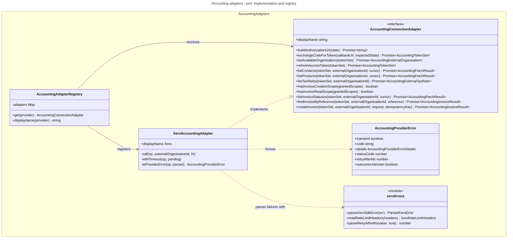

# C4 Code Level: Accounting Adapters

## Overview

- **Name**: Accounting provider adapters (`accounting/adapters`)
- **Description**: The provider boundary of the accounting integration. Defines the provider-neutral port (`AccountingConnectionAdapter`) and the neutral data shapes that cross it, the provider error type (`AccountingProviderError`), the registry that resolves an adapter per `AccountingProvider`, and the Xero implementation (`XeroAccountingAdapter`) with its error parsing (`xero-errors.ts`).
- **Location**: [apps/api/src/accounting/adapters](../../../apps/api/src/accounting/adapters)
- **Language**: TypeScript (NestJS, xero-node 18.1.0)
- **Purpose**: Keep every provider-specific detail (SDK, OAuth, field names, statuses, cursors, rate limits, error codes, display name) behind one port, so that the sync, export, payment-status and matching code in the rest of `accounting/` talks only to neutral types. Only Xero is implemented today.

Spec files (`*.spec.ts`) were read for behaviour only and are not documented here.

Labels used below:

- **framework (provider-neutral)**: part of the port or the framework; contains no Xero vocabulary.
- **Xero implementation**: specific to xero-node / Xero's API.

Process labels: **API** = `apps/api/src/app.module.ts`; **Worker** = `apps/api/src/worker.module.ts`. `AccountingModule` (`accounting/accounting.module.ts`) is imported by both, so the registry and adapter exist in both processes; the process listed for each method is the one that calls it.

---

## Code Elements

### Framework (provider-neutral)

#### Port and neutral shapes: `accounting-connection-adapter.interface.ts`

File header (lines 1-92) is the framework overview and the provider checklist. This file has no imports (it is Prisma-free by design).

- `AccountingTokenSet` (interface, line 94)
  - Shape: `{ accessToken: string; refreshToken: string; expiresAt: string /* ISO 8601 */; idToken?: string; scope: string /* space-separated, as granted */ }`
  - Description: OAuth token set as the framework sees it. Encrypted at rest by `AccountingConnectionService` (not in this directory).
  - Process: API (OAuth handshake), Worker (every pull and export).
- `AccountingExternalOrganisation` (interface, line 104)
  - Shape: `{ externalId: string; name: string }`
  - Description: A company the token grants access to (Xero tenant).
- `AccountingExternalContact` (interface, line 112)
  - Shape: `externalId`, `code?`, `accountNumber?`, `displayName`, `email?`, billing and delivery address fields (`billingLine1/2`, `billingCity`, `billingState`, `billingPostcode`, `billingCountry`, and the `delivery*` equivalents), `isCustomer`, `isSupplier`, `isArchived` (all boolean), `updatedAt?` (ISO 8601), `raw: unknown`.
  - Description: One cached contact in neutral vocabulary.
  - Process: Worker.
- `AccountingExternalProduct` (interface, line 142)
  - Shape: `externalId`, `code?`, `displayName`, `description?`, `salesUnitPrice?`, `purchaseUnitPrice?`, `taxCode?`, `accountCode?`, `purchaseTaxCode?`, `purchaseAccountCode?`, `isSold`, `isPurchased`, `isTracked`, `isActive` (booleans), `quantityOnHand?`, `updatedAt?`, `raw: unknown`. Prices and quantities are decimal strings.
  - Description: One cached product/item. `isActive` is documented as "return true when the provider has no archived flag".
  - Process: Worker.
- `AccountingExternalTaxRate` (interface, line 170)
  - Shape: `{ taxType: string; displayName: string; ratePercentage: string /* decimal */; isActive: boolean; raw: unknown }`
  - Description: One tax rate. No `updatedAt` (the header says the provider has no per-record timestamp).
  - Process: Worker.
- `AccountingInvoiceTargetStatusValue` (type alias, line 185)
  - Shape: `'DRAFT' | 'SUBMITTED' | 'AUTHORISED'`
  - Description: Status an invoice is created with. Mirrors the Prisma `AccountingInvoiceTargetStatus` enum.
- `AccountingInvoiceLineRequest` (interface, line 193)
  - Shape: `{ description: string; quantity: number; unitPrice: string /* decimal */; externalItemCode?: string; taxCode?: string; accountCode?: string }`
  - Description: One invoice line. Description, quantity and unit price always come from the Stocdup order line; the external codes are optional enrichment.
  - Process: Worker (invoice export).
- `AccountingInvoiceRequest` (interface, line 203)
  - Shape: `{ externalContactId: string; reference: string; currency: string /* ISO 4217 */; issueDate: string /* YYYY-MM-DD */; dueDate?: string /* YYYY-MM-DD */; targetStatus: AccountingInvoiceTargetStatusValue; lines: AccountingInvoiceLineRequest[] }`
  - Description: Complete invoice request. `dueDate` is omitted when payment terms leave it to the provider (the Xero adapter then sends no due date).
  - Process: Worker.
- `AccountingInvoiceResult` (interface, line 222)
  - Shape: `{ externalInvoiceId: string; externalInvoiceNumber?: string; externalInvoiceStatus?: string /* provider vocabulary */; raw: unknown }`
  - Description: Result of creating or finding an invoice.
  - Process: Worker.
- `AccountingInvoiceStateValue` (type alias, line 233)
  - Shape: `'DRAFT' | 'AWAITING_APPROVAL' | 'AWAITING_PAYMENT' | 'PAID' | 'VOIDED' | 'DELETED'`
  - Description: Neutral invoice lifecycle state. Mirrors the Prisma `AccountingInvoiceState` enum.
- `AccountingExternalInvoiceStatus` (interface, line 245)
  - Shape: `{ externalInvoiceId: string; externalInvoiceNumber?: string; state: AccountingInvoiceStateValue; rawStatus: string; currency?: string; total: string; amountPaid: string; amountCredited: string; amountDue: string; issueDate: string | null; dueDate: string | null; fullyPaidOn: string | null; providerUpdatedAt: Date | null }`
  - Description: Status and payment facts for one invoice the application created. Amounts are the provider's own (`amountDue` already nets off payments and credits).
  - Process: Worker (invoice status sync).
- `AccountingFetchResult<T>` (interface, line 269)
  - Shape: `{ records: T[]; nextCursor: string | null }`
  - Description: One page of a pull. `nextCursor` is opaque to callers; `null` means the next pull must be full.
  - Process: Worker.
- `AccountingConnectionAdapter` (interface, line 278): **the port**
  - Members (signatures copied from the interface):
    - `readonly displayName: string` (line 281): provider name for user-facing text ("Xero").
    - `buildAuthorizationUrl(state: string): Promise<string>` (282)
    - `exchangeCodeForToken(callbackUrl: string, expectedState: string): Promise<AccountingTokenSet>` (286): `callbackUrl` is the full redirect URL including query string.
    - `listAvailableOrganisations(tokenSet: AccountingTokenSet): Promise<AccountingExternalOrganisation[]>` (287)
    - `refreshAccessToken(tokenSet: AccountingTokenSet): Promise<AccountingTokenSet>` (292)
    - `listContacts(tokenSet: AccountingTokenSet, externalOrganisationId: string, cursor?: string | null): Promise<AccountingFetchResult<AccountingExternalContact>>` (298)
    - `listProducts(tokenSet: AccountingTokenSet, externalOrganisationId: string, cursor?: string | null): Promise<AccountingFetchResult<AccountingExternalProduct>>` (303)
    - `listTaxRates(tokenSet: AccountingTokenSet, externalOrganisationId: string): Promise<AccountingExternalTaxRate[]>` (311): no cursor, always a full fetch.
    - `hasInvoiceCreationScope(grantedScopes: string): boolean` (320)
    - `hasInvoiceReadScope(grantedScopes: string): boolean` (323)
    - `listInvoiceStatuses(tokenSet: AccountingTokenSet, externalOrganisationId: string, cursor?: string | null): Promise<AccountingFetchResult<AccountingExternalInvoiceStatus>>` (328)
    - `findInvoiceByReference(tokenSet: AccountingTokenSet, externalOrganisationId: string, reference: string): Promise<AccountingInvoiceResult | null>` (340): the ADR-073 duplicate guard. Must answer from live provider data and throw rather than return `null` when it cannot tell.
    - `createInvoice(tokenSet: AccountingTokenSet, externalOrganisationId: string, request: AccountingInvoiceRequest, idempotencyKey: string): Promise<AccountingInvoiceResult>` (353): failures are `AccountingProviderError`, with `outcomeUnknown` set when the provider may have created the invoice.
  - Description: The only type the framework uses to talk to a provider. Its header (lines 51-89) lists the obligations every implementation meets (single call path with budget, timeout and logging; error classification; opaque cursors; neutral shapes; checklist for adding a provider).
  - Process: API and Worker (see each method under the implementation).

#### Error type: `accounting-provider.error.ts`

- `AccountingProviderErrorDetails` (interface, line 25)
  - Shape: `{ statusCode?: number; retryAfterMs?: number; outcomeUnknown?: boolean }`
  - Description: Provider-neutral facts about a failed exchange. `outcomeUnknown` marks a failed write that may still have been carried out (ADR-073).
- `AccountingProviderError` (class, line 31, `extends Error`)
  - Constructor (line 32): `(message: string, readonly transient: boolean, readonly cause?: unknown, readonly code?: string, readonly details: AccountingProviderErrorDetails = {})`. Sets `name = 'AccountingProviderError'`.
  - Getters: `statusCode: number | undefined` (line 43), `retryAfterMs: number | undefined` (line 47), `outcomeUnknown: boolean` (line 51; `details.outcomeUnknown === true`).
  - Description: The one error type the framework classifies. `transient` decides retry-with-backoff; `code` is the provider's own machine-readable code (e.g. Xero OAuth `invalid_grant`, or `HTTP_<status>` / `NETWORK` from the Xero adapter). The header says `message` must already be safe to show and log.
  - Process: API and Worker. Consumed by `classifyJobFailure` (`accounting/accounting-job-failure.ts`, not in this directory) in the Worker.

#### Registry: `accounting-adapter.registry.ts`

- `AccountingAdapterRegistry` (`@Injectable()` class, line 10)
  - Private field (line 11): `adapters: Map<AccountingProvider, AccountingConnectionAdapter>`
  - Constructor (line 13): `constructor(xeroAdapter: XeroAccountingAdapter)`. Registers `AccountingProvider.XERO` to that instance.
  - `get(provider: AccountingProvider): AccountingConnectionAdapter` (line 17). Throws a plain `Error` (`No accounting adapter registered for provider ...`) when no adapter is registered.
  - `displayName(provider: AccountingProvider): string` (line 26). Returns `get(provider).displayName`.
  - Description: The only place a provider enum value is resolved to an adapter. Callers hold the registry, not an adapter.
  - Process: API (connection service: OAuth, refresh, `displayName` for messages) and Worker (every pull, export, and the contact-change notification).

### Xero implementation

#### `xero-connection.adapter.ts`

Exported declarations:

- `XERO_SCOPES` (const, line 34; re-exported at line 804): `['openid', 'profile', 'email', 'accounting.contacts', 'accounting.settings', 'accounting.invoices', 'offline_access']`. Requested at consent. Not a provider call; used as the default scope string in `toAccountingTokenSet`.
- `parseXeroCalendarDate(value: unknown): string | null` (function, line 93). Converts Xero's `/Date(ms+0000)/` strings (and ISO forms) to a `YYYY-MM-DD` date by taking the UTC date part. Returns `null` for anything else.
- `nextXeroCursor` (function, line 121; re-exported at line 137): `(previous: string | null | undefined, updatedAt: Array<Date | string | undefined>): string | null`. Builds the next ISO UTC cursor as the newest `UpdatedDateUTC` minus `CURSOR_OVERLAP_MS` (5 min), never moving backwards; returns `null` if there is no previous cursor and no records.
- `XeroAccountingAdapter` (`@Injectable()` class, line 151, `implements AccountingConnectionAdapter`)
  - Field: `readonly displayName = 'Xero'` (line 152).
  - Private fields: `logger` (Logger, line 154), `clientId`, `clientSecret`, `redirectUri` (lines 155-157).
  - Constructor (line 159): `(config: ConfigService, budget: AccountingCallBudgetService)`. Reads `XERO_CLIENT_ID`, `XERO_CLIENT_SECRET` and `XERO_REDIRECT_URI` with `getOrThrow` (lines 163-170). `XERO_REDIRECT_URI` is the admin-api public callback URL (ADR-051).
  - Public port methods (in port order):
    - `buildAuthorizationUrl(state: string): Promise<string>` (185). Builds the consent URL with a fresh `XeroClient` pinned to `state`. Process: API.
    - `exchangeCodeForToken(callbackUrl: string, expectedState: string): Promise<AccountingTokenSet>` (190). xero-node `apiCallback` (token exchange and state check). Not routed through `call()`. Process: API.
    - `listAvailableOrganisations(tokenSet: AccountingTokenSet): Promise<AccountingExternalOrganisation[]>` (196). `client.updateTenants(false)`, mapped to `{ externalId: tenantId, name: tenantName }`. Not routed through `call()`. Process: API.
    - `refreshAccessToken(tokenSet: AccountingTokenSet): Promise<AccountingTokenSet>` (215). Calls the Xero token endpoint with `fetch` and `AbortSignal.timeout(REFRESH_HTTP_TIMEOUT_MS)` (10 s), bypassing xero-node. Network failures are transient. HTTP failures go to `toRefreshTokenError`. Computes `expires_at` from `expires_in`. Process: API and Worker. Called from `performRefresh` (`accounting-connection.service.ts` line 400), which runs under `getValidTokenSet` (line 284).
    - `listContacts(tokenSet, externalOrganisationId, cursor?)` (314). Pages `getContacts` with `includeArchived = true` and `CONTACTS_PAGE_SIZE` (1000) until a short page; `modifiedSince` from the cursor. Process: Worker (contact sync).
    - `listProducts(tokenSet, externalOrganisationId, cursor?)` (351). One `getItems` call (no pagination), `unitdp = 4`. Process: Worker (product sync).
    - `listTaxRates(tokenSet, externalOrganisationId)` (378). One `getTaxRates` call. Process: Worker (tax type sync).
    - `hasInvoiceCreationScope(grantedScopes: string): boolean` (392). True for `accounting.invoices` or the legacy `accounting.transactions`. Process: Worker (invoice export preflight).
    - `hasInvoiceReadScope(grantedScopes: string): boolean` (400). True for `accounting.invoices`, `accounting.invoices.read` or `accounting.transactions`. Process: Worker (invoice sync preflight).
    - `listInvoiceStatuses(tokenSet, externalOrganisationId, cursor?)` (410). `getInvoices` with `Type=="ACCREC"`, `createdByMyApp = true`, paged at `INVOICES_PAGE_SIZE` (1000). Maps to `AccountingExternalInvoiceStatus` (line 705). Process: Worker.
    - `findInvoiceByReference(tokenSet, externalOrganisationId, reference: string): Promise<AccountingInvoiceResult | null>` (458). Validates the reference against `/^[\w .\-/#]+$/` (otherwise a permanent error), then `getInvoices` with `Reference=="<reference>"`, live statuses only (`XERO_LIVE_INVOICE_STATUSES`), `Date ASC`, page 1. If more than one match, logs `accounting.invoice.duplicate_detected` at error level and returns the oldest. Process: Worker (invoice export).
    - `createInvoice(tokenSet, externalOrganisationId, request, idempotencyKey: string): Promise<AccountingInvoiceResult>` (502). Builds an ACCREC invoice with `lineAmountTypes = Exclusive`, `unitAmount = Number(line.unitPrice)` (the only decimal-to-number conversion), `dueDate` only when present, and calls `createInvoices` with `summarizeErrors = true`, `unitdp = 4` and the idempotency key. A response with no invoice id throws a permanent error with `outcomeUnknown`. Process: Worker (invoice export).
  - Private methods:
    - `buildClient(state?: string): XeroClient` (175). Constructs `XeroClient` with the client id/secret, the redirect URI, `XERO_SCOPES` and `state`.
    - `toRefreshTokenError(status: number, body: unknown): AccountingProviderError` (280). `invalid_grant` → permanent, code `invalid_grant`; `invalid_client` → permanent, code `invalid_client`; 429 and 5xx → transient; other → permanent.
    - `toInvoiceResult(invoice: Invoice): AccountingInvoiceResult` (558).
    - `call<T>(op: string, externalOrganisationId: string, fn: () => Promise<T>): Promise<T>` (573). The single call path for Accounting API calls: `budget.acquire('XERO', orgId, 50)`, timeout via `withTimeout`, one structured log line per call, day-limit warning below 500 remaining. On failure, logs `accounting.provider.call_failed` and throws the mapped `AccountingProviderError`.
    - `withTimeout<T>(op: string, pending: Promise<T>): Promise<T>` (624). `Promise.race` with a 60 s timer that rejects with `XeroCallTimeoutError`.
    - `toProviderError(op: string, parsed: ParsedXeroError): AccountingProviderError` (643). Transient: no response (code `NETWORK`), 401, 429, 5xx. Permanent: other statuses. `outcomeUnknown` is true for write ops (`createInvoices`) with no response or 5xx.
    - `toAccountingExternalProduct(item: Item): AccountingExternalProduct` (678).
    - `toAccountingExternalInvoiceStatus(invoice: Invoice): AccountingExternalInvoiceStatus` (705). Maps Xero status to neutral state via `XERO_TO_INVOICE_STATE`.
    - `toAccountingExternalTaxRate(taxRate: TaxRate): AccountingExternalTaxRate` (725).
    - `toAccountingExternalContact(contact: Contact): AccountingExternalContact` (736). Billing address = POBOX, falling back to STREET. Delivery address = STREET only.
    - `toAccountingTokenSet(tokenSet: {...}): AccountingTokenSet` (774). Throws a plain `Error` when the set is incomplete.
    - `toXeroTokenSetParams(tokenSet: AccountingTokenSet)` (793). Converts to xero-node's token shape (`expires_at` in epoch seconds).
- Module-private declarations:
  - `XERO_TOKEN_ENDPOINT` (line 47), `REFRESH_HTTP_TIMEOUT_MS = 10_000` (51), `XERO_CALLS_PER_ORG_PER_MINUTE = 50` (60), `XERO_DAILY_LIMIT = 5_000` (61), `DAY_LIMIT_WARN_BELOW` (62), `XERO_CALL_TIMEOUT_MS = 60_000` (68), `XERO_WRITE_OPS = new Set(['createInvoices'])` (71), `XERO_LIVE_INVOICE_STATUSES` (74), `CONTACTS_PAGE_SIZE` and `INVOICES_PAGE_SIZE` (76-77), `XERO_TO_INVOICE_STATE` (79), `CURSOR_OVERLAP_MS = 5 min` (110), `XERO_INVOICE_STATUS` (139), `class XeroCallTimeoutError extends Error` (112), `decimalString` (104), `cursorToDate` (131).

#### `xero-errors.ts`

Parsing of xero-node failures into plain facts. Nothing here leaves the adapter; callers only see the `AccountingProviderError` built from it.

- `ParsedXeroError` (interface, line 14): `{ statusCode?: number; validationMessages: string[]; xeroMessage?: string; retryAfterMs?: number; correlationId?: string; transportMessage?: string }`
- `parseRetryAfterMs(value: string | undefined, now: number = Date.now()): number | undefined` (line 60). Accepts seconds or an HTTP date.
- `parseXeroSdkError(err: unknown): ParsedXeroError` (line 91). Accepts xero-node's JSON-string rejection, a rejected object, or a plain `Error`. `statusCode` is `undefined` for transport failures (xero-node reports 0). Validation messages come from `Elements[].ValidationErrors[].Message`. Text is truncated to 500 characters.
- `XeroRateLimitHeaders` (interface, line 118): `{ minRemaining?: number; dayRemaining?: number; appMinRemaining?: number; correlationId?: string }`
- `readRateLimitHeaders(headers: Record<string, unknown> | undefined): XeroRateLimitHeaders` (line 131). Reads `x-minlimit-remaining`, `x-daylimit-remaining`, `x-appminlimit-remaining` and `xero-correlation-id`.
- Module-private: `MAX_DETAIL_CHARS` (line 12), `RawXeroErrorShape` (26), `toShape` (38), `header` (51), `truncate` (68), `extractBodyDetail` (72), `intHeader` (125).
- Process: API and Worker (called inside `call()` and the refresh path).

---

## Dependencies

### Internal Dependencies

- `accounting-adapter.registry.ts` imports the port (`accounting-connection-adapter.interface.ts`) and `XeroAccountingAdapter` (`xero-connection.adapter.ts`).
- `xero-connection.adapter.ts` imports the port, `accounting-provider.error.ts`, `xero-errors.ts`, and `AccountingCallBudgetService` from `accounting/accounting-call-budget.service.ts` (outside this directory; per ADR-071 it is a Redis sliding-window log).
- `accounting-connection-adapter.interface.ts`, `accounting-provider.error.ts` and `xero-errors.ts` have no internal imports.
- Consumers outside this directory (via `AccountingAdapterRegistry`, never the concrete class):
  - `accounting/accounting-connection.service.ts`: `buildAuthorizationUrl` (line 136, in `createAuthorizationUrl`), `exchangeCodeForToken` and `listAvailableOrganisations` (lines 174-175, in `handleCallback`), `refreshAccessToken` (line 400, in `performRefresh`), `displayName` (line 508).
  - `accounting/sync/accounting-pull-processor.base.ts`: `get(provider)`.
  - `accounting-contact-sync`, `accounting-product-sync`, `accounting-tax-type-sync`, `accounting-invoice-sync` processors: the `list*` and scope methods.
  - `accounting-invoice-export/accounting-invoice-export.processor.ts`: `hasInvoiceCreationScope`, `findInvoiceByReference`, `createInvoice`.
- Concrete-class import outside this directory: `accounting/accounting.module.ts` line 28 (`XeroAccountingAdapter`), listed as a provider edge in the architecture spec.

### External Dependencies

- `@nestjs/common` (`Injectable`, `Logger`), `@nestjs/config` (`ConfigService`).
- `xero-node` 18.1.0: `XeroClient`, `Invoice`, `Contact`, `Item`, `TaxRate`, `LineItem`, `Address`, `CurrencyCode`, `LineAmountTypes`.
- `@prisma/client`: `AccountingProvider` enum (registry only).
- Runtime globals: `fetch`, `AbortSignal.timeout`, `Buffer`, `URLSearchParams`.
- Outside systems: Xero identity token endpoint `https://identity.xero.com/connect/token`; Xero Accounting API (via xero-node); Redis via `AccountingCallBudgetService` (per ADR-071).

---

## Relationships

Call path inside the Xero adapter: every `list*`, `findInvoiceByReference` and `createInvoice` call goes through `call()` (budget, then `withTimeout`, then the xero-node call). Errors pass through `parseXeroSdkError` and `toProviderError`. `buildAuthorizationUrl`, `exchangeCodeForToken`, `listAvailableOrganisations` and `refreshAccessToken` do not go through `call()`.

---

## Notes

### Where the code differs from the header comments and ADRs

These are statements of what the code does today, checked against the header of `accounting-connection-adapter.interface.ts` (lines 51-73) and the ADRs.

1. **Single call path is not universal.** The header says every provider API call goes through one private call path that acquires the budget, applies a timeout and logs one line per call. In `XeroAccountingAdapter`:
   - `exchangeCodeForToken` (line 190) calls xero-node `apiCallback` directly: no budget, no `call()` timeout, no log line.
   - `listAvailableOrganisations` (line 196) calls `client.updateTenants(false)` directly: same gaps.
   - `refreshAccessToken` (line 215) makes its own `fetch` with a 10 s `AbortSignal` and no budget acquire. The code comment (lines 206-214) explains this as deliberate; the other two have no comment saying so.
2. **Not every failure is an `AccountingProviderError`.** The header says every failure is thrown as one. `exchangeCodeForToken` and `listAvailableOrganisations` let xero-node errors propagate unwrapped. `toAccountingTokenSet` (line 781-783) throws a plain `Error` for an incomplete token set.
3. **Raw provider body in `cause` on the refresh path.** The message is built only from `error`/`error_description`, as the header requires. But `toRefreshTokenError` (lines 280-312) passes the raw OAuth response body as `cause`. The `call()` path passes the parsed object as `cause`, which is what ADR-071 describes.
4. **Registry comment vs registry code.** `accounting-adapter.registry.ts` line 6 says the framework "never names a provider itself". The registry itself names `AccountingProvider.XERO` and `XeroAccountingAdapter` (lines 4 and 14). The checklist (interface header, step 3) makes the registry the registration point, so the comment describes callers, not the registry.
5. **Concrete adapter import outside the directory.** The interface header says nothing outside `accounting/adapters/` may import a concrete adapter. `accounting/accounting.module.ts` line 28 does. The architecture spec allows it through its `PROVIDER_EDGES` list, which the header does not mention.
6. **ADR-051 vs the header.** ADR-051 says adding a provider changes "nothing else in the service, controllers, or frontend". The interface header checklist (step 4) says a new provider also needs an OAuth start route, callback and admin connection card, and that the current ones are Xero-named.
7. **ADR-071 on write retries.** ADR-071 says a timed-out write is "safe to retry: every write carries an idempotency key". ADR-073 supersedes this. The Xero adapter's comment (lines 63-67) and `toProviderError` (`outcomeUnknown`) follow ADR-073.
8. **Stale scope comment.** The comment on `XERO_SCOPES` (lines 22-24) says contacts and settings are "unused until Phases 2-3". Contacts are read by `listContacts`. `accounting.settings` is requested but no call in this directory uses it.

### Not determined from this directory

- The internals of `AccountingCallBudgetService` (the Redis window and the 20 s wait behaviour described in ADR-071) are in `accounting/accounting-call-budget.service.ts`, which was not read for this document.
- `AccountingConnectionService` internals (token encryption, advisory lock, status transitions) were not read; only the call sites of the adapter are recorded.
- The contents of the xero-node 18.1.0 SDK were not inspected; the behaviour described is what this adapter code expects from it, as documented in its comments.
