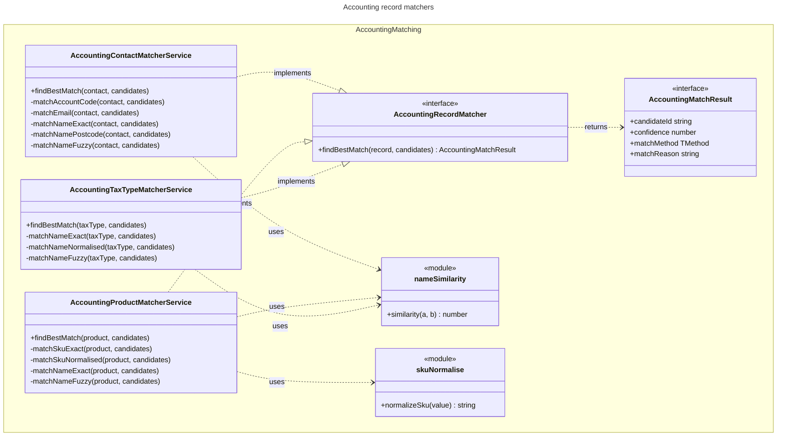

# C4 Code Level: Accounting Matching

## Overview

- **Name**: Accounting record matching (`accounting/matching`)
- **Description**: The matching framework contract (`AccountingRecordMatcher`) and its three implementations, one per synced record type: contacts (customers), products and tax types. Also two pure string helpers used by them: a similarity score and a SKU normaliser.
- **Location**: [apps/api/src/accounting/matching](../../../apps/api/src/accounting/matching)
- **Language**: TypeScript (NestJS `@Injectable()` services, Prisma enum values)
- **Purpose**: Rank the unmapped Stocdup candidates for one cached provider record and return at most one best match, with a confidence, a method and a human-readable reason. The result is always a suggestion: matchers never write mappings.

Spec files were read for behaviour only and are not documented here.

Labels used below:

- **framework (provider-neutral)**: `accounting-record-matcher.interface.ts` (the contract) and `name-similarity.util.ts`, `sku-normalise.util.ts` (generic string helpers).
- **Record-type matcher**: one per synced record type. Each is provider-neutral in its own code (it works on the cached, neutral fields), but is specific to one Stocdup domain (contacts, products, tax types). These are classed as framework because they are provider-neutral. They are not Xero-specific: no file in this directory imports a provider SDK or names a provider.

Process labels: **API** = `apps/api/src/app.module.ts`; **Worker** = `apps/api/src/worker.module.ts`. The three services are provided and exported by `AccountingModule` (both processes). The only caller of `findBestMatch` is the sync pipeline, which runs in the Worker.

---

## Code Elements

### Contract: `accounting-record-matcher.interface.ts` (framework)

- `AccountingMatchResult<TMethod>` (interface, line 12)
  - Shape: `{ candidateId: string; confidence: number; matchMethod: TMethod; matchReason: string }`
  - Description: `candidateId` is the Stocdup candidate's domain id (TradeRelationship id for contacts, Product id for products, TaxType id for tax types). `confidence` is a 0-100 score. `matchReason` is shown to the distributor.
- `AccountingRecordMatcher<TRecord, TCandidate, TMethod>` (interface, line 21)
  - Member: `findBestMatch(record: TRecord, candidates: TCandidate[]): AccountingMatchResult<TMethod> | null` (line 22)
  - Description: The contract every record-type matcher implements. The header states matchers are pure, DB-free, rank only the pool they are given, and never decide on their own.
  - Consumers: `AccountingSyncProcessorBase.runMatcherFor` (`accounting/sync/accounting-sync-processor.base.ts` line 176), via the abstract `matcher` property. Process: Worker.

### Contact matcher: `accounting-contact-matcher.service.ts` (framework, record-type matcher)

- `AccountingMatchContact` (interface, line 9)
  - Shape: `{ externalContactCode?: string | null; externalAccountNumber?: string | null; displayName: string; email?: string | null; billingPostcode?: string | null }`
  - Description: The cached contact fields the matcher reads. A subset of the Prisma `ExternalAccountingContact` model.
- `AccountingMatchCandidate` (interface, line 20)
  - Shape: `{ tradeRelationshipId: string; accountNumber?: string | null; organisationName: string; organisationEmail?: string | null; organisationPostcode?: string | null }`
  - Description: One Stocdup customer eligible for matching. The caller filters out customers already mapped.
- `AccountingContactMatchResult` (type alias, line 28): `AccountingMatchResult<AccountingContactMatchMethod>`.
- Module-private constants: `NAME_POSTCODE_SIMILARITY_THRESHOLD = 0.85` (line 30), `NAME_FUZZY_SIMILARITY_THRESHOLD = 0.6` (line 31), `NAME_FUZZY_MAX_CONFIDENCE = 40` (line 32), `NAME_FUZZY_MIN_CONFIDENCE = 25` (line 33).
- Module-private `normalizedEquals(a?: string | null, b?: string | null): boolean` (line 35): trimmed, case-insensitive equality; false if either is empty.
- `AccountingContactMatcherService` (`@Injectable()` class, line 45, `implements AccountingRecordMatcher<AccountingMatchContact, AccountingMatchCandidate, AccountingContactMatchMethod>`)
  - `findBestMatch(contact: AccountingMatchContact, candidates: AccountingMatchCandidate[]): AccountingContactMatchResult | null` (line 48). Returns the first non-null result of, in order: `matchAccountCode`, `matchEmail`, `matchNameExact`, `matchNamePostcode`, `matchNameFuzzy`.
  - Private rules (each returns `AccountingContactMatchResult | null`):
    - `matchAccountCode(contact, candidates)` (line 61). Matches the trimmed `externalContactCode` or `externalAccountNumber` against a candidate's `accountNumber`. Confidence 95, method `ACCOUNT_CODE_EXACT`. Takes the first matching candidate.
    - `matchEmail(contact, candidates)` (line 84). Case-insensitive equality of `email` and `organisationEmail`. Confidence 80, method `EMAIL_EXACT`. Takes the first match.
    - `matchNameExact(contact, candidates)` (line 101). Case-insensitive `displayName` vs `organisationName`. Confidence 70, method `NAME_EXACT`. Takes the first match.
    - `matchNamePostcode(contact, candidates)` (line 116). Postcode must be equal, and name similarity at least 0.85. Picks the highest similarity. Confidence 60, method `NAME_POSTCODE`.
    - `matchNameFuzzy(contact, candidates)` (line 140). Name similarity at least 0.6 over all candidates; picks the highest. Confidence `max(25, round(40 × similarity))`, method `NAME_FUZZY`.
  - Process: Worker.

### Product matcher: `accounting-product-matcher.service.ts` (framework, record-type matcher)

- `AccountingMatchProduct` (interface, line 10): `{ externalProductCode?: string | null; displayName: string }`
- `AccountingProductMatchCandidate` (interface, line 18): `{ productId: string; sku?: string | null; name: string }`
- `AccountingProductMatchResult` (type alias, line 24): `AccountingMatchResult<AccountingProductMatchMethod>`.
- Module-private constants: `NAME_FUZZY_SIMILARITY_THRESHOLD = 0.75` (line 31), `NAME_FUZZY_MAX_CONFIDENCE = 40` (line 32), `NAME_FUZZY_MIN_CONFIDENCE = 25` (line 33).
- Module-private `normalizedEquals` (line 35): same as the contact version.
- `AccountingProductMatcherService` (`@Injectable()` class, line 46, `implements AccountingRecordMatcher<AccountingMatchProduct, AccountingProductMatchCandidate, AccountingProductMatchMethod>`)
  - `findBestMatch(product: AccountingMatchProduct, candidates: AccountingProductMatchCandidate[]): AccountingProductMatchResult | null` (line 49). First non-null of: `matchSkuExact`, `matchSkuNormalised`, `matchNameExact`, `matchNameFuzzy`.
  - Private rules:
    - `matchSkuExact(product, candidates)` (line 61). Trimmed `externalProductCode` equal to a candidate's trimmed `sku`. Requires exactly one match, otherwise null (ambiguity gives no suggestion). Confidence 95, method `SKU_EXACT`.
    - `matchSkuNormalised(product, candidates)` (line 82). Compares `normalizeSku` of both codes. Requires exactly one match. Confidence 75, method `SKU_NORMALISED`.
    - `matchNameExact(product, candidates)` (line 105). Case-insensitive `displayName` vs `name`. Takes the first match (no ambiguity check). Confidence 65, method `NAME_EXACT`.
    - `matchNameFuzzy(product, candidates)` (line 120). Similarity at least 0.75; picks the highest. Confidence `max(25, round(40 × similarity))`, method `NAME_FUZZY`.
  - Process: Worker.

### Tax type matcher: `accounting-tax-type-matcher.service.ts` (framework, record-type matcher)

- `AccountingMatchTaxType` (interface, line 9): `{ displayName: string }`
- `AccountingTaxTypeMatchCandidate` (interface, line 16): `{ taxTypeId: string; name: string }`
- `AccountingTaxTypeMatchResult` (type alias, line 21): `AccountingMatchResult<AccountingTaxTypeMatchMethod>`.
- Module-private constants: `NAME_FUZZY_SIMILARITY_THRESHOLD = 0.75` (line 28), `NAME_FUZZY_MAX_CONFIDENCE = 40` (line 29), `NAME_FUZZY_MIN_CONFIDENCE = 25` (line 30).
- Module-private `normalizedEquals` (line 32).
- Module-private `normalizeName(value: string): string` (line 39): trim, lowercase, remove every character that is not `a-z` or `0-9`.
- `AccountingTaxTypeMatcherService` (`@Injectable()` class, line 49, `implements AccountingRecordMatcher<AccountingMatchTaxType, AccountingTaxTypeMatchCandidate, AccountingTaxTypeMatchMethod>`)
  - `findBestMatch(taxType: AccountingMatchTaxType, candidates: AccountingTaxTypeMatchCandidate[]): AccountingTaxTypeMatchResult | null` (line 52). First non-null of: `matchNameExact`, `matchNameNormalised`, `matchNameFuzzy`.
  - Private rules:
    - `matchNameExact(taxType, candidates)` (line 63). Case-insensitive name equality. Requires exactly one match. Confidence 90, method `NAME_EXACT`.
    - `matchNameNormalised(taxType, candidates)` (line 80). Equal after `normalizeName`. Requires exactly one match. Confidence 75, method `NAME_NORMALISED`.
    - `matchNameFuzzy(taxType, candidates)` (line 98). Similarity at least 0.75; picks the highest. Confidence `max(25, round(40 × similarity))`, method `NAME_FUZZY`.
  - Process: Worker.

### String helpers (framework)

- `similarity(a: string, b: string): number` (exported function, `name-similarity.util.ts` line 38). Normalises both strings (lowercase, non-alphanumerics to single spaces, trimmed) and returns `1 - levenshtein / maxLength`. Both empty → 1; one empty → 0.
- `normalize(value: string): string` (module-private, `name-similarity.util.ts` line 4).
- `levenshteinDistance(a: string, b: string): number` (module-private, `name-similarity.util.ts` line 13). Standard dynamic-programming edit distance.
- `normalizeSku(value: string): string` (exported function, `sku-normalise.util.ts` line 5). Lowercases and removes whitespace, `-` and `_`. Does not collapse other character differences (the header gives `CAB-SAUV-001` vs `CAB-SAV-001` as an example that must stay different).
- Process: Worker (via the matchers).

---

## Dependencies

### Internal Dependencies

- `accounting-record-matcher.interface.ts`: no imports.
- `accounting-contact-matcher.service.ts`: `./accounting-record-matcher.interface` (types), `./name-similarity.util` (`similarity`).
- `accounting-product-matcher.service.ts`: `./accounting-record-matcher.interface` (types), `./sku-normalise.util` (`normalizeSku`), `./name-similarity.util` (`similarity`).
- `accounting-tax-type-matcher.service.ts`: `./accounting-record-matcher.interface` (types), `./name-similarity.util` (`similarity`).
- `name-similarity.util.ts`, `sku-normalise.util.ts`: no imports.
- Consumers:
  - `accounting/sync/accounting-sync-processor.base.ts` (`AccountingRecordMatcher`, `AccountingMatchResult`).
  - `accounting-contact-sync/accounting-contact-sync.processor.ts`, `accounting-product-sync/accounting-product-sync.processor.ts`, `accounting-tax-type-sync/accounting-tax-type-sync.processor.ts`: inject the matcher service and pass it to the base class.
  - `accounting/accounting.module.ts`: provides and exports the three services.

### External Dependencies

- `@nestjs/common`: `Injectable`.
- `@prisma/client`: `AccountingContactMatchMethod`, `AccountingProductMatchMethod`, `AccountingTaxTypeMatchMethod` (enum values used at runtime, for the `matchMethod` field). The services are DB-free in that they perform no queries, but they need the generated Prisma client to provide these enum values.
- No database, queue, HTTP or provider SDK access.

---

## Relationships

Match priority per record type (first rule that returns a result wins):

| Record type | Rules in order (confidence) |
|---|---|
| Contact | account code (95), email (80), exact name (70), name + postcode at similarity 0.85 (60), fuzzy name at 0.6 (25 to 40) |
| Product | SKU exact, unique (95), SKU normalised, unique (75), exact name (65), fuzzy name at 0.75 (25 to 40) |
| Tax type | exact name, unique (90), normalised name, unique (75), fuzzy name at 0.75 (25 to 40) |

---

## Notes

### Where the code differs from the header comments and ADRs

1. **Ambiguity rule is not applied uniformly.** `accounting-tax-type-matcher.service.ts` (lines 68-69) says the ambiguity rule is "same rule as the product/contact matchers". The contact matcher's exact rules (`matchAccountCode`, `matchEmail`, `matchNameExact`) take the first match with `Array.find` and never check for more than one candidate. The product matcher applies the rule only to the two SKU rules (`matchSkuExact`, `matchSkuNormalised`); its `matchNameExact` takes the first match. The tax type matcher's `matchNameExact` and `matchNameNormalised` both apply it.
2. **Header describes DB-free matchers.** The matcher headers and the contract say the matchers are pure and DB-free. That holds for queries (there are none), but the three services import Prisma enum values at runtime, so they depend on the generated client.
3. **Confidence scale.** The contract does not state a range for `confidence`. All three matchers emit values between 25 and 95.

### Not determined from this directory

- Whether the `candidates` pools passed in by the sync processors already exclude mapped records. The contract says the caller owns that filtering; the caller implementations (`loadMatchCandidates` in each concrete processor) were not read here.
- The Prisma enum members (`AccountingContactMatchMethod`, `AccountingProductMatchMethod`, `AccountingTaxTypeMatchMethod`) are defined in the Prisma schema, which was not read for this document.
- `similarity` is documented in its header as dependency-free and "no fuzzy-matching library exists in this repo's dependency tree". That claim was not verified against `package.json`.
