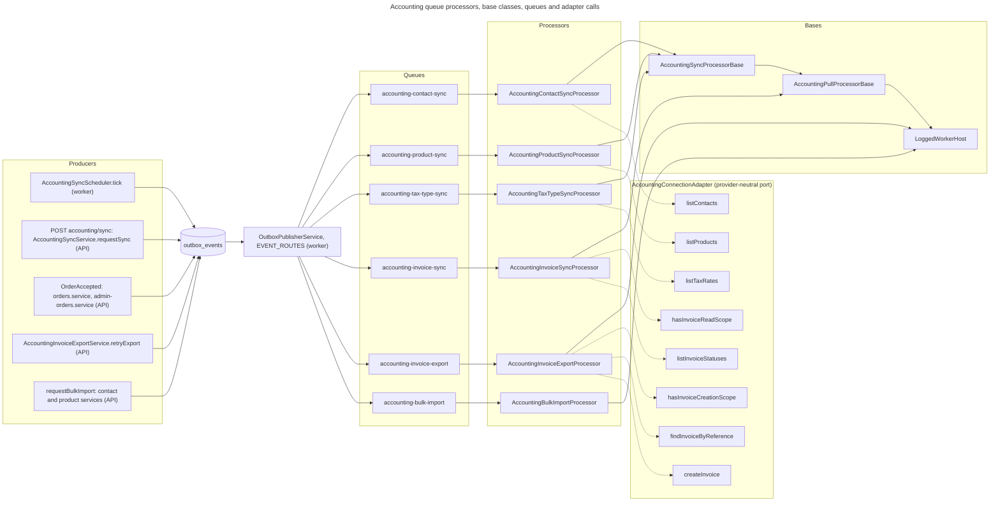

# C4 Code Level: Accounting Queue Processors

## Overview

- **Name**: Accounting queue processors (six directories, one module + one processor each)
- **Description**: The six BullMQ processors that do the provider-facing work of the accounting integration after the outbox has relayed an event onto a queue: four pulls (contacts, products, tax rates, invoice status), the per-order invoice export (push), and the bulk import of accounting records into Stocdup.
- **Location**:
  - [apps/api/src/accounting-contact-sync](../../../apps/api/src/accounting-contact-sync)
  - [apps/api/src/accounting-product-sync](../../../apps/api/src/accounting-product-sync)
  - [apps/api/src/accounting-tax-type-sync](../../../apps/api/src/accounting-tax-type-sync)
  - [apps/api/src/accounting-invoice-sync](../../../apps/api/src/accounting-invoice-sync)
  - [apps/api/src/accounting-invoice-export](../../../apps/api/src/accounting-invoice-export)
  - [apps/api/src/accounting-bulk-import](../../../apps/api/src/accounting-bulk-import)
- **Language**: TypeScript (NestJS, `@nestjs/bullmq`, Prisma, BullMQ)
- **Purpose**: Consume accounting jobs, call the provider only through the provider-neutral adapter port, and write the results to Stocdup tables. Pulls cache provider records and produce match suggestions; the invoice status sync mirrors payment facts; the invoice export creates one invoice per order; the bulk import calls the same per-item services the single-row actions use.
- **Process**: All six processors run in the **Worker** process only. Their modules are imported by `WorkerModule` (`apps/api/src/worker.module.ts:163-171`) and not by `AppModule`. The producers of their jobs run in both processes: the HTTP API (controllers and services write outbox rows) and the Worker (`AccountingSyncScheduler`).

### Shared flow (all six)

1. A producer writes an outbox row in the same database transaction as its state change (`OutboxService.writeEvent`, `apps/api/src/outbox/outbox.service.ts`).
2. `OutboxPublisherService` (`apps/api/src/outbox/outbox-publisher.service.ts`, `@Interval(5000)` at line 62) reads PENDING and retryable FAILED rows (`publishPending`, lines 73-122), looks up `EVENT_ROUTES[eventType]` (`apps/api/src/queues/queue.constants.ts:28-62`), and calls `queue.add(eventType, { eventId, aggregateType, aggregateId, payload }, { jobId: event.id })` for each route (lines 93-102). The job name is the event type.
3. The matching processor consumes the job. Retries and backoff come from the queue registration in `worker.module.ts` (lines 55-121) and from the processor's `ACCOUNTING_WORKER_SETTINGS` where present.

### Summary table

| Directory | Processor class (file) | Base class | Queue consumed | Job payload type | Triggered by | Provider adapter methods called |
|---|---|---|---|---|---|---|
| `accounting-contact-sync` | `AccountingContactSyncProcessor` | `AccountingSyncProcessorBase` (extends `AccountingPullProcessorBase`) | `accounting-contact-sync` | `OutboxEventJobData` `{ runId? }` | `AccountingContactSyncRequested` (scheduler and manual Sync) | `listContacts` |
| `accounting-product-sync` | `AccountingProductSyncProcessor` | `AccountingSyncProcessorBase` | `accounting-product-sync` | `OutboxEventJobData` `{ runId? }` | `AccountingProductSyncRequested` (scheduler and manual Sync) | `listProducts` |
| `accounting-tax-type-sync` | `AccountingTaxTypeSyncProcessor` | `AccountingSyncProcessorBase` | `accounting-tax-type-sync` | `OutboxEventJobData` `{ runId? }` | `AccountingTaxTypeSyncRequested` (scheduler and manual Sync) | `listTaxRates` |
| `accounting-invoice-sync` | `AccountingInvoiceSyncProcessor` | `AccountingPullProcessorBase` (directly) | `accounting-invoice-sync` | `OutboxEventJobData` `{ runId? }` | `AccountingInvoiceSyncRequested` (scheduler, only for organisations with unsettled invoices; manual Sync) | `hasInvoiceReadScope`, `listInvoiceStatuses` |
| `accounting-invoice-export` | `AccountingInvoiceExportProcessor` | `LoggedWorkerHost` (not a pull base) | `accounting-invoice-export` | `InvoiceExportJobData` `{ orderId?, distributorId? }` | `OrderAccepted` (domain) and `AccountingInvoiceExportRequested` (manual retry) | `hasInvoiceCreationScope`, `findInvoiceByReference`, `createInvoice` |
| `accounting-bulk-import` | `AccountingBulkImportProcessor` | `LoggedWorkerHost` | `accounting-bulk-import` | `BulkImportJobData` (aggregate = `AccountingBulkImportJob` id; payload `{}`) | `AccountingBulkImportRequested` (contact and product bulk-import endpoints) | none (uses Stocdup services only) |

### Diagram

## Shared base classes these processors rely on

These are documented in detail by the `accounting/sync` and `accounting/adapters` code-level docs. Only the parts that shape these six processors are summarised here.

- **`AccountingPullProcessorBase`** (`apps/api/src/accounting/sync/accounting-pull-processor.base.ts`, class at line 152). `process(job)` at lines 176-259 runs: connection lookup (missing or not CONNECTED finalises the run as failed without a provider call, lines 181-201); `ensureRun` for legacy jobs without `runId` (lines 205-213); `ingestionRuns.claim` (line 215, return when null); `shouldRunFull` (line 218); started log; then, inside one `try`, `adapters.get(provider)`, `preflight`, `accountingConnectionService.getValidTokenSet(distributorId, provider)` (line 238), `pull(ctx)`. On success it writes `AccountingConnection.lastSyncedAt` (line 250), `finalizeSuccess` (line 251) and a completed log. On failure, `handleFailure` (lines 261-300) calls `classifyJobFailure` and then `finalizeFailure` (permanent or last attempt) or `requeueForRetry` (transient with attempts left); permanent failures throw `UnrecoverableError`; transient ones rethrow for BullMQ backoff; unexpected non-provider errors are logged with the stack and rethrown as transient.
  - `shouldRunFull(run, now)` (lines 77-85): full when MANUAL, no cursor, no `lastFullRunAt`, or the last full run is 24 h old (`ACCOUNTING_FULL_SYNC_INTERVAL_MS`).
  - `RunProgress` (lines 97-130): `setTotal`, `tick(counts, items)` and `flush(counts)` write heartbeats through `IngestionRunService` every `HEARTBEAT_ITEM_INTERVAL` (25) items or `HEARTBEAT_TIME_INTERVAL_MS` (5 s).
  - `OutboxEventJobData` (lines 87-92, exported) is the job payload type for the four pulls.
- **`AccountingSyncProcessorBase`** (`apps/api/src/accounting/sync/accounting-sync-processor.base.ts`, class at line 115). Extends the pull base and adds the cache, then match, then suggestion pipeline. `pull(ctx)` (lines 134-190) calls `fetchExternalRecords`, then `progress.setTotal`, then `upsertCacheRecord` in batches of `UPSERT_BATCH_SIZE` = 25 (line 100), then `handleStaleRecords` only when the fetch was full (lines 167-169), then `loadMatchCandidates`, then `runMatcherFor` per cached row (lines 206-238). `shouldAutoLink` (line 295) returns `false`; none of the three subclasses overrides it, so every match becomes a suggestion, never a mapping. `classifyChange` (lines 196-204) produces created, updated or unchanged.
- **`accounting-sync.constants.ts`**: `ACCOUNTING_SYNC_RESOURCE_TYPES` (line 11), `ACCOUNTING_SYNC_EVENT_TYPE` (lines 15-20), `ACCOUNTING_SYNC_INTERVAL_MS` (lines 26-33: contact and product 30 min, tax 6 h, invoice 15 min), `ACCOUNTING_FULL_SYNC_INTERVAL_MS` (line 38).
- **`ACCOUNTING_WORKER_SETTINGS`** (`apps/api/src/accounting/accounting-backoff.ts:37`) sets `settings.backoffStrategy`. `accountingBackoffStrategy` (lines 21-34) waits `retryAfterMs` plus up to 5 s jitter when the error carries it, otherwise `30 s * 2^(attempt-1)`, and at least 120 s after an `outcomeUnknown` failure.
- **`classifyJobFailure`** (`apps/api/src/accounting/accounting-job-failure.ts:68-76`) returns `providerError`, `permanent` (provider error with `transient === false`), `lastAttempt`, and `budgetWait` (code `CALL_BUDGET_EXHAUSTED`). Non-provider errors are treated as transient.
- **`LoggedWorkerHost`** (`apps/api/src/queues/logged-worker-host.ts:64`) gives each processor `queue.job.failed` and `queue.job.stalled` logging.

## Queue registration (shared by the six)

From `apps/api/src/worker.module.ts`:

| Queue | Registration lines | Attempts | Backoff | Concurrency |
|---|---|---|---|---|
| `accounting-invoice-export` | 57-70 | 5 | `accounting` (`ACCOUNTING_BACKOFF_TYPE`) | default (1) |
| `accounting-contact-sync` | 74-82 | 3 | `accounting` | 2 (`@Processor` option) |
| `accounting-product-sync` | 83-91 | 3 | `accounting` | 2 |
| `accounting-tax-type-sync` | 92-100 | 3 | `accounting` | 2 |
| `accounting-invoice-sync` | 101-109 | 3 | `accounting` | 2 |
| `accounting-bulk-import` | 110-121 | 5 | `exponential`, 5 000 ms | default (1) |

All six use `removeOnComplete: { count: 1000 }` and `removeOnFail: false`. The bulk-import processor passes no `ACCOUNTING_WORKER_SETTINGS`, so it uses the exponential backoff from the registration.

---

## 1. accounting-contact-sync

### Module

File: `apps/api/src/accounting-contact-sync/accounting-contact-sync.module.ts` (lines 9-13)

- **Imports**: `BullModule.registerQueue({ name: ACCOUNTING_CONTACT_SYNC_QUEUE })`, `AccountingModule`
- **Providers**: `AccountingContactSyncProcessor`
- **Exports**: none
- Worker-only (comment at lines 7-8).

Injected dependencies (from `AccountingModule` exports): `PrismaService` (global `PrismaModule`), `AccountingConnectionService`, `AccountingAdapterRegistry`, `AccountingChangeDetectionService`, `IngestionRunService` (re-exported through `AccountingModule` from `IngestionRunModule`), `AccountingContactMatcherService`.

### Processor

File: `apps/api/src/accounting-contact-sync/accounting-contact-sync.processor.ts`

- **Class**: `AccountingContactSyncProcessor` (`@Processor(ACCOUNTING_CONTACT_SYNC_QUEUE, { concurrency: 2, ...ACCOUNTING_WORKER_SETTINGS })`, line 61; class lines 62-282)
- **Base**: `AccountingSyncProcessorBase<AccountingExternalContact, ExternalAccountingContact, AccountingMatchCandidate, AccountingContactMatchMethod>` (lines 62-67)
- **Properties**: `logger` (line 68), `recordNoun = 'contact'` (line 69), `resourceType = 'contact'` (line 70)
- **Queue**: `accounting-contact-sync`
- **Job payload**: `OutboxEventJobData` `{ eventId, aggregateType, aggregateId (AccountingConnection id), payload: { runId? } }`
- **Triggers**:
  - `AccountingSyncScheduler.tick` (`apps/api/src/accounting/accounting-sync.scheduler.ts`, `@Interval(60 s)` at line 83) calls `AccountingSyncService.enqueueDue`, which writes the event through `writeSyncEvent` (`apps/api/src/accounting/sync/accounting-sync.service.ts:179-192`) with payload `{ runId }`.
  - Manual: `POST accounting/sync` (`apps/api/src/accounting/accounting-connection.controller.ts:72-76`) calls `AccountingSyncService.requestSync(distributorId, MANUAL)` (`accounting-sync.service.ts:46-65`), which enqueues all four resource types in one transaction.

#### Methods

| Method | Signature (from source) | Override of base hook | Lines |
|---|---|---|---|
| `fetchExternalRecords` | `protected fetchExternalRecords(adapter: AccountingConnectionAdapter, tokenSet: AccountingTokenSet, externalOrganisationId: string, cursor: string \| null): Promise<AccountingFetchResult<AccountingExternalContact>>` | Yes (`fetchExternalRecords`) | 83-90 |
| `upsertCacheRecord` | `protected async upsertCacheRecord(connection: AccountingConnectionWithOrganisation, contact: AccountingExternalContact): Promise<CacheUpsertResult<ExternalAccountingContact>>` | Yes | 116-196 |
| `loadMatchCandidates` | `protected async loadMatchCandidates(connection: AccountingConnectionWithOrganisation): Promise<AccountingMatchCandidate[]>` | Yes | 198-219 |
| `shouldMatch` | `protected shouldMatch(cached: ExternalAccountingContact): boolean` | Yes | 221-231 |
| `hasActiveMapping` | `protected async hasActiveMapping(cachedId: string): Promise<boolean>` | Yes | 233-239 |
| `findOpenSuggestion` | `protected async findOpenSuggestion(cachedId: string): Promise<AccountingSyncSuggestionRef \| null>` | Yes | 241-247 |
| `updateSuggestion` | `protected async updateSuggestion(suggestionId: string, match: AccountingMatchResult<AccountingContactMatchMethod>): Promise<void>` | Yes | 249-257 |
| `supersedeSuggestion` | `protected async supersedeSuggestion(suggestionId: string): Promise<void>` | Yes | 259-264 |
| `createSuggestion` | `protected async createSuggestion(connection: AccountingConnectionWithOrganisation, cached: ExternalAccountingContact, match: AccountingMatchResult<AccountingContactMatchMethod>): Promise<void>` | Yes | 266-281 |
| `CHANGE_FIELDS` | `private static readonly CHANGE_FIELDS: string[]` (18 business fields) | No (constant) | 94-114 |

Not overridden: `handleStaleRecords` (base default returns 0, because contacts carry their own `isArchived` flag), `shouldAutoLink`, `createMappingFromMatch`, `pull`, `preflight`.

- `upsertCacheRecord` (lines 116-196): builds a shared field set (`lastExternalUpdatedAt` from `contact.updatedAt`, `lastSyncedAt: new Date()`, `rawProviderData: contact.raw`), reads the previous row, upserts keyed on `accountingOrganisationId_externalContactId` (lines 145-165, `create` spreads `organisationScope(connection)`; `ignoredAt` is left untouched on update), then calls `changeDetection.detectAndFlag` with fields `displayName` and `email` (lines 167-186). A row that flips from not archived to archived is reported as `removed`; otherwise `classifyChange` is used (lines 190-193).
- `shouldMatch` (lines 221-231): `!cached.isArchived && !cached.ignoredAt`. It is deliberately not gated on `isCustomer` or `isSupplier`.
- `loadMatchCandidates` (lines 198-219): `tradeRelationship.findMany` for the distributor, not deleted, with no active `CustomerAccountingMapping` in this organisation. Candidates are `{ tradeRelationshipId, accountNumber, organisationName, organisationEmail, organisationPostcode }`.

#### Adapter calls

- `adapter.listContacts(tokenSet, externalOrganisationId, cursor)` (line 89), the only provider call. The cursor is `null` on a full run.

#### Prisma models

- Reads and writes `ExternalAccountingContact` (`findUnique`, `upsert`, `update` for `changeDetectedAt`).
- Reads `TradeRelationship` (with `customer` select) and `CustomerAccountingMapping` (`findFirst`, in `hasActiveMapping`).
- Reads and writes `AccountingContactMatchSuggestion` (`findFirst`, `update`, `create`, status `SUPERSEDED`).
- Base class writes `AccountingConnection.lastSyncedAt` and the `IngestionRun` row.

#### Domain services

- `AccountingChangeDetectionService.detectAndFlag` (`apps/api/src/accounting/accounting-change-detection.service.ts:35`). It flags and notifies only when `hasActiveMapping` is true and a watched field changed.
- `AccountingContactMatcherService.findBestMatch` through the base's `matcher` (`AccountingRecordMatcher`).

#### Errors, retry and budget

- Provider errors follow the base failure policy (see the shared section). Attempts are 3, with the accounting backoff. Each retry is a full provider fetch.
- Provider call budget (ADR-071) is enforced inside the adapter, not here. This processor sees only `AccountingProviderError` or other errors.

#### Progress and ingestion-run tracking

- `IngestionRun` (`resourceType = 'contact'`): `recordsTotal` (`setTotal`), `recordsProcessed`, `recordsCreated`, `recordsUpdated`, `recordsRemoved`, `detailCount` (suggestions created), `cursor` and `lastFullRunAt` on full success.
- Log lines: `accounting.sync.started`, `accounting.sync.completed`, `accounting.sync.failed`, with `recordNoun` `contact`.

#### Provider-specific mentions

- Code: none. The `displayName` for notifications comes from `adapters.displayName(provider)`.
- Comments only: lines 175 and 210 (`"flipped to archived in Xero"`, `"set automatically by Xero"`).

---

## 2. accounting-product-sync

### Module

File: `apps/api/src/accounting-product-sync/accounting-product-sync.module.ts` (lines 10-14)

- **Imports**: `BullModule.registerQueue({ name: ACCOUNTING_PRODUCT_SYNC_QUEUE })`, `AccountingModule`
- **Providers**: `AccountingProductSyncProcessor`
- **Exports**: none
- Worker-only.

Injected: `PrismaService`, `AccountingConnectionService`, `AccountingAdapterRegistry`, `AccountingChangeDetectionService`, `IngestionRunService`, `AccountingProductMatcherService`.

### Processor

File: `apps/api/src/accounting-product-sync/accounting-product-sync.processor.ts`

- **Class**: `AccountingProductSyncProcessor` (`@Processor(ACCOUNTING_PRODUCT_SYNC_QUEUE, { concurrency: 2, ...ACCOUNTING_WORKER_SETTINGS })`, line 65; class lines 66-284)
- **Base**: `AccountingSyncProcessorBase<AccountingExternalProduct, ExternalAccountingProduct, AccountingProductMatchCandidate, AccountingProductMatchMethod>` (lines 66-71)
- **Properties**: `logger` (line 72), `recordNoun = 'product'` (line 73), `resourceType = 'product'` (line 74)
- **Queue**: `accounting-product-sync`
- **Job payload**: `OutboxEventJobData` `{ payload: { runId? } }`
- **Triggers**: `AccountingProductSyncRequested`, from the scheduler (`accounting-sync.scheduler.ts` line 83) and from manual Sync (`accounting-sync.service.ts:46-65`). Same paths as the contact processor.

#### Methods

| Method | Signature (from source) | Override | Lines |
|---|---|---|---|
| `fetchExternalRecords` | `protected fetchExternalRecords(adapter: AccountingConnectionAdapter, tokenSet: AccountingTokenSet, externalOrganisationId: string, cursor: string \| null): Promise<AccountingFetchResult<AccountingExternalProduct>>` | Yes | 87-94 |
| `upsertCacheRecord` | `protected async upsertCacheRecord(connection: AccountingConnectionWithOrganisation, product: AccountingExternalProduct): Promise<CacheUpsertResult<ExternalAccountingProduct>>` | Yes | 116-189 |
| `handleStaleRecords` | `protected async handleStaleRecords(connection: AccountingConnectionWithOrganisation, fetched: ExternalAccountingProduct[]): Promise<number>` | Yes | 195-208 |
| `loadMatchCandidates` | `protected async loadMatchCandidates(connection: AccountingConnectionWithOrganisation): Promise<AccountingProductMatchCandidate[]>` | Yes | 210-225 |
| `shouldMatch` | `protected shouldMatch(cached: ExternalAccountingProduct): boolean` | Yes | 227-233 |
| `hasActiveMapping` | `protected async hasActiveMapping(cachedId: string): Promise<boolean>` | Yes | 235-241 |
| `findOpenSuggestion` | `protected async findOpenSuggestion(cachedId: string): Promise<AccountingSyncSuggestionRef \| null>` | Yes | 243-249 |
| `updateSuggestion` | `protected async updateSuggestion(suggestionId: string, match: AccountingMatchResult<AccountingProductMatchMethod>): Promise<void>` | Yes | 251-259 |
| `supersedeSuggestion` | `protected async supersedeSuggestion(suggestionId: string): Promise<void>` | Yes | 261-266 |
| `createSuggestion` | `protected async createSuggestion(connection: AccountingConnectionWithOrganisation, cached: ExternalAccountingProduct, match: AccountingMatchResult<AccountingProductMatchMethod>): Promise<void>` | Yes | 268-283 |
| `CHANGE_FIELDS` | `private static readonly CHANGE_FIELDS: string[]` (13 fields, excludes `isActive`) | No | 100-114 |

Not overridden: `shouldAutoLink`, `createMappingFromMatch`, `pull`, `preflight`.

- `upsertCacheRecord` (116-189): shared fields include prices as strings (`salesUnitPrice`, `purchaseUnitPrice`) written as-is, `isActive: product.isActive`, `lastExternalUpdatedAt`, and `rawProviderData`. Upsert keyed on `accountingOrganisationId_externalProductId` (lines 142-162). `detectAndFlag` uses fields `salesUnitPrice` and `taxCode` (lines 164-183), with notification `ACCOUNTING_PRODUCT_CHANGED` and link `/integrations/accounting?tab=products`. The return value is `classifyChange` on `CHANGE_FIELDS` (lines 185-188).
- `handleStaleRecords` (195-208): `externalAccountingProduct.updateMany` sets `isActive: false` for every row in the organisation that is active and whose `id` is not in the fetched set. It returns `count`. It runs only for full pulls (base lines 167-169).
- `loadMatchCandidates` (210-225): `product.findMany` for the distributor, not deleted, with no active `ProductAccountingMapping` in this organisation. Candidates are `{ productId, sku, name }`.
- `shouldMatch` (227-233): `cached.isActive && !cached.ignoredAt`. Not gated on `isSold`.

Mapped Stocdup products are never mutated. The file header (lines 60-63) says so, and the code only writes the cache table.

#### Adapter calls

- `adapter.listProducts(tokenSet, externalOrganisationId, cursor)` (line 93).

#### Prisma models

- `ExternalAccountingProduct`: `findUnique`, `upsert`, `update` (`changeDetectedAt`), `updateMany` (`isActive`).
- `Product`: `findMany` (`id`, `sku`, `name`) with `accountingMappings` filter.
- `ProductAccountingMapping`: `findFirst` (`hasActiveMapping`).
- `AccountingProductMatchSuggestion`: `findFirst`, `update`, `create`.
- Base: `AccountingConnection.lastSyncedAt`, `IngestionRun`.

#### Domain services

- `AccountingChangeDetectionService.detectAndFlag`.
- `AccountingProductMatcherService.findBestMatch` (via base `matcher`).

#### Errors, retry and budget

- Same as the contact processor. Attempts 3.
- Deletion is detected by absence from a full fetch only. An incremental pull (`cursor` present) never deactivates anything.

#### Progress and ingestion-run tracking

- `IngestionRun` (`resourceType = 'product'`): same counters as contact. `recordsRemoved` counts rows newly marked inactive.
- Logs: `accounting.sync.*`, `recordNoun` `product`.

#### Provider-specific mentions

- Code: none.
- Comments only: line 177 (`"Xero Items carry no archived/deleted flag"`).

---

## 3. accounting-tax-type-sync

### Module

File: `apps/api/src/accounting-tax-type-sync/accounting-tax-type-sync.module.ts` (lines 9-13)

- **Imports**: `BullModule.registerQueue({ name: ACCOUNTING_TAX_TYPE_SYNC_QUEUE })`, `AccountingModule`
- **Providers**: `AccountingTaxTypeSyncProcessor`
- **Exports**: none
- Worker-only.

Injected: `PrismaService`, `AccountingConnectionService`, `AccountingAdapterRegistry`, `AccountingChangeDetectionService`, `IngestionRunService`, `AccountingTaxTypeMatcherService`.

### Processor

File: `apps/api/src/accounting-tax-type-sync/accounting-tax-type-sync.processor.ts`

- **Class**: `AccountingTaxTypeSyncProcessor` (`@Processor(ACCOUNTING_TAX_TYPE_SYNC_QUEUE, { concurrency: 2, ...ACCOUNTING_WORKER_SETTINGS })`, line 63; class lines 64-251)
- **Base**: `AccountingSyncProcessorBase<AccountingExternalTaxRate, ExternalAccountingTaxType, AccountingTaxTypeMatchCandidate, AccountingTaxTypeMatchMethod>` (lines 64-69)
- **Properties**: `logger` (line 70), `recordNoun = 'tax type'` (line 71), `resourceType = 'tax_type'` (line 72)
- **Queue**: `accounting-tax-type-sync`
- **Job payload**: `OutboxEventJobData` `{ payload: { runId? } }`
- **Triggers**: `AccountingTaxTypeSyncRequested`, from the scheduler (6 h interval) and manual Sync.

#### Methods

| Method | Signature (from source) | Override | Lines |
|---|---|---|---|
| `fetchExternalRecords` | `protected async fetchExternalRecords(adapter: AccountingConnectionAdapter, tokenSet: AccountingTokenSet, externalOrganisationId: string): Promise<AccountingFetchResult<AccountingExternalTaxRate>>` | Yes (3 parameters, no cursor) | 87-93 |
| `upsertCacheRecord` | `protected async upsertCacheRecord(connection: AccountingConnectionWithOrganisation, taxRate: AccountingExternalTaxRate): Promise<CacheUpsertResult<ExternalAccountingTaxType>>` | Yes | 99-160 |
| `handleStaleRecords` | `protected async handleStaleRecords(connection: AccountingConnectionWithOrganisation, fetched: ExternalAccountingTaxType[]): Promise<number>` | Yes | 167-180 |
| `loadMatchCandidates` | `protected async loadMatchCandidates(connection: AccountingConnectionWithOrganisation): Promise<AccountingTaxTypeMatchCandidate[]>` | Yes | 182-196 |
| `shouldMatch` | `protected shouldMatch(cached: ExternalAccountingTaxType): boolean` | Yes | 198-200 |
| `hasActiveMapping` | `protected async hasActiveMapping(cachedId: string): Promise<boolean>` | Yes | 202-208 |
| `findOpenSuggestion` | `protected async findOpenSuggestion(cachedId: string): Promise<AccountingSyncSuggestionRef \| null>` | Yes | 210-216 |
| `updateSuggestion` | `protected async updateSuggestion(suggestionId: string, match: AccountingMatchResult<AccountingTaxTypeMatchMethod>): Promise<void>` | Yes | 218-226 |
| `supersedeSuggestion` | `protected async supersedeSuggestion(suggestionId: string): Promise<void>` | Yes | 228-233 |
| `createSuggestion` | `protected async createSuggestion(connection: AccountingConnectionWithOrganisation, cached: ExternalAccountingTaxType, match: AccountingMatchResult<AccountingTaxTypeMatchMethod>): Promise<void>` | Yes | 235-250 |
| `CHANGE_FIELDS` | `private static readonly CHANGE_FIELDS: string[]` = `['displayName', 'ratePercentage']` | No | 97 |

- `fetchExternalRecords` (87-93) returns `{ records: await adapter.listTaxRates(...), nextCursor: null }`. Every run is therefore a full pull, since `shouldRunFull` treats a null cursor as full.
- `upsertCacheRecord` (99-160): `ratePercentage` is stored as `new Prisma.Decimal(taxRate.ratePercentage)` (line 105). Keyed on `accountingOrganisationId_taxType` (lines 113-118). `detectAndFlag` uses fields `ratePercentage`, `isActive`, `displayName` (lines 135-154) with notification `ACCOUNTING_TAX_TYPE_CHANGED` and link `/integrations/accounting?tab=taxTypes`. The notification says the Stocdup rate was not changed automatically.
- `handleStaleRecords` (167-180): same logic as products on `externalAccountingTaxType`.
- `loadMatchCandidates` (182-196): `taxType.findMany` with `active: true` and no active `TaxTypeAccountingMapping` in this organisation. Candidates are `{ taxTypeId, name }`.
- `shouldMatch` (198-200): `cached.isActive && !cached.ignoredAt`.

`TaxType.ratePercentage` is never written here (file header, lines 59-61).

#### Adapter calls

- `adapter.listTaxRates(tokenSet, externalOrganisationId)` (line 92).

#### Prisma models

- `ExternalAccountingTaxType`: `findUnique`, `upsert`, `update` (`changeDetectedAt`), `updateMany` (`isActive`).
- `TaxType`: `findMany`.
- `TaxTypeAccountingMapping`: `findFirst`.
- `AccountingTaxTypeMatchSuggestion`: `findFirst`, `update`, `create`.
- Base: `AccountingConnection.lastSyncedAt`, `IngestionRun`.

#### Domain services

- `AccountingChangeDetectionService.detectAndFlag`.
- `AccountingTaxTypeMatcherService.findBestMatch` (via base `matcher`).

#### Errors, retry and budget

- Same base policy. Attempts 3.

#### Progress and ingestion-run tracking

- `IngestionRun` (`resourceType = 'tax_type'`), same counters. Log `recordNoun` `tax type`.

#### Provider-specific mentions

- Code: none.
- Comments only: lines 149-152 (`"Xero tax rates carry a status field"`).

---

## 4. accounting-invoice-sync

### Module

File: `apps/api/src/accounting-invoice-sync/accounting-invoice-sync.module.ts` (lines 10-13)

- **Imports**: `BullModule.registerQueue({ name: ACCOUNTING_INVOICE_SYNC_QUEUE })`, `AccountingModule`, `IngestionRunModule`
- **Providers**: `AccountingInvoiceSyncProcessor`
- **Exports**: none
- Worker-only.

Injected: `PrismaService`, `AccountingConnectionService`, `AccountingAdapterRegistry`, `IngestionRunService`, `InvoicePaymentStateService` (exported by `AccountingModule`).

### Processor

File: `apps/api/src/accounting-invoice-sync/accounting-invoice-sync.processor.ts`

- **Class**: `AccountingInvoiceSyncProcessor` (`@Processor(ACCOUNTING_INVOICE_SYNC_QUEUE, { concurrency: 2, ...ACCOUNTING_WORKER_SETTINGS })`, line 73; class lines 74-187)
- **Base**: `AccountingPullProcessorBase` (directly, line 74). Not a `AccountingSyncProcessorBase` subclass: no cache, matcher or suggestions.
- **Properties**: `logger` (line 75), `recordNoun = 'invoice'` (line 76), `resourceType = 'invoice'` (line 77)
- **Queue**: `accounting-invoice-sync`
- **Job payload**: `OutboxEventJobData` `{ payload: { runId? } }`
- **Triggers**:
  - Scheduler, every 15 min. `AccountingSyncScheduler.runOnce` (`accounting-sync.scheduler.ts`) enqueues an `invoice` row only when `connectionsWithUnsettledInvoices` finds an organisation with at least one COMPLETED export that has an external invoice id and an invoice state not in `SETTLED_INVOICE_STATES` (scheduler lines 103-120). Otherwise it calls `skipDue` and makes no provider call (lines 166-171).
  - Manual Sync includes `invoice` in `ACCOUNTING_SYNC_RESOURCE_TYPES` (`accounting-sync.service.ts:50`), so it always runs.

#### Methods

| Method | Signature (from source) | Override | Lines |
|---|---|---|---|
| `preflight` | `protected async preflight(connection: AccountingConnectionWithOrganisation, adapter: AccountingConnectionAdapter): Promise<void>` | Yes (base hook) | 89-98 |
| `pull` | `protected async pull({ connection, adapter, tokenSet, cursor, progress }: PullContext): Promise<PullResult>` | Yes (abstract base hook) | 100-112 |
| `applyStatuses` | `async applyStatuses(connection: AccountingConnectionWithOrganisation, records: AccountingExternalInvoiceStatus[], progress?: RunProgress): Promise<{ matched: number; updated: number; statusChanges: number }>` | No (public method) | 119-186 |

- `preflight` (89-98): `adapter.hasInvoiceReadScope(connection.scopes)`. If false, throws `AccountingProviderError('Reconnect the accounting integration to grant Stocdup permission to read invoices.', transient=false, undefined, 'SCOPE_MISSING')`. No provider call is made.
- `pull` (100-112): `adapter.listInvoiceStatuses(tokenSet, connection.organisation.externalOrganisationId, cursor)`, then `progress.setTotal`, then `applyStatuses`. Returns `counts { recordsProcessed, recordsUpdated, detailCount: statusChanges }` and `nextCursor` from the adapter.
- `applyStatuses` (119-186): for each chunk of `LOOKUP_CHUNK` = 500 records (line 38):
  1. `accountingInvoiceExport.findMany` where `organisationScope(connection)`, status `COMPLETED`, `externalInvoiceId in chunk` (line 130), including `order.traderCustomerId` and `order.currency`.
  2. For each record: `progress?.tick` (line 141); skip if no export row (not ours); skip if the provider snapshot's `providerUpdatedAt` is older than the stored one (lines 149-155); skip if `syncedStateChanged(current, next)` is false (line 157).
  3. `prisma.$transaction(tx => paymentState.apply(tx, current, next, { source: displayName(provider), currency, actor: { type: SYSTEM } }))` (lines 158-164).
  4. When `changed` and the derived status changed, logs `accounting.invoice.payment_status_changed` (lines 167-182).
- Module-level helpers: `toSyncedState(record)` (exported, lines 44-58) maps the adapter record to `SyncedState`, with `invoiceState` cast from the neutral state. `calendarDate(value)` (lines 40-42) turns `YYYY-MM-DD` into UTC midnight `Date`.

Not overridden: `handleStaleRecords`, `fetchExternalRecords`, and the other sync-only hooks do not exist on this base. `shouldAutoLink` does not apply.

#### Adapter calls

- `adapter.hasInvoiceReadScope(connection.scopes)` (line 90), in `preflight`.
- `adapter.listInvoiceStatuses(tokenSet, externalOrganisationId, cursor)` (line 101). The cursor is `null` on a full run (base line 243).

#### Prisma models

- Reads `AccountingInvoiceExport` (with `order` select), filtered by organisation scope, status `COMPLETED`.
- Writes `AccountingInvoiceExport` (invoice state, amounts, dates, `providerUpdatedAt`, `externalInvoiceStatus`) and writes order audit rows, through `InvoicePaymentStateService.apply`, inside `$transaction`.
- Base: `AccountingConnection.lastSyncedAt` (written after every pull, including this one), `IngestionRun`.

#### Domain services

- `InvoicePaymentStateService.apply(tx, current, next, ctx)` (`apps/api/src/accounting/invoice-payment-state.service.ts:90`). It is the single writer of payment state. Per the ADR-072 description, it also writes the order timeline audit row, reconciles order COMPLETED status, and writes `InvoicePaymentStatusChanged`. Those details are in the `accounting/` docs; this processor does not do them itself.
- `syncedStateChanged(current, next)` (`invoice-payment-state.service.ts:42`), used as a pre-check.
- `ExportWithOrder` and `SyncedState` types from the same file.

#### Errors, retry and budget

- Missing read scope is a permanent error (no retry, UnrecoverableError via base).
- Provider errors follow the base policy. Attempts 3.
- Non-provider errors inside `applyStatuses` (for example a database error) are not `AccountingProviderError`, so `classifyJobFailure` treats them as transient and the job is retried.
- Each record is applied in its own transaction. A failure partway through a run leaves earlier records applied (code fact; no run-level transaction).

#### Progress and ingestion-run tracking

- `IngestionRun` (`resourceType = 'invoice'`): `recordsTotal`, `recordsProcessed`, `recordsUpdated`, `detailCount` (payment status changes), `cursor`, `lastFullRunAt`. It does not set created or removed counts.
- Logs: `accounting.sync.started`, `accounting.sync.completed` (message "Invoice status sync complete: ..."), `accounting.sync.failed`, and `accounting.invoice.payment_status_changed`.
- Not shown in the sync status panel: `AccountingSyncService.getStatus` filters to contact, product and tax_type (`accounting-sync.service.ts:134-138`).

#### Provider-specific mentions

- Code: none. The `source` for payment audit text is `displayName(provider)`.
- Comments only: none naming a provider.

---

## 5. accounting-invoice-export

### Module

File: `apps/api/src/accounting-invoice-export/accounting-invoice-export.module.ts` (lines 12-21)

- **Imports**: `BullModule.registerQueue({ name: ACCOUNTING_INVOICE_EXPORT_QUEUE })`, `AccountingModule`, `OutboxModule`, `AuditModule`, `AdminNotificationsModule`
- **Providers**: `AccountingInvoiceExportProcessor`
- **Exports**: none
- Worker-only.

Injected: `PrismaService`, `AccountingConnectionService`, `AccountingTaxTypeService`, `AccountingAdapterRegistry`, `OutboxService`, `AuditService`, `AdminNotificationsService`.

### Processor

File: `apps/api/src/accounting-invoice-export/accounting-invoice-export.processor.ts`

- **Class**: `AccountingInvoiceExportProcessor` (`@Processor(ACCOUNTING_INVOICE_EXPORT_QUEUE, { ...ACCOUNTING_WORKER_SETTINGS })`, line 84; class lines 85-629). Concurrency is the default, 1 (ADR-071).
- **Base**: `LoggedWorkerHost`. This is a push, not a pull. It does not extend `AccountingPullProcessorBase` and does not use `IngestionRun`.
- **Queue**: `accounting-invoice-export`
- **Job payload**: `InvoiceExportJobData` (not exported, lines 40-45): `{ eventId, aggregateType, aggregateId, payload: { orderId?: string; distributorId?: string } }`. The processor reads only `payload.orderId`.
- **Triggers**:
  - `OrderAccepted` (`EVENT_ROUTES`, `queue.constants.ts:43`). Written by `OrdersService` on auto-accept at submission (`apps/api/src/orders/orders.service.ts:386`, `isAutoAccept`), and by `AdminOrdersService` on distributor accept (`apps/api/src/admin-orders/admin-orders.service.ts:516`). Both payloads include `orderId`.
  - `AccountingInvoiceExportRequested` (`queue.constants.ts:54`), from `AccountingInvoiceExportService.retryExport` (`apps/api/src/accounting/accounting-invoice-export.service.ts:22-40`). It is accepted only when the export row is FAILED. The processor ignores the `exportId` in that payload and finds the export by order.

Also `OrderAccepted` is routed to `ANALYTICS_FACTS_QUEUE` and `DELIVERY_RUN_ALLOCATION_QUEUE`. Those are not part of this processor.

#### Exported function

- `invoiceIdempotencyKey(exportId: string, request: AccountingInvoiceRequest): string` (lines 56-58). Returns `${exportId}:${sha256(JSON.stringify(request)).hex.slice(0, 32)}`. The key is stable for an unchanged request and changes when it changes.

#### Methods

| Method | Signature (from source) | Override | Lines |
|---|---|---|---|
| `process` | `async process(job: Job<InvoiceExportJobData>): Promise<void>` | Yes (`WorkerHost.process`) | 100-172 |
| `claimExport` | `private async claimExport(connection: AccountingConnectionWithOrganisation, order: Order): Promise<AccountingInvoiceExport \| null>` | No | 178-236 |
| `runExport` | `private async runExport(exportRow: AccountingInvoiceExport, connection: AccountingConnectionWithOrganisation, order: Order & { lines: OrderLine[] }, job: Job<InvoiceExportJobData>): Promise<void>` | No | 238-446 |
| `recordCompleted` | `private async recordCompleted(exportRow: AccountingInvoiceExport, connection: AccountingConnectionWithOrganisation, order: Order & { lines: OrderLine[] }, result: AccountingInvoiceResult, adopted: boolean): Promise<void>` | No | 453-556 |
| `markFailed` | `private async markFailed(exportRow: Pick<AccountingInvoiceExport, 'id' \| 'distributorId' \| 'orderId'>, errorCode: string, errorMessage: string, extraFields: Record<string, unknown> = {}): Promise<void>` | No | 570-628 |
| `logFields` | `private logFields(connection, exportRow): object` | No | 558-567 |

#### Flow

1. `process` (100-172): skips when there is no `orderId` (no retry). Loads the `Order` with lines. Skips when status is not one of `ACCEPTED`, `COMPLETED`, `DELIVERED`, `DELIVERY_FAILED` (lines 126-138). Loads the first `AccountingConnection` with status CONNECTED for the distributor, including `organisation`; none means skip (lines 142-152). Skips when any `AccountingInvoiceExport` for this order is COMPLETED, on any connection (lines 157-166, ADR-073 cross-organisation guard). Then `claimExport`.
2. `claimExport` (178-236): `accountingInvoiceExport.create` with status PROCESSING and `retryCount: 1`. On Prisma `P2002` it reads the existing row by `accountingOrganisationId_orderId`. COMPLETED returns null. PROCESSING younger than `PROCESSING_STALE_MS` returns null (in flight). PROCESSING older is resumed. Any other state (PENDING, FAILED) moves to PROCESSING with `retryCount` incremented.
3. `runExport` (238-446):
   - Scope guard, outside `try`: `adapter.hasInvoiceCreationScope(connection.scopes)` false means `markFailed(..., 'SCOPE_MISSING', 'Reconnect the accounting integration to grant Wholo permission to create invoices.')` and return (lines 251-258).
   - No invoiceable lines (status not CANCELLED or REJECTED) means `markFailed('ORDER_NOT_INVOICEABLE')` and return (lines 260-266).
   - Contact mapping, outside `try`: `tradeRelationship.findUnique` by `distributorId_customerId`, then `customerAccountingMapping.findFirst` in organisation scope with `unlinkedAt: null` and `externalContact` included. None means `markFailed('CUSTOMER_NOT_MAPPED')` and return (lines 268-292).
   - Product mappings: `productAccountingMapping.findMany` for the invoiceable product ids in organisation scope, including `externalProduct` (lines 305-313). Best-effort: unmapped lines use the Stocdup description.
   - Tax code cache (lines 322-330): `accountingTaxTypes.resolveExternalCodeForTaxType(accountingOrganisationId, taxTypeId)`, cached as a promise.
   - Line build (lines 333-350): `unitPrice: line.unitPriceSnapshot.toFixed(2)`, `quantity: line.quantityOrdered`, description from the line snapshots, `externalItemCode` and `accountCode` from the product mapping, `taxCode` from the tax-type cache.
   - Request (lines 352-362): `externalContactId`, `reference: order.orderNumber`, `currency`, `issueDate` (from `invoiceDate` or `acceptedAt`, UTC date), `dueDate` only when set, `targetStatus: connection.organisation.invoiceExportTargetStatus`, `lines`.
   - Inside `try` (364-443):
     - `getValidTokenSet(order.distributorId, provider)` (line 369).
     - `adapter.findInvoiceByReference(tokenSet, externalOrganisationId, request.reference)` (lines 376-380). `adopted = existing !== null`.
     - `result = existing ?? await adapter.createInvoice(tokenSet, externalOrganisationId, request, invoiceIdempotencyKey(exportRow.id, request))` (lines 382-389). This is the only `createInvoice` call site.
   - Catch (390-443): `classifyJobFailure`. If `budgetWait && !lastAttempt`: the row goes back to PENDING (lines 403-407), a `deferred` log is written, and the error is rethrown (BullMQ retry). Otherwise `expected` is provider error or `HttpException`. An unexpected error gets a generic stored message. `markFailed('PROVIDER_ERROR', message, { provider, connectionId, code, statusCode, transient, outcomeUnknown })` (lines 433-440). If `!permanent`, the error is rethrown. Permanent errors return without throwing, so the job completes and only a manual retry can run it again.
   - On success: `recordCompleted` (line 445).
4. `recordCompleted` (453-556): in one transaction, sets the export to COMPLETED with `externalInvoiceId`, `externalInvoiceNumber`, `externalInvoiceStatus`, `requestedDueDate`, `exportedAt` and clears error fields. Writes outbox `AccountingInvoiceExportProcessed` (aggregate `AccountingInvoiceExport`, lines 478-495) and `audit.record` `INVOICE_EXPORT_COMPLETED` (496-506). If the transaction fails, logs `accounting.invoice_export.persist_failed`, moves the row back to PENDING best-effort, and rethrows so the retry adopts the invoice. After commit, it logs `adopted` or `completed` and writes an admin notification with `notifyOrganisationAdmins` (542-555), best-effort.
5. `markFailed` (570-628): sets FAILED, `failedAt`, `errorCode`, `errorMessage`. In one transaction, writes outbox `AccountingInvoiceExportFailed` (597-610) and `audit.record` `INVOICE_EXPORT_FAILED` (611-619). Then `notifyOrganisationAdmins` (621-627) outside the transaction.

#### Adapter calls

- `adapter.hasInvoiceCreationScope(connection.scopes)` (line 251).
- `adapter.findInvoiceByReference(tokenSet, externalOrganisationId, reference)` (line 376). Always before `createInvoice`, on every attempt (ADR-073).
- `adapter.createInvoice(tokenSet, externalOrganisationId, request, idempotencyKey)` (line 384).

#### Prisma models

- `Order` (`findUnique` with `lines`), `OrderLine` via include.
- `AccountingConnection` (`findFirst` with `organisation`).
- `AccountingInvoiceExport` (`findFirst`, `create`, `findUnique`, `update`, transactional update).
- `TradeRelationship` (`findUnique`), `CustomerAccountingMapping` (`findFirst`, `externalContact` included).
- `ProductAccountingMapping` (`findMany`, `externalProduct` included).
- Writes: `OutboxEvent` (through `OutboxService.writeEvent`), `AuditLog` (through `AuditService.record`), `AdminNotification` (through `AdminNotificationsService.notifyOrganisationAdmins`).

#### Domain services

- `AccountingConnectionService.getValidTokenSet` (`accounting-connection.service.ts:284`), the only sanctioned token gateway.
- `AccountingTaxTypeService.resolveExternalCodeForTaxType(accountingOrganisationId, taxTypeId)` (`accounting-tax-type.service.ts:299`).
- `OutboxService.writeEvent`, `AuditService.record`, `AdminNotificationsService.notifyOrganisationAdmins`.
- `classifyJobFailure` (`accounting-job-failure.ts`), `PROCESSING_STALE_MS` from `ingestion-run.service.ts`.

#### Errors, retry and budget

- Eligibility failures (`SCOPE_MISSING`, `ORDER_NOT_INVOICEABLE`, `CUSTOMER_NOT_MAPPED`) mark the row FAILED and return without throwing. Only a manual retry runs them again.
- Permanent provider errors (`transient === false`) mark FAILED and return without throwing.
- Transient provider errors and token refresh failures mark FAILED (`PROVIDER_ERROR`) and rethrow. BullMQ retries with the accounting backoff (`outcomeUnknown` waits at least 120 s). The next attempt claims the FAILED row again and looks up the invoice first.
- Call budget exhaustion (`CALL_BUDGET_EXHAUSTED`, ADR-071) while attempts remain puts the row back to PENDING and rethrows. It is not recorded as a failure.
- Attempts 5.
- Unexpected errors store a generic message and are logged with the stack.

#### Progress and ingestion-run tracking

- No `IngestionRun`. Progress is the `AccountingInvoiceExport` row: `status` (PENDING, PROCESSING, COMPLETED, FAILED), `retryCount`, `failedAt`, `errorCode`, `errorMessage`, `externalInvoiceId`, `externalInvoiceNumber`, `externalInvoiceStatus`, `exportedAt`.
- Logs: `accounting.invoice_export.{skipped,resumed_stale,deferred,failed,adopted,completed,persist_failed,unexpected_error,notify_failed}`.

#### Provider-specific mentions

- Code: none. Provider names come from `adapters.displayName(provider)`.
- User-facing copy: line 255 (`SCOPE_MISSING`) says **"Wholo"** in the message stored on the export row and shown to the distributor. Other user-facing copy in the six processors uses "Stocdup" (see the invoice-sync processor, line 78), and the product name is Stocdup.
- Comments only: lines 296 and 298 use "Wholo" in comments.

---

## 6. accounting-bulk-import

### Module

File: `apps/api/src/accounting-bulk-import/accounting-bulk-import.module.ts` (lines 11-19)

- **Imports**: `BullModule.registerQueue({ name: ACCOUNTING_BULK_IMPORT_QUEUE })`, `AccountingModule`, `AdminNotificationsModule`
- **Providers**: `AccountingBulkImportProcessor`
- **Exports**: none
- Worker-only.

Injected: `PrismaService`, `AccountingProductService`, `AccountingContactService` (both exported by `AccountingModule`), `AdminNotificationsService`.

### Processor

File: `apps/api/src/accounting-bulk-import/accounting-bulk-import.processor.ts`

- **Class**: `AccountingBulkImportProcessor` (`@Processor(ACCOUNTING_BULK_IMPORT_QUEUE)`, line 72; class lines 73-301). No options, so concurrency is the default, 1.
- **Base**: `LoggedWorkerHost`. Not a pull and not provider-facing.
- **Queue**: `accounting-bulk-import`
- **Job payload**: `BulkImportJobData` (not exported, lines 34-39): `{ eventId, aggregateType, aggregateId (AccountingBulkImportJob id), payload: unknown }`. The producer sends `payload: {}`.
- **Triggers**: `AccountingBulkImportRequested` (`queue.constants.ts:61`). Written by:
  - `AccountingContactService.requestBulkImport` (`apps/api/src/accounting/accounting-contact.service.ts:258`), from `POST` in `accounting-contact.controller.ts:104-112`.
  - `AccountingProductService.requestBulkImport` (`apps/api/src/accounting/accounting-product.service.ts:261`), from `POST` in `accounting-product.controller.ts:112-120`.
  - Each service creates the `AccountingBulkImportJob` row first, then writes the outbox event in a separate transaction (`contact.service.ts` lines 271-282). This is the orphan window ADR-061 describes.

#### Constants

- `PROCESSING_STALE_MS = 5 * 60 * 1000` (line 55), local to this file. It differs from the shared 15-minute constant in `ingestion-run.service.ts:13` (see the findings section).

#### Methods

| Method | Signature (from source) | Override | Lines |
|---|---|---|---|
| `process` | `async process(job: Job<BulkImportJobData>): Promise<void>` | Yes (`WorkerHost.process`) | 85-130 |
| `claim` | `private async claim(jobId: string): Promise<AccountingBulkImportJob \| null>` | No | 135-159 |
| `resolveIds` | `private async resolveIds(bulkJob: AccountingBulkImportJob): Promise<string[]>` | No | 161-176 |
| `processOne` | `private processOne(bulkJob: AccountingBulkImportJob, externalId: string, conflictedIds: Set<string>): Promise<ItemResult>` | No | 178-182 |
| `processOneProduct` | `private async processOneProduct(bulkJob: AccountingBulkImportJob, externalId: string, conflictedProductIds: Set<string>): Promise<ItemResult>` | No | 184-221 |
| `processOneContact` | `private async processOneContact(bulkJob: AccountingBulkImportJob, externalId: string, conflictedTradeRelationshipIds: Set<string>): Promise<ItemResult>` | No | 223-260 |
| `writeProgress` | `private async writeProgress(jobId: string, totalCount: number, results: ItemResult[]): Promise<void>` | No | 266-271 |
| `finalize` | `private async finalize(bulkJob: AccountingBulkImportJob, totalCount: number, results: ItemResult[]): Promise<void>` | No | 273-296 |
| `reportLinkPath` | `private reportLinkPath(bulkJob: AccountingBulkImportJob): string` | No | 298-301 |

Module-level: `tally(results)` (57-64) and `ItemOutcome = 'imported' | 'matched' | 'skipped' | 'failed'` (line 41).

#### Flow

1. `process` (85-130): `claim` (returns null when missing, COMPLETED, or PROCESSING fresher than the local 5 min). Then `resolveIds` (`selection.ids` if non-empty, else the filter re-run through `resolveExternalIdsForFilter` on the product or contact service). Then the conflict set (`findConflictedProductIds` or `findConflictedTradeRelationshipIds`, on `accountingOrganisationId`). Each item is processed sequentially. Progress is written every `HEARTBEAT_ITEM_INTERVAL` (25) items or after `HEARTBEAT_TIME_INTERVAL_MS` (5 s), checked only after an item completes. Then `finalize`.
2. `claim` (135-159): `findUnique`, then `update` to PROCESSING. This is not the conditional compare-and-set used by `IngestionRunService.claim`.
3. `processOneProduct` (184-221): loads `externalAccountingProduct` by id in organisation scope with `productInclude`, formats it via `productService.formatProduct`. Status `LINKED` is `skipped` ("Already linked"). `NOT_SOLD` or `INACTIVE` is `skipped`. When `honourSuggestions` and the status is `SUGGESTED` or `CONFLICT` with a suggestion, `productService.confirmSuggestion(distributorId, userId, suggestion.id)` gives `matched`. Otherwise `productService.importAsNewProduct(distributorId, userId, externalId, {})` gives `imported`. Errors in these calls become `failed` with the error message.
4. `processOneContact` (223-260): same with `contactService.formatContact`, `importAsNewCustomer`, `confirmSuggestion`. Skipped statuses are `LINKED`, `NOT_A_CUSTOMER`, `ARCHIVED`.
5. `finalize` (273-296): sets COMPLETED, `totalCount`, `results` (JSON), `completedAt` and the four counts. Then `AdminNotificationsService.create` with `ACCOUNTING_BULK_IMPORT_COMPLETED`, link to `/integrations/accounting/bulk-imports/{id}?type=...`.
6. Systemic failure (`process` catch, lines 109-129): logs `accounting.bulk_import.failed`, sets FAILED and `completedAt`, creates a failure notification, and rethrows. BullMQ then retries (attempts 5, exponential from 5 s). A retry runs `claim` again, which resumes a PROCESSING job once its `updatedAt` is older than 5 min.

#### Adapter calls

- None. The processor makes no provider call. Provider interaction happens inside `productService` and `contactService` only where those services use the adapter. Those calls are outside this directory, and this processor depends on them only through the per-item methods shown above.

#### Prisma models

- `AccountingBulkImportJob`: `findUnique`, `update` (PROCESSING claim, heartbeat `results` and counts, FAILED and COMPLETED finalisation).
- `ExternalAccountingProduct` and `ExternalAccountingContact`: `findFirst` in organisation scope with `productInclude` or `contactInclude`.
- Other models are reached only through the product and contact services.

#### Domain services

- `AccountingProductService`: `findConflictedProductIds`, `resolveExternalIdsForFilter`, `formatProduct`, `importAsNewProduct`, `confirmSuggestion`.
- `AccountingContactService`: `findConflictedTradeRelationshipIds`, `resolveExternalIdsForFilter`, `formatContact`, `importAsNewCustomer`, `confirmSuggestion`.
- `AdminNotificationsService.create` (`apps/api/src/admin-notifications/admin-notifications.service.ts:26`).

#### Errors, retry and budget

- Per item: any error is caught and recorded as `failed` with its message. The batch continues.
- Job-level: any other error (for example `resolveIds` throws) marks the job FAILED and rethrows.
- Attempts 5, exponential from 5 s (`worker.module.ts:115-120`). No accounting backoff, no `UnrecoverableError`, and no call budget. The processor makes no provider call.

#### Progress and ingestion-run tracking

- No `IngestionRun`. Progress is the `AccountingBulkImportJob` row: `status` (PENDING, PROCESSING, COMPLETED, FAILED), `totalCount`, `importedCount`, `matchedCount`, `skippedCount`, `failedCount`, `results` (per-item `{ externalId, displayName, outcome, error? }`), `updatedAt` (the heartbeat), `completedAt`.

#### Provider-specific mentions

- Code: none. The processor is provider-neutral. Its records come from the cache tables.

---

## Dependencies

### Internal dependencies (shared with other domains)

- `apps/api/src/accounting/**`: `AccountingModule` (providers and exports used by all six), `AccountingConnectionService`, `AccountingAdapterRegistry`, `AccountingChangeDetectionService`, matcher services, `InvoicePaymentStateService`, `AccountingTaxTypeService`, `AccountingProductService`, `AccountingContactService`, `accounting-organisation.ts`, `accounting-backoff.ts`, `accounting-job-failure.ts`, `accounting/sync/*`, `accounting/adapters/*` (port and error types).
- `apps/api/src/ingestion/`: `IngestionRunService`, `IngestionRunModule`, `PROCESSING_STALE_MS`, `HEARTBEAT_*`.
- `apps/api/src/outbox/`: `OutboxService` (writes), `OutboxPublisherService` (relays).
- `apps/api/src/audit/`: `AuditService`, `AuditModule`.
- `apps/api/src/admin-notifications/`: `AdminNotificationsService`, `AdminNotificationsModule`.
- `apps/api/src/queues/`: `queue.constants.ts` (queue names and `EVENT_ROUTES`), `logged-worker-host.ts`.
- `apps/api/src/prisma/`: `PrismaService` (global).
- Producers (not in these six directories): `apps/api/src/orders/orders.service.ts`, `apps/api/src/admin-orders/admin-orders.service.ts`, `apps/api/src/accounting/accounting-invoice-export.service.ts`, `apps/api/src/accounting/accounting-contact.service.ts`, `apps/api/src/accounting/accounting-product.service.ts`, `apps/api/src/accounting/sync/accounting-sync.service.ts`, `apps/api/src/accounting/accounting-sync.scheduler.ts`.

### External dependencies

- `@nestjs/bullmq` (`@Processor`, `WorkerHost`, `OnWorkerEvent`, `BullModule`).
- `bullmq` (`Job`, `UnrecoverableError`, `Queue`).
- `@nestjs/common` (`Logger`).
- `@prisma/client` (enums and `Prisma`).
- `@wholo/nest-telemetry` (`loggableError`).
- `crypto` (`createHash`, export processor only).
- The provider SDK is not imported by any of the six. Only the adapter port types (`accounting/adapters/accounting-connection-adapter.interface.ts`) and `AccountingProviderError` (`accounting/adapters/accounting-provider.error.ts`) are used.

## Relationships

The diagram in the overview covers the relationships: producer to outbox to queue to processor to base class to adapter port method. Additional relationships:

- Pulls: `AccountingSyncProcessorBase` owns the pipeline. The three sync processors supply only domain hooks. The invoice-status pull supplies `preflight` and `pull` and calls `InvoicePaymentStateService` for each change.
- Export: one processor per order, with its own export row. The provider lookup always precedes `createInvoice`.
- Bulk import: the processor calls the same per-item methods that the single-row admin actions call (`importAsNewProduct`, `confirmSuggestion`, and the contact equivalents).

## Notes

- Every queue is served only in the Worker. In the API process, `AppModule` imports `AccountingModule` (controllers and services) but none of these six processor modules.
- The four pulls and the export share the failure policy and token gateway. The bulk import shares only the Stocdup services it calls.
- `shouldAutoLink` is false for all three matching pulls. No suggestion is ever auto-linked, and mappings are written only by explicit user actions.
- `ignoredAt` is never cleared by a sync upsert (contacts, products, tax types).

## Findings: where the code differs from the header comments or ADRs

1. **Stale-claim threshold.** The shared constant `PROCESSING_STALE_MS` is 15 minutes (`apps/api/src/ingestion/ingestion-run.service.ts:13`). ADR-061 (claim and Processor changes sections) says 5 minutes, and a comment inside `finalizeFailure` (lines 256-275 of the same file) also says 5 minutes. The bulk-import processor defines its own 5-minute `PROCESSING_STALE_MS` (`accounting-bulk-import.processor.ts:55`) and does not use the shared constant. The invoice-export header (lines 47-49) says the constant is shared with every accounting pull. It is shared with the export and the pulls, but not with the bulk import.
2. **Bulk-import claim is not compare-and-set.** `AccountingBulkImportProcessor.claim` uses `findUnique` then `update` (lines 135-159). ADR-061 describes this as the pattern to replace with the conditional `updateMany` that `IngestionRunService.claim` uses. The code still has the old pattern.
3. **Bulk-import orphan window still present.** `requestBulkImport` in both services creates the job row in one statement and writes the outbox event in a separate transaction. ADR-061 says this is still the case.
4. **ADR-073 describes three layers. The export header describes two guards.** The header (lines 73-81) lists the own-record guard and the provider-lookup guard. The idempotency key (`invoiceIdempotencyKey`) and the `outcomeUnknown` backoff are also in the code. The header omits the key. Code and ADR agree on the behaviour.
5. **"Wholo" in user-facing copy.** `accounting-invoice-export.processor.ts:255` stores and shows "grant Wholo permission to create invoices". The invoice-sync processor (line 78) uses "Stocdup" for the equivalent text, and the product is named Stocdup.
6. **Xero named in comments of provider-neutral processors.** `accounting-contact-sync.processor.ts` (lines 175, 210), `accounting-product-sync.processor.ts` (line 177) and `accounting-tax-type-sync.processor.ts` (lines 149-152) name Xero in comments. The code in these files names no provider. The framework header says that provider names appear only in adapters and as examples in comments, so this is a comment-level leak, not a code-level one.
7. **Call-budget handling differs between pulls and export.** ADR-071 describes `CALL_BUDGET_EXHAUSTED` as a wait. The export honours it (PENDING, no FAILED, rethrow). The four pulls treat it as an ordinary transient failure (`requeueForRetry` to QUEUED, rethrow), which shows as a failed attempt in the run's error message. The code is consistent with its own paths; the ADR does not spell out the pull behaviour.
8. **ADR-071 lists four accounting queues using the accounting backoff.** The code now has five: export, contact, product, tax type and invoice sync. The invoice-sync queue was added later (ADR-072). This is a documentation drift, not a code issue.

## Unclear from the code

- `AccountingSyncService.requestSyncForConnection` (`accounting-sync.service.ts:68-76`) has no non-spec caller in `apps/api/src`. It may be unused.
- The export's `retryExport` payload includes `exportId`. The processor never reads it. It looks up the export by order instead. Whether that is intentional is not stated.
- The pull base writes `lastSyncedAt` on every successful pull, including invoice status. ADR-051 describes it as a loose "last successful round-trip", which matches.
- `AccountingTaxTypeService.resolveExternalCodeForTaxType` and `InvoicePaymentStateService.apply` are described only by their call sites here. Their internals belong to the `accounting/` documentation.
- The concurrency settings are per process. The code does not say what happens if more than one worker replica runs these queues; the outbox publisher's comment calls the worker a single replica.
