# C4 Code Level: Accounting Sync

## Overview

- **Name**: Accounting sync framework (`accounting/sync`)
- **Description**: The framework for pulling provider data into Stocdup. Holds the pull base class (run lifecycle, token, heartbeats, failure policy), the sync base class (cache, match, suggestion pipeline for reviewed record types), the schedule and resource-type constants, and the service that all triggers (manual Sync and the scheduler) go through.
- **Location**: [apps/api/src/accounting/sync](../../../apps/api/src/accounting/sync)
- **Language**: TypeScript (NestJS, BullMQ, Prisma)
- **Purpose**: Give every pull one lifecycle. Subclasses supply only the provider call, the cache upsert and the domain hooks; the base runs the common lifecycle and, for reviewed record types, the pipeline.

Spec files were read for behaviour only and are not documented here.

Labels used below:

- **framework (provider-neutral)**: all elements in this directory. None of them contain Xero vocabulary (the header comments name Xero only in examples or in the triggers they describe).
- **Abstract hook**: a method a concrete processor must supply.
- **Template method**: a method the base runs in the lifecycle; subclasses may override it, with the default shown.

Process labels: **API** = `apps/api/src/app.module.ts`; **Worker** = `apps/api/src/worker.module.ts`. All processors are registered only in the worker module. `AccountingSyncService` is used by the API (connection controller) and by the Worker (scheduler).

Concrete subclasses (found by grep for `extends`):

| Subclass | File | Extends | Resource type |
|---|---|---|---|
| `AccountingContactSyncProcessor` | `apps/api/src/accounting-contact-sync/accounting-contact-sync.processor.ts` (line 49) | `AccountingSyncProcessorBase` | `contact` |
| `AccountingProductSyncProcessor` | `apps/api/src/accounting-product-sync/accounting-product-sync.processor.ts` (line 52) | `AccountingSyncProcessorBase` | `product` |
| `AccountingTaxTypeSyncProcessor` | `apps/api/src/accounting-tax-type-sync/accounting-tax-type-sync.processor.ts` (line 51) | `AccountingSyncProcessorBase` | `tax_type` |
| `AccountingInvoiceSyncProcessor` | `apps/api/src/accounting-invoice-sync/accounting-invoice-sync.processor.ts` (line 60) | `AccountingPullProcessorBase` | `invoice` |

`accounting-invoice-export.processor.ts` is a push, not a pull, and does not extend either base.

---

## Code Elements

### `accounting-pull-processor.base.ts` (the pull guide)

The header (lines 20-71) is the guide for pulls: what the base owns, what a subclass supplies, which base to extend, and the checklist for adding a pull.

- `shouldRunFull(run: Pick<IngestionRun, 'trigger' | 'cursor' | 'lastFullRunAt'>, now: Date = new Date()): boolean` (function, line 77)
  - Description: Full pull when the trigger is `MANUAL`, when there is no cursor, when there is no `lastFullRunAt`, or when the last full pull is at least `ACCOUNTING_FULL_SYNC_INTERVAL_MS` old.
  - Process: Worker.
- `OutboxEventJobData` (interface, line 87)
  - Shape: `{ eventId: string; aggregateType: string; aggregateId: string /* AccountingConnection id */; payload: unknown /* { runId?: string } */ }`
  - Description: The BullMQ job payload written by the outbox.
  - Process: Worker.
- `RunProgress` (class, line 97)
  - Constructor (line 101): `(ingestionRuns: IngestionRunService, runId: string, now: () => number = Date.now)`.
  - `setTotal(recordsTotal: number): Promise<void>` (line 111). Records the total, which also marks the run live.
  - `tick(counts: RunCounts, items = 1): Promise<void>` (line 117). Writes a heartbeat every `HEARTBEAT_ITEM_INTERVAL` items or after `HEARTBEAT_TIME_INTERVAL_MS`.
  - `flush(counts: RunCounts): Promise<void>` (line 125). Writes a heartbeat now.
  - Description: Keeps `IngestionRun.updatedAt` fresh during long pulls, so a live pull is not treated as stalled (`PROCESSING_STALE_MS`, per the header).
  - Process: Worker.
- `PullContext` (interface, line 132)
  - Shape: `{ connection: AccountingConnectionWithOrganisation; adapter: AccountingConnectionAdapter; tokenSet: AccountingTokenSet; cursor: string | null; full: boolean; progress: RunProgress }`
  - Description: Everything a `pull` implementation receives. `cursor` is `null` for a full pull.
- `PullResult` (interface, line 144)
  - Shape: `{ counts: RunCounts; nextCursor: string | null; summary: { fields: Record<string, unknown>; message: string } }`
  - Description: What `pull` returns. `nextCursor: null` means the next pull is full. `summary` feeds the `accounting.sync.completed` log line.
- `AccountingPullProcessorBase` (abstract class, line 152, `extends LoggedWorkerHost`)
  - Constructor (line 159): `(prisma: PrismaService, accountingConnectionService: AccountingConnectionService, adapters: AccountingAdapterRegistry, ingestionRuns: IngestionRunService)`. All four are `protected readonly`.
  - Abstract members a subclass must supply:
    - `protected abstract readonly logger: Logger` (line 153)
    - `protected abstract readonly recordNoun: string` (line 155): used in log text (e.g. `contact`).
    - `protected abstract readonly resourceType: string` (line 157): the `IngestionRun.resourceType` (e.g. `contact`, `invoice`).
    - `protected abstract pull(ctx: PullContext): Promise<PullResult>` (line 174): the provider call(s) through `ctx.adapter`, the writes, `ctx.progress.tick`, and the result.
  - Hook with a default:
    - `protected async preflight(_connection: AccountingConnectionWithOrganisation, _adapter: AccountingConnectionAdapter): Promise<void>` (line 170). Default does nothing. Invoice sync overrides it to throw `SCOPE_MISSING` (permanent) when the connection lacks the read scope.
  - Template method:
    - `async process(job: Job<OutboxEventJobData>): Promise<void>` (line 176). Runs the lifecycle: load the connection with `CONNECTION_WITH_ORGANISATION`; skip (and finalise the run if a `runId` is in the payload) when the connection is missing or not `CONNECTED`; `ensureRun` for pre-`runId` jobs; `claim(runId)` (return if none); compute full or incremental; log `accounting.sync.started`; `adapters.get(provider)`; `preflight`; `getValidTokenSet`; `pull`; set `lastSyncedAt`; `finalizeSuccess(runId, counts, { cursor, full })`; log `accounting.sync.completed`. Any error goes to `handleFailure`.
  - Private:
    - `handleFailure(err: unknown, job: Job<OutboxEventJobData>, runId: string, logFields: Record<string, unknown>, started: number): Promise<never>` (line 261). Classifies with `classifyJobFailure`. Permanent or last attempt: `finalizeFailure`. Otherwise `requeueForRetry`. Permanent provider errors throw `UnrecoverableError`; transient ones are rethrown so BullMQ backs off. Non-provider errors are logged at error level with the stack.
  - Process: Worker.
- Logger name and job name strings in the process log lines are set by subclasses via `logger` and `recordNoun`.

### `accounting-sync-processor.base.ts` (the cache, match and suggestion pipeline)

- Re-exports (line 20): `OutboxEventJobData`, `shouldRunFull` from `accounting-pull-processor.base.ts`.
- `AccountingSyncSuggestionRef` (interface, line 24): `{ id: string; candidateId: string }`. The fields the pipeline needs from an open suggestion.
- `CacheRecordChange` (type alias, line 38): `'created' | 'updated' | 'removed' | 'unchanged'`.
- `CacheUpsertResult<TCached>` (interface, line 40): `{ record: TCached; change: CacheRecordChange }`.
- `AccountingSyncProcessorBase<TExternal, TCached extends { id: string }, TCandidate, TMethod>` (abstract class, line 77, `extends AccountingPullProcessorBase`)
  - Generic parameters: `TExternal` (provider record), `TCached` (cache row), `TCandidate` (Stocdup candidate for matching), `TMethod` (match-method enum).
  - Constructor (line 86): `(prisma, accountingConnectionService, adapters, protected readonly changeDetection: AccountingChangeDetectionService, ingestionRuns)`.
  - Abstract members a subclass must supply:
    - `protected abstract readonly logger: Logger` (line 83)
    - `protected abstract readonly matcher: AccountingRecordMatcher<TCached, TCandidate, TMethod>` (line 84). Injected in each concrete subclass.
    - `protected abstract fetchExternalRecords(adapter, tokenSet, externalOrganisationId: string, cursor: string | null): Promise<AccountingFetchResult<TExternal>>` (line 207). The only provider call in the pipeline (e.g. `adapter.listContacts`).
    - `protected abstract upsertCacheRecord(connection, record: TExternal): Promise<CacheUpsertResult<TCached>>` (line 220). Upsert keyed by organisation. Must leave `ignoredAt` untouched.
    - `protected abstract loadMatchCandidates(connection): Promise<TCandidate[]>` (line 234). The pool of unmapped Stocdup candidates.
    - `protected abstract shouldMatch(cached: TCached): boolean` (line 238).
    - `protected abstract hasActiveMapping(cachedId: string): Promise<boolean>` (line 240).
    - `protected abstract findOpenSuggestion(cachedId: string): Promise<AccountingSyncSuggestionRef | null>` (line 243).
    - `protected abstract updateSuggestion(suggestionId: string, match: AccountingMatchResult<TMethod>): Promise<void>` (line 244).
    - `protected abstract supersedeSuggestion(suggestionId: string): Promise<void>` (line 245).
    - `protected abstract createSuggestion(connection, cached: TCached, match: AccountingMatchResult<TMethod>): Promise<void>` (line 246).
  - Hooks with defaults:
    - `protected async handleStaleRecords(_connection, _fetched: TCached[]): Promise<number>` (line 229). Default returns `0`. Product and tax-type processors override it (absence from a full fetch means removed).
    - `protected shouldAutoLink(_match: AccountingMatchResult<TMethod>): boolean` (line 257). Default `false`. No concrete subclass overrides it, so every match is a suggestion.
    - `protected createMappingFromMatch(_connection, _cached: TCached, _match): Promise<void>` (line 261). Default rejects with "Auto-linking is enabled but createMappingFromMatch is not implemented". Only reachable if `shouldAutoLink` is overridden.
  - Template methods:
    - `protected async pull(ctx: PullContext): Promise<PullResult>` (line 96). Overrides the abstract `pull`. Runs: `fetchExternalRecords`; `progress.setTotal`; `upsertCacheRecord` in batches of `UPSERT_BATCH_SIZE` (25) with `Promise.all` per batch and a heartbeat per batch; a final `flush`; `handleStaleRecords` only when `full`; `loadMatchCandidates`; `runMatcherFor` for each cached record. Returns counts, `nextCursor` and a summary sentence.
    - `protected classifyChange(previous: Record<string, unknown> | null, current: Record<string, unknown>, fields: string[]): CacheRecordChange` (line 158). `created` if no previous row; `updated` if any listed field moved; otherwise `unchanged`.
    - `private runMatcherFor(connection, cached: TCached, candidates: TCandidate[]): Promise<MatcherOutcome>` (line 168). Skips when `shouldMatch` is false or there is an active mapping. Runs `matcher.findBestMatch`. Auto-links only if `shouldAutoLink`. Otherwise: updates the open suggestion if it proposes the same candidate, supersedes it if it proposes a different one, and creates a new suggestion when there is a match.
  - Module-private: `fieldValuesEqual(a: unknown, b: unknown): boolean` (line 48; Date by time, objects by `toString`, null and undefined equal); `UPSERT_BATCH_SIZE = 25` (line 62); `type MatcherOutcome` (line 29).
  - Process: Worker.
- Concrete implementations (Worker):
  - `AccountingContactSyncProcessor`: `matcher` = `AccountingContactMatcherService`; no `handleStaleRecords` override (contacts carry their own archived flag); `CHANGE_FIELDS` as the review-table fields.
  - `AccountingProductSyncProcessor`: `matcher` = `AccountingProductMatcherService`; overrides `handleStaleRecords`.
  - `AccountingTaxTypeSyncProcessor`: `matcher` = `AccountingTaxTypeMatcherService`; overrides `handleStaleRecords`; `fetchExternalRecords` ignores the cursor and returns `nextCursor: null`, because `listTaxRates` has no cursor.

### `accounting-sync.constants.ts`

- `ACCOUNTING_SOURCE_TYPE = 'accounting'` (const, line 5). `IngestionRun.sourceType` for every accounting run.
- `ACCOUNTING_SYNC_RESOURCE_TYPES` (const, line 11): `['contact', 'product', 'tax_type', 'invoice'] as const`.
- `AccountingSyncResourceType` (type, line 12): `(typeof ACCOUNTING_SYNC_RESOURCE_TYPES)[number]`.
- `ACCOUNTING_MAPPING_RESOURCE_TYPES` (const, line 13): `readonly AccountingSyncResourceType[]` = `['contact', 'product', 'tax_type']`. The resource types shown on the sync status panel.
- `ACCOUNTING_SYNC_EVENT_TYPE` (const, line 15): `Record<AccountingSyncResourceType, string>`. Maps each type to its outbox event name: `AccountingContactSyncRequested`, `AccountingProductSyncRequested`, `AccountingTaxTypeSyncRequested`, `AccountingInvoiceSyncRequested`.
- `ACCOUNTING_SYNC_INTERVAL_MS` (const, line 26): `Record<AccountingSyncResourceType, number>`. contact 30 min, product 30 min, tax_type 6 h, invoice 15 min. (`MINUTE_MS` at line 25 is module-private.)
- `ACCOUNTING_FULL_SYNC_INTERVAL_MS` (const, line 38): `24 * 60 * MINUTE_MS` (24 h).
- Process: API and Worker.

### `accounting-sync.service.ts`

- `nextSlotAfter(slot: Date, now: Date, intervalMs: number): Date` (function, line 20). The first slot strictly after `now` on the grid `slot + k·interval`, so missed slots are skipped rather than replayed.
- `EnqueueDueResult` (interface, line 26): `{ enqueued: boolean; nextRunAt: Date }`.
- `AccountingSyncService` (`@Injectable()` class, line 36)
  - Constructor (line 39): `(prisma: PrismaService, outbox: OutboxService, ingestionRuns: IngestionRunService, connections: AccountingConnectionService)`.
  - `requestSync(distributorId: string, trigger: IngestionRunTrigger): Promise<AccountingSyncStatusResponse>` (line 48). Queues every resource type (including `invoice`) in one transaction. Returns `getStatus`. Used by the manual "Sync" endpoint. Process: API.
  - `requestSyncForConnection(distributorId: string, connectionId: string, resourceType: AccountingSyncResourceType, trigger: IngestionRunTrigger): Promise<AccountingSyncStatusResponse>` (line 68). Queues one resource type for one connection. Process: API.
  - `enqueueDue(distributorId: string, connectionId: string, resourceType: AccountingSyncResourceType, slot: Date | null, now: Date): Promise<EnqueueDueResult>` (line 82). In one transaction: `requestRun` (SCHEDULED), writes the outbox event only if `shouldEnqueue`, then `advanceSchedule` to `nextSlotAfter`. Process: Worker (scheduler).
  - `skipDue(runId: string, resourceType: AccountingSyncResourceType, slot: Date, now: Date): Promise<Date>` (line 109). Advances a due slot without queueing. Process: Worker.
  - `getStatus(distributorId: string): Promise<AccountingSyncStatusResponse>` (line 115). Returns mapping-resource runs for the current connection and `lastSucceededAt` across all connections to the same organisation. Process: API.
  - Private `enqueue(distributorId, connectionId, resourceTypes, trigger): Promise<AccountingSyncResourceType[]>` (line 154). Returns the types actually queued.
  - Private `writeSyncEvent(tx: Prisma.TransactionClient, connectionId, resourceType, runId): Promise<void>` (line 179). `outbox.writeEvent(tx, 'AccountingConnection', connectionId, ACCOUNTING_SYNC_EVENT_TYPE[type], { runId })`.
  - Module-private `toSummary(run: IngestionRun): IngestionRunSummary` (line 195).
  - Process: API and Worker.

---

## Dependencies

### Internal Dependencies

- `accounting-pull-processor.base.ts`:
  - `../../queues/logged-worker-host` (`LoggedWorkerHost`)
  - `../../prisma/prisma.service` (`PrismaService`)
  - `../../ingestion/ingestion-run.service` (`HEARTBEAT_ITEM_INTERVAL`, `HEARTBEAT_TIME_INTERVAL_MS`, `IngestionRunService`, `RunCounts`)
  - `../accounting-connection.service` (`AccountingConnectionService.getValidTokenSet`)
  - `../adapters/accounting-adapter.registry` (`AccountingAdapterRegistry`)
  - `../adapters/accounting-connection-adapter.interface` (types)
  - `../accounting-job-failure` (`classifyJobFailure`)
  - `../accounting-organisation` (`AccountingConnectionWithOrganisation`, `CONNECTION_WITH_ORGANISATION`)
  - `./accounting-sync.constants` (`ACCOUNTING_FULL_SYNC_INTERVAL_MS`, `ACCOUNTING_SOURCE_TYPE`)
- `accounting-sync-processor.base.ts`:
  - `./accounting-pull-processor.base` (base class and re-exports)
  - `../matching/accounting-record-matcher.interface` (`AccountingMatchResult`, `AccountingRecordMatcher`)
  - `../accounting-change-detection.service` (`AccountingChangeDetectionService`, injected, used by subclasses)
  - `../accounting-organisation`, `../adapters/*` as above, `../../ingestion/ingestion-run.service`, `../../prisma/prisma.service`
- `accounting-sync.constants.ts`: no imports.
- `accounting-sync.service.ts`:
  - `../../prisma/prisma.service`, `../../outbox/outbox.service` (`OutboxService.writeEvent`), `../../ingestion/ingestion-run.service` (`requestRun`, `advanceSchedule`, `listRuns`)
  - `../accounting-connection.service` (`getActiveConnectionOrThrow`, `getCurrentConnection`)
  - `./accounting-sync.constants`

### External Dependencies

- `@nestjs/common`: `Logger`, `Injectable`.
- `bullmq`: `Job`, `UnrecoverableError`.
- `@prisma/client`: `AccountingConnectionStatus`, `IngestionRun`, `IngestionRunTrigger`, `Prisma` (transaction client type, the `InputJsonValue` cast).
- `@wholo/nest-telemetry`: `loggableError`.
- `@wholo/types`: `AccountingSyncStatusResponse`, `IngestionRunSummary` (type-only).
- No provider SDK is imported. All provider access is through `AccountingConnectionAdapter` obtained from the registry.

---

## Relationships

```mermaid
---
title: Accounting pull processor hierarchy
---
classDiagram
    namespace AccountingSync {
        class AccountingPullProcessorBase {
            <<abstract>>
            #logger Logger
            #recordNoun string
            #resourceType string
            #preflight(connection, adapter)
            #pull(ctx) Promise~PullResult~
            +process(job) Promise~void~
            -handleFailure(err, job, runId, logFields, started)
        }
        class AccountingSyncProcessorBase {
            <<abstract>>
            #matcher AccountingRecordMatcher
            #fetchExternalRecords(adapter, tokenSet, externalOrganisationId, cursor)
            #upsertCacheRecord(connection, record)
            #handleStaleRecords(connection, fetched)
            #loadMatchCandidates(connection)
            #shouldMatch(cached) boolean
            #hasActiveMapping(cachedId) boolean
            #findOpenSuggestion(cachedId)
            #updateSuggestion(suggestionId, match)
            #supersedeSuggestion(suggestionId)
            #createSuggestion(connection, cached, match)
            #shouldAutoLink(match) boolean
            #createMappingFromMatch(connection, cached, match)
            #classifyChange(previous, current, fields) CacheRecordChange
            #pull(ctx) Promise~PullResult~
        }
        class RunProgress {
            +setTotal(recordsTotal)
            +tick(counts, items)
            +flush(counts)
        }
        class AccountingSyncService {
            +requestSync(distributorId, trigger)
            +requestSyncForConnection(distributorId, connectionId, resourceType, trigger)
            +enqueueDue(distributorId, connectionId, resourceType, slot, now)
            +skipDue(runId, resourceType, slot, now)
            +getStatus(distributorId)
        }
        class AccountingContactSyncProcessor {
            resourceType contact
        }
        class AccountingProductSyncProcessor {
            resourceType product
        }
        class AccountingTaxTypeSyncProcessor {
            resourceType tax_type
        }
        class AccountingInvoiceSyncProcessor {
            resourceType invoice
        }
    }

    AccountingSyncProcessorBase --|> AccountingPullProcessorBase : extends
    AccountingContactSyncProcessor --|> AccountingSyncProcessorBase : extends
    AccountingProductSyncProcessor --|> AccountingSyncProcessorBase : extends
    AccountingTaxTypeSyncProcessor --|> AccountingSyncProcessorBase : extends
    AccountingInvoiceSyncProcessor --|> AccountingPullProcessorBase : extends
    AccountingPullProcessorBase ..> RunProgress : creates per run
    AccountingSyncService ..> AccountingContactSyncProcessor : outbox event consumed by
```

The last edge is a simplification: the scheduler and manual Sync write outbox events through `AccountingSyncService`, and the BullMQ worker dispatches them to the subclass for that resource type.

---

## Notes

### Process and flow

- Triggers (API manual Sync, Worker scheduler) call `AccountingSyncService`, which calls `IngestionRunService.requestRun` and writes an outbox event in the same transaction (`requestSync`, `requestSyncForConnection`, `enqueueDue`). The pull header states that every trigger goes this way; the pull processors in this directory do not enqueue anything themselves.
- Each subclass's `process` is inherited from `AccountingPullProcessorBase`. Its `resourceType` is the key for both the schedule constant and the `IngestionRun` row.

### Where the code differs from the header comments and ADRs

1. **Matcher ambiguity rule.** `accounting-tax-type-matcher.service.ts` (lines 68-69) says "same rule as the product/contact matchers" for refusing ambiguous matches. The contact matcher's exact rules use `Array.find` and take the first match, with no ambiguity check (in `accounting/matching/`, not in this directory). The product matcher has the check for SKU rules but not for `NAME_EXACT`.
2. **Matchers outside the sync processors.** The `AccountingModule` comment (`accounting/accounting.module.ts` lines 71-79) says `AccountingContactService`/`AccountingProductService` are used by the bulk import processor "to reuse the same per-item import/match logic the row actions use". Outside this directory, the three matcher classes are referenced only by `accounting.module.ts` and the three sync processors. Whether the services' "match logic" is separate from the matchers was not read.
3. **Invoice sync is not a mapping pipeline.** The pull header (lines 51-56) says a provider-facts-on-existing-records pull extends the pull base directly, and names `AccountingInvoiceSyncProcessor`. This is what the code does. Its `preflight` calls `adapter.hasInvoiceReadScope(connection.scopes)` (`accounting-invoice-sync.processor.ts` line 76), so the scope judgement stays in the adapter as the port requires.
4. **Stale-run threshold.** The pull header says a live pull is kept fresh by heartbeats so it is not mistaken for a dead one (`PROCESSING_STALE_MS`). The constant and the stale check are defined outside this directory (`ingestion/`) and were not read, so this document does not state its value.

### Not determined from this directory

- The bodies of `classifyJobFailure` and the `IngestionRunService` methods (`claim`, `ensureRun`, `finalizeSuccess`, `finalizeFailure`, `requeueForRetry`, `requestRun`, `advanceSchedule`, `listRuns`, `heartbeat`, `setTotal`) were not read; only their call sites here are recorded.
- `AccountingChangeDetectionService` is injected by the sync base, but its methods are not called from this directory.
- The per-subclass `upsertCacheRecord`, `loadMatchCandidates` and suggestion-table code is in the concrete processor files outside this directory and was not documented here.
