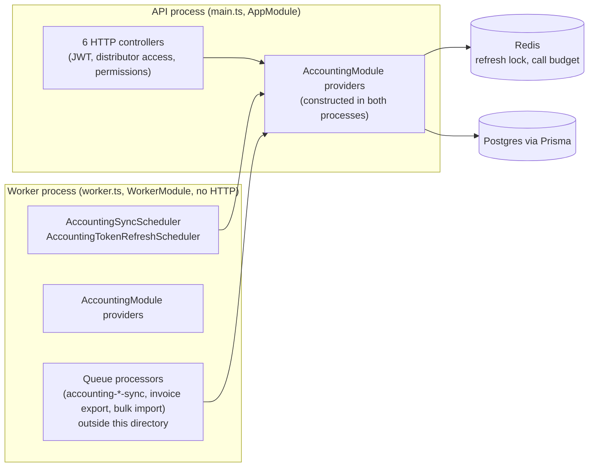
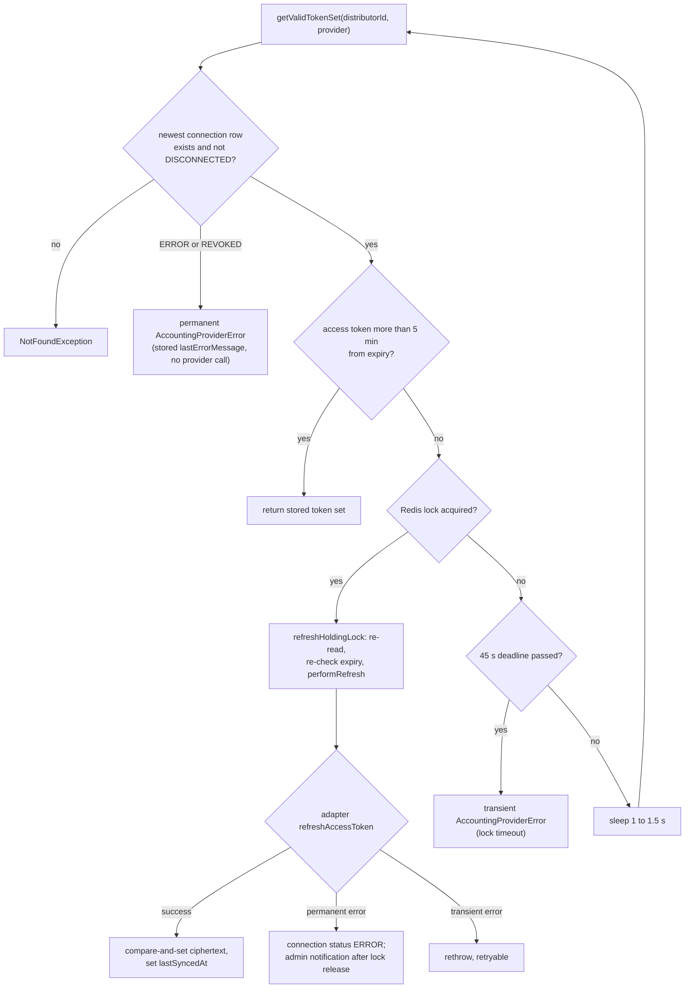
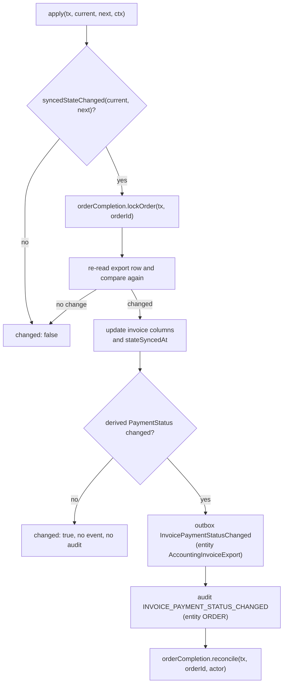
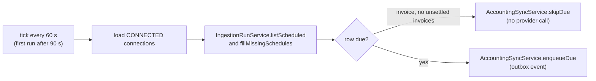

# C4 Code Level: Accounting Core (`apps/api/src/accounting/`)

## Overview

- **Name**: Accounting integration core (provider-neutral framework, with the Xero OAuth edge and the invoice payment state writer)
- **Description**: The files directly in `apps/api/src/accounting/` plus `dto/`. They hold the connection and OAuth lifecycle, token encryption and refresh, provider call budget and failure classification, the organisation scope rule, the HTTP surface for contacts / products / tax types / invoice export, the single writer of invoice payment state, derived payment status, and the sync scheduler.
- **Location**: `apps/api/src/accounting/` (excluding `adapters/`, `sync/`, `matching/`, and the `*.spec.ts` files)
- **Language**: TypeScript (NestJS, Prisma, BullMQ, ioredis)
- **Purpose**: Connect a distributor to an accounting provider (Xero today), keep the provider's contacts, products and tax rates cached and matched to Stocdup records, export orders as invoices, sync invoice payment status back, and expose the admin HTTP API for all of it. Provider-specific behaviour is behind `AccountingConnectionAdapter` (in `adapters/`, documented elsewhere).

Sub-directories and files documented by other agents (referenced, not described here):

- `apps/api/src/accounting/adapters/` (port interface, `AccountingAdapterRegistry`, `XeroAccountingAdapter`, `AccountingProviderError`)
- `apps/api/src/accounting/sync/` (`AccountingSyncService`, pull base processors, `accounting-sync.constants.ts`)
- `apps/api/src/accounting/matching/` (contact / product / tax type matcher services)

## Code Elements

Process column: **API** = served by `apps/api` (`main.ts`, `AppModule`); **Worker** = runs in `worker.ts` (`WorkerModule`); **Both** = provided by `AccountingModule`, which both root modules import, so the class is constructed in both processes.

### 1. Connection and OAuth

#### `AccountingConnectionController` (controller)

- **Kind**: HTTP controller
- **Location**: `apps/api/src/accounting/accounting-connection.controller.ts:23` (`@Controller('distributors/:distributorId/accounting')` at line 22)
- **Group**: framework (provider-neutral), except the authorization-url route at lines 45-52, which is the Xero implementation edge (see Provider-neutrality)
- **Process**: API
- **Class guards** (line 21): `JwtAuthGuard`, `DistributorAccessGuard`, `PermissionsGuard`
- **Routes** (prefixed `/api/v1` by the global prefix in `main.ts:13`):

| Method and path | Handler (line) | Permission | Calls |
|---|---|---|---|
| `GET /distributors/:distributorId/accounting/connection` | `getConnection` (33) | `ACCOUNTING_READ` (30) | `AccountingConnectionService.getConnectionStatus`; sets 204 when null |
| `POST /distributors/:distributorId/accounting/connections/xero/authorization-url` | `createXeroAuthorizationUrl` (48) | `ACCOUNTING_MANAGE` (46) | `createAuthorizationUrl(distributorId, req.user.sub, AccountingProvider.XERO)` |
| `PATCH /distributors/:distributorId/accounting/connection` | `updateConnectionSettings` (58) | `ACCOUNTING_MANAGE` (56) | `updateConnectionSettings(distributorId, dto)` |
| `DELETE /distributors/:distributorId/accounting/connection` | `disconnect` (68) | `ACCOUNTING_MANAGE` (66) | `disconnect(distributorId)` |
| `POST /distributors/:distributorId/accounting/sync` | `requestSync` (75) | `ACCOUNTING_IMPORT` (73) | `AccountingSyncService.requestSync(distributorId, IngestionRunTrigger.MANUAL)` |
| `GET /distributors/:distributorId/accounting/sync/status` | `getSyncStatus` (82) | `ACCOUNTING_READ` (80) | `AccountingSyncService.getStatus(distributorId)` |

- **Dependencies**: `AccountingConnectionService`, `AccountingSyncService`

#### `XeroCallbackController` (controller)

- **Kind**: HTTP controller, internal only
- **Location**: `apps/api/src/accounting/xero-callback.controller.ts:16` (`@Controller('accounting/xero')` at line 15; `@ApiExcludeController()` at line 14)
- **Group**: Xero implementation (named Xero; OAuth browser-redirect edge)
- **Process**: API
- **Guards**: none. The handler is unauthenticated by design (comment lines 7-13: the call is server-to-server from `apps/admin-api`; trust is the single-use `AccountingOAuthState` row).
- **Route**: `POST /api/v1/accounting/xero/callback`, handler `callback(@Body() body: XeroCallbackDto)` (line 20-21)
- **Behaviour**: calls `handleCallback(body.callbackUrl, body.code, body.state)`. Returns `{ status: 'connected' }`, or `{ status: 'error', reason }` where `reason` is `err.reason` for `AccountingOAuthError` and the literal `'unknown'` for any other exception.
- **Dependencies**: `AccountingConnectionService`, `XeroCallbackDto`, `AccountingOAuthError`

#### `AccountingConnectionService` (service)

- **Kind**: service (framework, provider-neutral in logic; provider is passed in as `AccountingProvider` and resolved through the adapter registry)
- **Location**: `apps/api/src/accounting/accounting-connection.service.ts:36`
- **Process**: Both (API for HTTP calls; Worker via `AccountingTokenRefreshScheduler` and the pull/export processors that call `getValidTokenSet`)
- **Constants**: `STATE_TTL_MS = 10 min` (line 22), `REFRESH_BUFFER_MS = 5 min` (26), `WAITER_DEADLINE_MS = 45 s` (31), `POLL_BASE_MS = 1 s` (32), `POLL_JITTER_MS = 500` (33)
- **Public methods**:
  - `getConnectionStatus(distributorId: string)` (49): status view of the CONNECTED-or-ERROR connection, or `null`.
  - `updateConnectionSettings(distributorId: string, settings: { invoiceExportTargetStatus: AccountingInvoiceTargetStatus })` (58): writes `AccountingOrganisation.invoiceExportTargetStatus`; throws `NotFoundException` if no connection.
  - `getCurrentConnection(distributorId: string)` (76): returns the CONNECTED-or-ERROR connection row (with organisation) or `null`; used by `AccountingSyncService.getStatus`.
  - `getActiveConnectionOrThrow(distributorId: string): Promise<AccountingConnectionWithOrganisation>` (82): CONNECTED only; `NotFoundException` otherwise; used by `AccountingSyncService.requestSync`.
  - `createAuthorizationUrl(distributorId: string, connectedByUserId: string, provider: AccountingProvider): Promise<{ authorizationUrl: string }>` (121): writes an `AccountingOAuthState` row (random 32-byte hex state, 10-minute expiry), then `adapters.get(provider).buildAuthorizationUrl(state)`.
  - `handleCallback(callbackUrl: string, code: string | undefined, state: string | undefined): Promise<void>` (142): see the OAuth flow below.
  - `getValidTokenSet(distributorId: string, provider: AccountingProvider): Promise<AccountingTokenSet>` (284): the only token gateway (see the token flow diagram).
  - `disconnect(distributorId: string): Promise<void>` (572): sets the CONNECTED row to DISCONNECTED; `NotFoundException` if none.
- **Private methods**: `findCurrentConnection(distributorId)` (96, orders by `connectedAt desc`, statuses CONNECTED or ERROR); `toConnectionStatus` (110); `sleep` (333); `refreshHoldingLock(lock, connectionId, distributorId)` (341); `performRefresh(connection, currentTokenSet, distributorId)` (393); `notifyReconnectNeeded(distributorId, provider, error)` (503).
- **Behaviour of `handleCallback`** (142-269): consumes the state row (`findUnique` then `delete`) before any external call; checks expiry; `code` missing → `access_denied`; calls `adapter.exchangeCodeForToken(callbackUrl, state)` and `adapter.listAvailableOrganisations(tokenSet)` (failure → `exchange_failed`); zero organisations → `no_organisation`; more than one → logs a warning and uses the first. In a transaction: upserts `AccountingOrganisation` on `(distributorId, provider, externalOrganisationId)` and refreshes its name; retires all CONNECTED/ERROR connections for the distributor (status DISCONNECTED); creates a new CONNECTED `AccountingConnection` with `scopes = tokenSet.scope` and the encrypted token JSON.
- **Behaviour of `getValidTokenSet`**: reads the newest connection for `(distributorId, provider)` (any status). Missing or DISCONNECTED → `NotFoundException`. ERROR or REVOKED → permanent `AccountingProviderError` built from `lastErrorMessage` (no provider call). Otherwise decrypts; returns the stored set when more than 5 minutes of life remain; otherwise acquires the Redis lock (see `AccountingRefreshLockService`) and refreshes. Lock not acquired → sleeps 1 to 1.5 s and loops until 45 s, then throws a transient `AccountingProviderError('Timed out waiting for the accounting refresh lock', true)`.
- **Behaviour of `performRefresh`**: calls `adapters.get(provider).refreshAccessToken(currentTokenSet)`. Non-`AccountingProviderError` failures are wrapped as transient. Permanent failure → `AccountingConnection` set to ERROR with `lastErrorAt` and `lastErrorMessage`. Success → encrypts the new set and writes it with `updateMany` predicated on the old ciphertext and status CONNECTED, also setting `lastSyncedAt`. A zero-row result logs `accounting.connection.refresh_race_lost`, re-reads, and returns the newer credential if still valid, else throws transient.
- **Behaviour of `notifyReconnectNeeded`**: runs only after the lock is released (in `finally`). Calls `AdminNotificationsService.notifyOrganisationAdmins` with type `ACCOUNTING_CONNECTION_NEEDS_RECONNECT`, link `/integrations/accounting`, and provider display name from `adapters.displayName(provider)`. Unless the error code is `invalid_client` (logged as an application-credential error, no email), it emails each DISTRIBUTOR_ADMIN membership through `MailService.sendAccountingConnectionNeedsReconnect`. Email failures are logged per user id.
- **Dependencies**:
  - Prisma models: `AccountingConnection`, `AccountingOrganisation`, `AccountingOAuthState`, `Membership`, `Organisation`
  - Services: `PrismaService`, `TokenEncryptionService`, `AccountingAdapterRegistry` (`get`, `displayName`), `AccountingRefreshLockService`, `AdminNotificationsService`, `MailService`, `ConfigService` (`ADMIN_URL`, required)
  - Errors and types: `AccountingOAuthError`, `AccountingProviderError`, `AccountingTokenSet`, `CONNECTION_WITH_ORGANISATION`

#### `AccountingOAuthError` (error type)

- **Kind**: error class
- **Location**: `apps/api/src/accounting/accounting-oauth.error.ts:8` (type `AccountingOAuthErrorReason` at line 1)
- **Group**: framework (provider-neutral)
- **Process**: API (thrown by `handleCallback`, mapped by `XeroCallbackController`)
- **Reasons**: `'access_denied' | 'invalid_state' | 'expired_state' | 'no_organisation' | 'exchange_failed'`
- **Shape**: `constructor(public readonly reason: AccountingOAuthErrorReason, message?: string)` (line 9)

#### `TokenEncryptionService` (service)

- **Kind**: service / utility
- **Location**: `apps/api/src/accounting/token-encryption.service.ts:10`
- **Group**: framework (provider-neutral)
- **Process**: Both
- **Constants**: `ALGORITHM = 'aes-256-gcm'`, `IV_LENGTH = 12`, `KEY_LENGTH = 32` (lines 5-7)
- **Constructor**: `constructor(config: ConfigService)` (13). Reads `ACCOUNTING_TOKEN_ENCRYPTION_KEY` (required, base64). Throws at construction unless it decodes to 32 bytes.
- **Public methods**:
  - `encrypt(plaintext: string): string` (22): random IV; output is `iv:authTag:ciphertext`, each part base64.
  - `decrypt(payload: string): string` (30): splits on `:`, sets the auth tag, returns UTF-8 plaintext. Throws on tampering (GCM auth failure).
- **Dependencies**: `ConfigService`, Node `crypto`

#### `AccountingRefreshLockService` and `AccountingRefreshLock` (service and lock handle)

- **Kind**: service plus a handle class in the same file
- **Location**: `apps/api/src/accounting/accounting-refresh-lock.service.ts`. Constants: `KEY_PREFIX = 'wholo:accounting-refresh:'` (7), `COMMAND_TIMEOUT_MS = 3_000` (8), `ACCOUNTING_REFRESH_LOCK_TTL_MS = 15_000` (14, exported). Lua `RELEASE_SCRIPT` (19), `RENEW_SCRIPT` (29). `AccountingRefreshLock` class (40). `AccountingRefreshLockService` class (88).
- **Group**: framework (provider-neutral)
- **Process**: Both
- **`AccountingRefreshLockService`**:
  - `constructor(config: ConfigService)` (92): Redis client from `REDIS_URL` (default `redis://localhost:6379`), `commandTimeout` 3 s, `maxRetriesPerRequest: 3`.
  - `tryAcquire(connectionId: string, ttlMs: number = ACCOUNTING_REFRESH_LOCK_TTL_MS): Promise<AccountingRefreshLock | null>` (107): `SET key token NX PX ttl`. Returns `null` when held by someone else and also when Redis errors (fail closed).
  - `onModuleDestroy(): Promise<void>` (123): quits the client.
- **`AccountingRefreshLock`**:
  - `constructor(client, key, ownerToken, ttlMs, logger)` (43): starts a renewal interval every `floor(ttl / 3)` ms, unref'd.
  - `release(): Promise<void>` (64): clears the timer and runs the compare-and-delete script. Errors are logged, not thrown.
  - Renewal uses the compare-and-`PEXPIRE` script (`renew`, 56).
- **Key**: `wholo:accounting-refresh:<connectionId>`
- **Dependencies**: `ConfigService`, `ioredis`, `redisConnectionFromUrl` (`apps/api/src/queues/redis-connection`), Node `crypto.randomUUID`

#### `AccountingTokenRefreshScheduler` (scheduler)

- **Kind**: scheduler
- **Location**: `apps/api/src/accounting/accounting-token-refresh.scheduler.ts:20`
- **Group**: framework (provider-neutral)
- **Process**: Worker only (registered in `worker.module.ts:182`)
- **Constant**: `DORMANCY_THRESHOLD_MS = 25 days` (line 15)
- **Methods**:
  - `onModuleInit(): Promise<void>` (31): runs `tick()` once at startup.
  - `tick(): Promise<void>` (36, `@Interval(DAY_MS)` at line 35): re-entrancy guarded.
  - `refreshDormantConnections(): Promise<void>` (46): selects CONNECTED connections whose `lastSyncedAt` is null or older than 25 days, and calls `AccountingConnectionService.getValidTokenSet` for each, logging failures per connection. Because `getValidTokenSet` refreshes only when the stored access token has under 5 minutes left, a dormant connection (whose token has long expired) is refreshed.
- **Dependencies**: `PrismaService`, `AccountingConnectionService`, `@nestjs/schedule`

### 2. Provider call control

#### `AccountingCallBudgetService` (service)

- **Kind**: service
- **Location**: `apps/api/src/accounting/accounting-call-budget.service.ts:47`. Constants: `KEY_PREFIX = 'wholo:accounting-call-budget:'` (9), `WINDOW_MS = 60_000` (10), `COMMAND_TIMEOUT_MS = 3_000` (11), `MAX_BUDGET_WAIT_MS = 20_000` (14, exported), `WAIT_JITTER_MS = 250` (15), `CALL_BUDGET_EXHAUSTED = 'CALL_BUDGET_EXHAUSTED'` (17, exported). Lua `ACQUIRE_SCRIPT` (23): sliding-window sorted set scored by Redis `TIME`.
- **Group**: framework (provider-neutral, ADR-071)
- **Process**: Both
- **Public methods**:
  - `constructor(config: ConfigService)` (51): Redis client, `commandTimeout` 3 s, `maxRetriesPerRequest: 1`.
  - `acquire(provider: string, externalOrgId: string, perMinute: number): Promise<void>` (61): loops on the Lua script. Admitted → returns. Wait would exceed `MAX_BUDGET_WAIT_MS` → throws `AccountingProviderError(message, true, undefined, 'CALL_BUDGET_EXHAUSTED', { retryAfterMs: waitMs })`. Otherwise sleeps `waitMs` plus up to 250 ms of jitter and retries. A Redis error logs `accounting.call_budget.unavailable` and returns (fail open).
  - `protected sleep(ms: number): Promise<void>` (92).
  - `onModuleDestroy(): Promise<void>` (96).
- **Key**: `wholo:accounting-call-budget:<provider>:<externalOrgId>`
- **Dependencies**: `ConfigService`, `ioredis`, `redisConnectionFromUrl`, `AccountingProviderError` (`adapters/`, constructor as called here: `(message, transient, cause?, code?, details?)`), `loggableError`

#### `computeAccountingBackoff`, `accountingBackoffStrategy`, `ACCOUNTING_WORKER_SETTINGS`, `ACCOUNTING_BACKOFF_TYPE` (utility)

- **Kind**: utility functions and constants
- **Location**: `apps/api/src/accounting/accounting-backoff.ts`
  - `ACCOUNTING_BACKOFF_TYPE = 'accounting'` (line 6)
  - `computeAccountingBackoff(attemptsMade: number, err?: Error, random: () => number = Math.random): number` (21)
  - `accountingBackoffStrategy(attemptsMade: number, _type?: string, err?: Error): number` (32): BullMQ `BackoffStrategy` signature
  - `ACCOUNTING_WORKER_SETTINGS = { settings: { backoffStrategy: accountingBackoffStrategy } }` (37)
- **Group**: framework (provider-neutral)
- **Process**: Worker (applied on the BullMQ processors that call providers)
- **Behaviour**: when the error is an `AccountingProviderError` with `retryAfterMs` ≥ 0, the delay is `retryAfterMs + floor(random * 5000)`. Otherwise `30 s * 2^(max(0, attemptsMade - 1))`, raised to at least 120 s when `err.outcomeUnknown` is true. The Retry-After branch does not apply the 120 s floor.
- **Dependencies**: `AccountingProviderError` getters `retryAfterMs` and `outcomeUnknown` (`adapters/accounting-provider.error.ts:47,51`)

#### `classifyJobFailure`, `isLastAttempt`, `JobFailure` (utility)

- **Kind**: utility functions and interface
- **Location**: `apps/api/src/accounting/accounting-job-failure.ts`
  - `interface JobFailure` (19): `providerError: AccountingProviderError | null`, `permanent: boolean`, `lastAttempt: boolean`, `budgetWait: boolean`
  - `isLastAttempt(job: Pick<Job, 'attemptsMade' | 'opts'>): boolean` (27): `(attemptsMade ?? 0) + 1 >= (opts?.attempts ?? 1)`
  - `classifyJobFailure(err: unknown, job: Pick<Job, 'attemptsMade' | 'opts'>): JobFailure` (31)
- **Group**: framework (provider-neutral; ADR-071)
- **Process**: Worker (used by the pull base and the invoice export processor)
- **Behaviour**: non-`AccountingProviderError` values are treated as transient (`permanent: false`, `providerError: null`). `budgetWait` is true when the code is `CALL_BUDGET_EXHAUSTED`.
- **Dependencies**: `AccountingProviderError`, `CALL_BUDGET_EXHAUSTED`, BullMQ `Job` type (type-only import)

### 3. Organisation scope

#### `accounting-organisation.ts` (utility)

- **Kind**: constants, types and a scope helper
- **Location**: `apps/api/src/accounting/accounting-organisation.ts`
  - `CONNECTION_WITH_ORGANISATION = { organisation: true } satisfies Prisma.AccountingConnectionInclude` (11)
  - `type AccountingConnectionWithOrganisation` (13): payload type with `organisation`
  - `organisationScope(connection: Pick<AccountingConnection, 'distributorId' | 'accountingOrganisationId'>): { distributorId: string; accountingOrganisationId: string }` (20)
- **Group**: framework (provider-neutral; ADR-074)
- **Process**: Both
- **Use**: every query over organisation-owned accounting data spreads `organisationScope(connection)` (contact, product, tax type services; the sync base classes; the bulk import processor).
- **Dependencies**: Prisma types only

### 4. Contacts, products and tax types

Each of the three record types has a controller (HTTP) and a service (business logic). The services share a pattern: a `listX` method with cursor pagination (`createdAt desc`, `id desc`), an in-memory path when a computed status filter is applied, a `countNeedsAttention`, the suggestion and mapping mutations, and `formatX` that computes a status. The status is derived, not stored.

#### `AccountingContactController` (controller)

- **Location**: `apps/api/src/accounting/accounting-contact.controller.ts:24` (`@Controller('distributors/:distributorId/accounting/contacts')` at line 23)
- **Group**: framework (provider-neutral)
- **Process**: API
- **Class guards** (line 22): `JwtAuthGuard`, `DistributorAccessGuard`, `PermissionsGuard`

| Method and path (under `/api/v1/distributors/:distributorId/accounting/contacts`) | Handler (line) | Permission (line) | Delegates to |
|---|---|---|---|
| `GET /` | `listContacts(distributorId, query: ContactQueryDto)` (30) | `ACCOUNTING_READ` (28) | `listContacts` |
| `GET /needs-attention-count` | `countNeedsAttention` (37) | `ACCOUNTING_READ` (35) | `countNeedsAttention` → `{ count }` |
| `POST /:externalContactId/import` | `importAsNewCustomer` (44) | `ACCOUNTING_IMPORT` (42) | `importAsNewCustomer(distributorId, userId, externalContactId, dto)` |
| `POST /suggestions/:suggestionId/confirm` | `confirmSuggestion` (56) | `ACCOUNTING_IMPORT` (54) | `confirmSuggestion(distributorId, userId, suggestionId)` |
| `POST /:externalContactId/match` | `matchToExistingCustomer` (67) | `ACCOUNTING_IMPORT` (65) | `matchToExistingCustomer(distributorId, userId, externalContactId, dto.tradeRelationshipId)` |
| `POST /:externalContactId/ignore` | `ignore` (79) | `ACCOUNTING_IMPORT` (77) | `ignore(distributorId, userId, externalContactId)` |
| `POST /mappings/:mappingId/unlink` | `unlink` (90) | `ACCOUNTING_IMPORT` (88) | `unlink(distributorId, mappingId)` |
| `POST /:externalContactId/acknowledge-change` | `acknowledgeChange` (97) | `ACCOUNTING_IMPORT` (95) | `acknowledgeChange(distributorId, externalContactId)` |
| `POST /bulk-import` | `requestBulkImport` (107) | `ACCOUNTING_IMPORT` (105) | `requestBulkImport(distributorId, userId, dto)` |
| `GET /bulk-import-jobs/:jobId` | `getBulkImportJob` (118) | `ACCOUNTING_READ` (116) | `getBulkImportJob(distributorId, jobId)` |

- **Dependencies**: `AccountingContactService`, DTOs in `dto/` (see the DTO section)

#### `AccountingContactService` (service)

- **Location**: `apps/api/src/accounting/accounting-contact.service.ts:41`
- **Exports at module top**: `contactInclude` (25), `type ContactRow` (38)
- **Group**: framework (provider-neutral)
- **Process**: Both (HTTP via the controller; the bulk import processor reuses `formatContact`, `findConflictedTradeRelationshipIds`, and `resolveExternalIdsForFilter`)
- **Public methods**:
  - `listContacts(distributorId: string, query: ContactQueryDto)` (50): returns `{ data, pagination: { nextCursor, hasMore, total } }`. Filters: `search` (displayName or email, case-insensitive), `type` (customers, suppliers, archived; OR'd), `status` (in-memory after a full fetch).
  - `countNeedsAttention(distributorId: string): Promise<number>` (186): suggested-and-unmapped plus ready-to-import (customer, not archived, not ignored, unmapped, no suggestion). Returns 0 with no CONNECTED connection.
  - `resolveExternalIdsForFilter(distributorId: string, filter: { status?; type?; search? }): Promise<string[]>` (220): unpaginated list of matching ids for "select all" bulk import.
  - `requestBulkImport(distributorId: string, userId: string, dto: BulkImportContactSelectionDto): Promise<{ jobId: string }>` (258): creates an `AccountingBulkImportJob` (`recordType CONTACT`, `selection` = `{ids}` or `{filter}`) and writes an outbox event. `BadRequestException` if neither ids nor filter is given.
  - `getBulkImportJob(distributorId: string, jobId: string)` (285): job row filtered by `distributorId` and `recordType`.
  - `importAsNewCustomer(distributorId: string, userId: string, externalContactId: string, dto: ImportContactDto)` (295): calls `AdminCustomersService.create(distributorId, {...}, 'ACCOUNTING_IMPORT')` using DTO values falling back to the cached contact, then creates a MANUAL mapping.
  - `confirmSuggestion(distributorId: string, userId: string, suggestionId: string)` (340): creates the mapping from the suggestion and marks it ACCEPTED, in one transaction.
  - `matchToExistingCustomer(distributorId: string, userId: string, externalContactId: string, tradeRelationshipId: string): Promise<void>` (368): MANUAL mapping to a `TradeRelationship` of this distributor; supersedes any SUGGESTED suggestion for the contact.
  - `ignore(distributorId: string, userId: string, externalContactId: string): Promise<void>` (406): sets `ignoredAt` and rejects open suggestions.
  - `unlink(distributorId: string, mappingId: string): Promise<void>` (423): sets `unlinkedAt`.
  - `acknowledgeChange(distributorId: string, externalContactId: string): Promise<void>` (441): sets `changeAcknowledgedAt`.
  - `findConflictedTradeRelationshipIds(accountingOrganisationId: string): Promise<Set<string>>` (509): targets with more than one SUGGESTED suggestion (status CONFLICT).
  - `formatContact(row: ContactRow, conflictedTradeRelationshipIds: Set<string>)` (521): derives `status`. Precedence: `LINKED` > `CONFLICT` > `SUGGESTED` > `IGNORED` > `ARCHIVED` > `NOT_A_CUSTOMER` > `READY_TO_IMPORT`.
- **Private methods**: `paginateFilteredMatches` (151), `createMapping` (450), `getActiveConnection` (465), `getContactOrThrow` (475, scoped by `accountingOrganisationId`), `assertContactNotMapped` (485), `assertTradeRelationshipNotMapped` (494), `logMappingAction` (579)
- **Dependencies**: `PrismaService`; `OutboxService.writeEvent`; `AdminCustomersService.create`; Prisma models `ExternalAccountingContact`, `CustomerAccountingMapping`, `AccountingContactMatchSuggestion`, `AccountingBulkImportJob`, `TradeRelationship`, `AccountingConnection`

#### `AccountingProductController` (controller)

- **Location**: `apps/api/src/accounting/accounting-product.controller.ts:25` (`@Controller('distributors/:distributorId/accounting/products')` at line 24)
- **Group**: framework (provider-neutral)
- **Process**: API
- **Class guards** (line 23): `JwtAuthGuard`, `DistributorAccessGuard`, `PermissionsGuard`

| Method and path (under `/api/v1/distributors/:distributorId/accounting/products`) | Handler (line) | Permission (line) | Delegates to |
|---|---|---|---|
| `GET /` | `listProducts(distributorId, query: ProductQueryDto)` (31) | `ACCOUNTING_READ` (29) | `listProducts` |
| `GET /needs-attention-count` | `countNeedsAttention` (38) | `ACCOUNTING_READ` (36) | `countNeedsAttention` |
| `POST /:externalProductId/import` | `importAsNewProduct` (45) | `ACCOUNTING_IMPORT` (43) | `importAsNewProduct(distributorId, userId, externalProductId, dto)` |
| `POST /suggestions/:suggestionId/confirm` | `confirmSuggestion` (57) | `ACCOUNTING_IMPORT` (55) | `confirmSuggestion(distributorId, userId, suggestionId, dto.confirmTaxTypeOverride)` |
| `POST /:externalProductId/match` | `matchToExistingProduct` (69) | `ACCOUNTING_IMPORT` (67) | `matchToExistingProduct(distributorId, userId, externalProductId, dto.productId, dto.confirmTaxTypeOverride)` |
| `POST /:externalProductId/ignore` | `ignore` (87) | `ACCOUNTING_IMPORT` (85) | `ignore(distributorId, userId, externalProductId)` |
| `POST /mappings/:mappingId/unlink` | `unlink` (98) | `ACCOUNTING_IMPORT` (96) | `unlink(distributorId, mappingId)` |
| `POST /:externalProductId/acknowledge-change` | `acknowledgeChange` (105) | `ACCOUNTING_IMPORT` (103) | `acknowledgeChange(distributorId, externalProductId)` |
| `POST /bulk-import` | `requestBulkImport` (115) | `ACCOUNTING_IMPORT` (113) | `requestBulkImport(distributorId, userId, dto)` |
| `GET /bulk-import-jobs/:jobId` | `getBulkImportJob` (126) | `ACCOUNTING_READ` (124) | `getBulkImportJob(distributorId, jobId)` |

- **Dependencies**: `AccountingProductService`, DTOs in `dto/`

#### `AccountingProductService` (service)

- **Location**: `apps/api/src/accounting/accounting-product.service.ts:43`
- **Exports at module top**: `productInclude` (27), `type ProductRow` (40)
- **Group**: framework (provider-neutral)
- **Process**: Both
- **Public methods**:
  - `listProducts(distributorId: string, query: ProductQueryDto)` (53): same pagination shape as contacts. Filters: `search` (displayName or externalProductCode), `type` (`sold`, `purchased`, `tracked` flags, OR'd), `status`.
  - `countNeedsAttention(distributorId: string): Promise<number>` (189): suggested-and-unmapped plus ready-to-import (`isSold`, `isActive`, not ignored, unmapped, no suggestion).
  - `resolveExternalIdsForFilter(distributorId: string, filter: { status?; type?; search? }): Promise<string[]>` (223)
  - `requestBulkImport(distributorId: string, userId: string, dto: BulkImportProductSelectionDto): Promise<{ jobId: string }>` (261)
  - `getBulkImportJob(distributorId: string, jobId: string)` (288)
  - `importAsNewProduct(distributorId: string, userId: string, externalProductId: string, dto: ImportProductDto)` (298): SKU pre-check (`ConflictException` for an existing product with the SKU, including soft-deleted ones). Creates the Wholo product through `AdminProductsService.create` with `status: ProductStatus.DRAFT`, `price` from the DTO or else `external.salesUnitPrice.toFixed(2)` (line 345), and `taxTypeId` from `AccountingTaxTypeService.resolveTaxTypeForCode`. Then creates a MANUAL mapping. See the Notes section on the price default.
  - `confirmSuggestion(distributorId: string, userId: string, suggestionId: string, confirmTaxTypeOverride = false): Promise<void>` (362): mapping plus ACCEPTED, in a transaction, then optional tax type update via `AdminProductsService.update`.
  - `matchToExistingProduct(distributorId: string, userId: string, externalProductId: string, productId: string, confirmTaxTypeOverride = false): Promise<void>` (412): MANUAL mapping; supersedes SUGGESTED suggestions; optional tax type update.
  - `ignore(distributorId: string, userId: string, externalProductId: string): Promise<void>` (492)
  - `unlink(distributorId: string, mappingId: string): Promise<void>` (509)
  - `acknowledgeChange(distributorId: string, externalProductId: string): Promise<void>` (527)
  - `findConflictedProductIds(accountingOrganisationId: string): Promise<Set<string>>` (595)
  - `formatProduct(row: ProductRow, conflictedProductIds: Set<string>)` (607): `status` precedence: `LINKED` > `CONFLICT` > `SUGGESTED` > `IGNORED` > `INACTIVE` > `NOT_SOLD` > `READY_TO_IMPORT`. Prices and quantities are returned as strings (`toString()`).
- **Private methods**: `paginateFilteredMatches` (154), `resolveTaxTypeForMatch(accountingOrganisationId, externalTaxCode, currentTaxType, confirmTaxTypeOverride): Promise<string | undefined>` (472), `createMapping` (536), `getActiveConnection` (551), `getProductOrThrow` (561), `assertExternalProductNotMapped` (571), `assertProductNotMapped` (580), `logMappingAction` (665)
- **Tax conflict rule** (`resolveTaxTypeForMatch`, 472-490): when the resolved tax type differs from the product's current tax type and `confirmTaxTypeOverride` is false, throws `ConflictException({ message, error: 'TAX_TYPE_CONFLICT' })`.
- **Dependencies**: `PrismaService`, `OutboxService.writeEvent`, `AdminProductsService` (`create`, `update`), `AccountingTaxTypeService` (`resolveTaxTypeForCode`); Prisma models `ExternalAccountingProduct`, `ProductAccountingMapping`, `AccountingProductMatchSuggestion`, `AccountingBulkImportJob`, `Product`, `TaxType`

#### `AccountingTaxTypeController` (controller)

- **Location**: `apps/api/src/accounting/accounting-tax-type.controller.ts:23` (`@Controller('distributors/:distributorId/accounting/tax-types')` at line 22)
- **Group**: framework (provider-neutral)
- **Process**: API
- **Class guards** (line 21): `JwtAuthGuard`, `DistributorAccessGuard`, `PermissionsGuard`
- **No bulk-import route** (the tax type service has no bulk import).

| Method and path (under `/api/v1/distributors/:distributorId/accounting/tax-types`) | Handler (line) | Permission (line) | Delegates to |
|---|---|---|---|
| `GET /` | `listTaxTypes(distributorId, query: TaxTypeQueryDto)` (29) | `ACCOUNTING_READ` (27) | `listTaxTypes` |
| `GET /needs-attention-count` | `countNeedsAttention` (36) | `ACCOUNTING_READ` (34) | `countNeedsAttention` |
| `POST /:externalTaxTypeId/import` | `importAsNewTaxType` (43) | `ACCOUNTING_IMPORT` (41) | `importAsNewTaxType(distributorId, userId, externalTaxTypeId, dto)` |
| `POST /suggestions/:suggestionId/confirm` | `confirmSuggestion` (55) | `ACCOUNTING_IMPORT` (53) | `confirmSuggestion(distributorId, userId, suggestionId)` |
| `POST /:externalTaxTypeId/match` | `matchToExistingTaxType` (66) | `ACCOUNTING_IMPORT` (64) | `matchToExistingTaxType(distributorId, userId, externalTaxTypeId, dto.taxTypeId)` |
| `POST /:externalTaxTypeId/ignore` | `ignore` (78) | `ACCOUNTING_IMPORT` (76) | `ignore(distributorId, userId, externalTaxTypeId)` |
| `POST /mappings/:mappingId/unlink` | `unlink` (89) | `ACCOUNTING_IMPORT` (87) | `unlink(distributorId, mappingId)` |
| `POST /:externalTaxTypeId/acknowledge-change` | `acknowledgeChange` (96) | `ACCOUNTING_IMPORT` (94) | `acknowledgeChange(distributorId, externalTaxTypeId)` |

- **Dependencies**: `AccountingTaxTypeService`, DTOs in `dto/`

#### `AccountingTaxTypeService` (service)

- **Location**: `apps/api/src/accounting/accounting-tax-type.service.ts:38`
- **Module-level declarations**: `taxTypeInclude` (14, not exported), `type TaxTypeRow` (27), `type AccountingTaxTypeStatus` (29)
- **Group**: framework (provider-neutral; the comments mention Xero at lines 123-125)
- **Process**: Both
- **Public methods**:
  - `listTaxTypes(distributorId: string, query: TaxTypeQueryDto)` (46): cursor pagination only; no filters.
  - `countNeedsAttention(distributorId: string): Promise<number>` (95): suggested-and-unmapped plus active, unignored, unmapped, no suggestion.
  - `importAsNewTaxType(distributorId: string, userId: string, externalTaxTypeId: string, dto: ImportTaxTypeDto)` (127): calls `TaxTypesService.create(distributorId, { name, classification, ratePercentage })` where `ratePercentage` falls back to `external.ratePercentage.toFixed(2)`. Then creates a MANUAL mapping.
  - `confirmSuggestion(distributorId: string, userId: string, suggestionId: string)` (155)
  - `matchToExistingTaxType(distributorId: string, userId: string, externalTaxTypeId: string, taxTypeId: string)` (183): `TaxType` must belong to this distributor; supersedes SUGGESTED suggestions.
  - `ignore(distributorId: string, userId: string, externalTaxTypeId: string): Promise<void>` (219)
  - `unlink(distributorId: string, mappingId: string): Promise<void>` (236)
  - `acknowledgeChange(distributorId: string, externalTaxTypeId: string): Promise<void>` (254)
  - `resolveTaxTypeForCode(accountingOrganisationId: string, code: string | null): Promise<{ taxTypeId: string; taxTypeName: string } | null>` (269): external tax code to confirmed Stocdup `TaxType`. Used by product import and match. Also called from `AccountingProductService` with the product's `taxCode`.
  - `resolveExternalCodeForTaxType(accountingOrganisationId: string, taxTypeId: string | null): Promise<string | null>` (299): Stocdup `TaxType` to external tax code. The export side. Its consumer is outside this directory.
- **Private methods**: `createMapping` (313), `getActiveConnection` (328), `getTaxTypeOrThrow` (338), `assertExternalTaxTypeNotMapped` (348), `assertTaxTypeNotMapped` (357), `findConflictedTaxTypeIds` (370), `formatTaxType` (379), `logMappingAction` (427)
- **Status vocabulary** (`formatTaxType`, 379-400): `LINKED` > `CONFLICT` > `SUGGESTED` > `IGNORED` > `INACTIVE` > `READY_TO_IMPORT`
- **Dependencies**: `PrismaService`, `TaxTypesService` (create); Prisma models `ExternalAccountingTaxType`, `TaxTypeAccountingMapping`, `AccountingTaxTypeMatchSuggestion`, `TaxType`

#### `AccountingChangeDetectionService` (service)

- **Location**: `apps/api/src/accounting/accounting-change-detection.service.ts:32`. Interface `DetectAndFlagParams<T>` at line 5 (not exported).
- **Group**: framework (provider-neutral)
- **Process**: Worker (injected into the sync processors through the sync base class; the injection is in `AccountingModule` providers and exports)
- **Method**: `detectAndFlag<T extends Record<string, unknown>>(params: DetectAndFlagParams<T>): Promise<void>` (35)
- **Behaviour**: does nothing unless `hasActiveMapping` and `previous` are both set. Compares `params.fields` with `String(...)`. On difference it calls `markChanged()` (supplied by the caller) and `AdminNotificationsService.notifyOrganisationAdmins(distributorId, notification)`. It never changes the Wholo side of a mapping.
- **Dependencies**: `AdminNotificationsService`; Prisma `Prisma.InputJsonValue` type

### 5. Invoice export

#### `AccountingInvoiceExportController` (controller)

- **Location**: `apps/api/src/accounting/accounting-invoice-export.controller.ts:20` (`@Controller('distributors/:distributorId/accounting/invoice-exports')` at line 19)
- **Group**: framework (provider-neutral)
- **Process**: API
- **Class-level** (lines 17-18): `@RequirePermissions(Permission.ACCOUNTING_IMPORT)`, `@UseGuards(JwtAuthGuard, DistributorAccessGuard, PermissionsGuard)`

| Method and path (under `/api/v1/distributors/:distributorId/accounting/invoice-exports`) | Handler (line) | Permission | Status |
|---|---|---|---|
| `POST /:exportId/retry` | `retry(distributorId, exportId, req)` (26) | `ACCOUNTING_IMPORT` (class-level) | `@HttpCode(202)` (line 24); delegates to `retryExport(distributorId, exportId, req.user.sub)` |

- **Dependencies**: `AccountingInvoiceExportService`

#### `AccountingInvoiceExportService` (service)

- **Location**: `apps/api/src/accounting/accounting-invoice-export.service.ts:13`
- **Group**: framework (provider-neutral)
- **Process**: API (the processor that performs the export is `accounting-invoice-export/accounting-invoice-export.processor.ts`, documented elsewhere)
- **Method**: `retryExport(distributorId: string, exportId: string, userId: string): Promise<{ status: 'requested' }>` (22)
- **Behaviour**: loads the export by `{ id: exportId, distributorId }` (`NotFoundException` if missing). Status must be `FAILED` (`UnprocessableEntityException` otherwise). In one transaction it writes outbox event `AccountingInvoiceExportRequested` on entity `Order` with payload `{ orderId, distributorId, exportId }`, and an audit row `INVOICE_EXPORT_RETRY_REQUESTED` (entity `ORDER`, with the actor name from `User`). It does not touch any queue.
- **Dependencies**: `PrismaService`, `OutboxService.writeEvent`, `AuditService.record`; Prisma models `AccountingInvoiceExport`, `User`

### 6. Invoice payment state and derived payment status

#### `InvoicePaymentStateService` (service, single writer)

- **Location**: `apps/api/src/accounting/invoice-payment-state.service.ts:83`
- **Module-level declarations**: `type ExportWithOrder` (13), `interface SyncedState` (17), `sameAmount` (31, private), `sameDate` (35, private), `isoDate` (39, private), `syncedStateChanged(current: AccountingInvoiceExport, next: SyncedState): boolean` (42, exported), `interface PaymentStateContext` (57), `interface PaymentStateResult` (65)
- **Group**: framework (provider-neutral). Named in the header as the single writer of invoice payment columns (layer 8). The file is exempted from the ESLint rule that forbids other writes.
- **Process**: Worker (called by `AccountingInvoiceSyncProcessor`, outside this directory); also `Both` through the module provider
- **Constructor**: `(audit: AuditService, outbox: OutboxService, orderCompletion: OrderCompletionService)` (84-88)
- **Method**: `apply(tx: Prisma.TransactionClient, current: ExportWithOrder, next: SyncedState, ctx: PaymentStateContext): Promise<PaymentStateResult>` (90)
- **Behaviour** (in the caller's transaction):
  1. `toStatus = derivePaymentStatus(next)`. If `syncedStateChanged(current, next)` is false, return `{ changed: false }`.
  2. `orderCompletion.lockOrder(tx, current.orderId)`, then re-read the export row and compare again. If nothing changed, return `changed: false`.
  3. `update` the export row: `invoiceState`, `invoiceTotal`, `amountPaid`, `amountCredited`, `amountDue`, `issueDate`, `dueDate`, `fullyPaidOn`, `providerUpdatedAt`, `externalInvoiceStatus`, `externalInvoiceNumber` (only when non-null), `stateSyncedAt = now`.
  4. If the derived status did not change (`fromStatus === toStatus`), return `changed: true` with no event and no audit row.
  5. Otherwise write outbox event `InvoicePaymentStatusChanged` on entity `AccountingInvoiceExport`, then audit `INVOICE_PAYMENT_STATUS_CHANGED` on entity `ORDER`, then `orderCompletion.reconcile(tx, orderId, ctx.actor)`.
- **Dependencies**: `AuditService`, `OutboxService`, `OrderCompletionService` (`lockOrder`, `reconcile`, in `orders/`), `derivePaymentStatus`, `paymentStatusSummary`, `INVOICE_PAYMENT_STATUS_CHANGED`

#### `invoice-payment-status.ts` (utility module)

- **Location**: `apps/api/src/accounting/invoice-payment-status.ts`
  - `INVOICE_PAYMENT_STATUS_CHANGED = 'InvoicePaymentStatusChanged'` (line 5)
  - `type InvoicePaymentStatus = 'NOT_SYNCED' | 'UNPAID' | 'PART_PAID' | 'PAID' | 'VOID'` (17)
  - `interface InvoicePaymentFacts` (22)
  - `derivePaymentStatus(facts: InvoicePaymentFacts): InvoicePaymentStatus` (37)
  - `isOverdue(facts: InvoicePaymentFacts, today: string): boolean` (53): AWAITING_PAYMENT, amountDue > 0, dueDate before `today` (YYYY-MM-DD)
  - `SETTLED_INVOICE_STATES: AccountingInvoiceState[] = [PAID, VOIDED, DELETED]` (61)
  - `paymentStatusSummary(fromStatus, toStatus, ctx: { invoiceRef, source, amountDue?, currency? }): string` (69): timeline wording
- **Group**: framework (provider-neutral). Wording uses the `source` argument, not a provider name.
- **Process**: Both (imported by the API read models and by Worker code)
- **Derivation rules** (37-47): no state → `NOT_SYNCED`; VOIDED or DELETED → `VOID`; PAID → `PAID`; AWAITING_PAYMENT with due ≤ 0 and total > 0 → `PAID`; paid-plus-credited > 0 with due > 0 → `PART_PAID`; otherwise `UNPAID`.
- **Consumers outside this directory** (verified by grep): `orders/order-completion.service.ts`, `customer-payments/customer-payments.logic.ts`, `customer-health/customer-health.service.ts`
- **Dependencies**: `AccountingInvoiceState` (Prisma enum)

#### `order-invoice-payment.ts` (utility module)

- **Location**: `apps/api/src/accounting/order-invoice-payment.ts`
  - `invoicePaymentSelect` (8): Prisma `select` object for `AccountingInvoiceExport`
  - `toOrderInvoicePayment(row: InvoicePaymentRow | undefined, today: string): OrderInvoicePayment | null` (31): returns null unless the export is COMPLETED and `invoiceState` is set
  - `distributorTodays(prisma: PrismaService, distributorIds: string[], now: Date = new Date()): Promise<Map<string, string>>` (46): distributor-local date per id, from `DistributorSettings.timezone` (default `UTC`)
  - `paymentFilterWhere(filters: OrderPaymentFilter[], today: string): Prisma.OrderWhereInput` (116): order list filter matching any of `PAID`, `PART_PAID`, `UNPAID`, `OVERDUE`, implemented as an `invoiceExports.some` condition
  - Private: `type InvoicePaymentRow` (20), `money` (26), `isoDate` (27), `overdue` (63), `notOverdue` (71), `paymentCondition` (83)
- **Group**: framework (provider-neutral)
- **Process**: API (read models for order endpoints; consumers are `orders/orders.service.ts` and `admin-orders/admin-orders.service.ts`)
- **Dependencies**: `PrismaService`, `distributorLocalDate` (`common/distributor-local-date`), `@wholo/types` (`OrderInvoicePayment`, `OrderPaymentFilter`), `derivePaymentStatus`, `isOverdue`

### 7. Scheduling

#### `AccountingSyncScheduler` (scheduler)

- **Location**: `apps/api/src/accounting/accounting-sync.scheduler.ts:66`. Module-level: `TICK_MS = 60 s` (16), `INITIAL_DELAY_MS = 90 s` (19), `firstSlot(now: Date, connectedAt: Date, intervalMs: number, random = Math.random): Date` (25, exported), `interface TickSummary` (44, exported), private `interface SchedulerConnection` (30), `interface DueSync` (35)
- **Group**: framework (provider-neutral)
- **Process**: Worker only (`worker.module.ts:183`)
- **Methods**:
  - `onModuleInit(): void` (76): one-off `setTimeout(tick, 90 s)`, unref'd
  - `tick(): Promise<void>` (84, `@Interval(TICK_MS)` at line 83): re-entrancy guarded; catches and logs `accounting.scheduler.tick_failed`
  - `runOnce(now: Date): Promise<TickSummary>` (122): one scheduling pass
  - Private: `connectionsWithUnsettledInvoices(connections)` (103)
- **Behaviour of `runOnce`**:
  1. Loads CONNECTED connections (`id`, `distributorId`, `accountingOrganisationId`, `connectedAt`).
  2. `IngestionRunService.listScheduled('accounting', connectionIds)`.
  3. For each connection and each resource type in `ACCOUNTING_SYNC_RESOURCE_TYPES` (contact, product, tax_type, invoice): no row → due now; row without `nextRunAt` → seeded via `firstSlot` (`fillMissingSchedules`); `nextRunAt` ≤ now → due.
  4. For invoice work, keeps only connections whose organisation has a COMPLETED export with an `externalInvoiceId` whose `invoiceState` is null or not in `SETTLED_INVOICE_STATES`. Due invoice rows that already have a stored run, but no unsettled invoices, call `AccountingSyncService.skipDue(runId, 'invoice', slot, now)` with no provider call. A due invoice row without a stored run is counted as `skippedNothingToDo` and is not enqueued.
  5. Every other due row calls `AccountingSyncService.enqueueDue(distributorId, connectionId, resourceType, slot, now)`, which writes the outbox event.
  6. Logs one `accounting.scheduler.tick` line per run with the counts.
- **Intervals** (from `sync/accounting-sync.constants.ts`, documented elsewhere): contact 30 min, product 30 min, tax_type 6 h, invoice 15 min.
- **Dependencies**: `PrismaService`, `IngestionRunService` (`listScheduled`, `fillMissingSchedules`), `AccountingSyncService` (`enqueueDue`, `skipDue`), `SETTLED_INVOICE_STATES`, `@nestjs/schedule`

### 8. Module wiring

#### `AccountingModule` (module)

- **Location**: `apps/api/src/accounting/accounting.module.ts:96` (decorator at line 33)
- **Group**: framework wiring. It is one of the allowed provider-edge files, since it registers `XeroAccountingAdapter`.
- **Process**: Both (`app.module.ts:77` and `worker.module.ts:165`)
- **Imports** (34-43): `AdminCustomersModule`, `AdminProductsModule`, `TaxTypesModule`, `OutboxModule`, `IngestionRunModule`, `AuditModule`, `AdminNotificationsModule`, `OrderCompletionModule`
- **Controllers** (44-51): `AccountingConnectionController`, `AccountingContactController`, `AccountingInvoiceExportController`, `AccountingProductController`, `AccountingTaxTypeController`, `XeroCallbackController`
- **Providers** (52-69, 16 entries): the services, `AccountingRefreshLockService`, `AccountingCallBudgetService`, `TokenEncryptionService`, `AccountingAdapterRegistry`, `XeroAccountingAdapter`, and the three matcher services
- **Exports** (79-94): `IngestionRunModule`, `AccountingConnectionService`, `AccountingSyncService`, `AccountingContactService`, `AccountingProductService`, `AccountingTaxTypeService`, `AccountingAdapterRegistry`, `AccountingChangeDetectionService`, the three matcher services, `InvoicePaymentStateService`

Scheduler providers are not in this module. They are registered in `WorkerModule` (`worker.module.ts:182-183`): `AccountingTokenRefreshScheduler` and `AccountingSyncScheduler`.

### 9. DTOs (`apps/api/src/accounting/dto/`)

All DTOs are class-validator classes. One DTO is a Xero implementation edge (`XeroCallbackDto`, `dto/xero-callback.dto.ts`). The other 13 are framework (provider-neutral). Two framework DTO comments name Xero (`import-tax-type.dto.ts` lines 5-6).

| DTO (file:line) | Group | Used by (route under `/api/v1`) | Fields (validators) |
|---|---|---|---|
| `BulkImportContactSelectionDto` (`bulk-import-contact-selection.dto.ts:30`) | framework | `POST /distributors/:distributorId/accounting/contacts/bulk-import` | `ids?: string[]` (IsArray, IsString each); `filter?: BulkImportContactFilterDto` (ValidateNested; private class at line 9: `status?: string[]` IsIn contact status values, `type?: string[]` IsIn contact type values, `search?: string`); `honourSuggestions?: boolean` |
| `BulkImportProductSelectionDto` (`bulk-import-product-selection.dto.ts:30`) | framework | `POST /distributors/:distributorId/accounting/products/bulk-import` | Same shape as the contact version; filter (line 9, `BulkImportProductFilterDto`) uses product status and type values |
| `ConfirmProductSuggestionDto` (`confirm-product-suggestion.dto.ts:3`) | framework | `POST .../products/suggestions/:suggestionId/confirm` | `confirmTaxTypeOverride?: boolean` |
| `ContactQueryDto` (`contact-query.dto.ts:30`) | framework | `GET .../accounting/contacts` | `limit?: number` (1-100); `cursor?: string`; `search?: string`; `status?: AccountingContactStatusFilter[]` (comma-separated, IsIn `ACCOUNTING_CONTACT_STATUS_VALUES`); `type?: AccountingContactTypeFilter[]` (comma-separated, IsIn `customers`, `suppliers`, `archived`). Exports `ACCOUNTING_CONTACT_STATUS_VALUES` (line 5) and `ACCOUNTING_CONTACT_TYPE_VALUES` (line 20). |
| `ImportContactDto` (`import-contact.dto.ts:6`) | framework | `POST .../contacts/:externalContactId/import` | All optional strings: `name` (MinLength 1), `legalName`, `email` (IsEmail), `phone`, `accountNumber`, `billingLine1`, `billingLine2`, `billingCity`, `billingState`, `billingPostcode`, `billingCountry`, `deliveryLine1`, `deliveryLine2`, `deliveryCity`, `deliveryState`, `deliveryPostcode`, `deliveryCountry` |
| `ImportProductDto` (`import-product.dto.ts:8`) | framework | `POST .../products/:externalProductId/import` | Optional: `name` (MinLength 1), `description`, `sku`, `price` (IsDecimal, 0 to 2 decimal digits), `productTypeId`, `supplierId` |
| `ImportTaxTypeDto` (`import-tax-type.dto.ts:8`) | framework | `POST .../tax-types/:externalTaxTypeId/import` | `name?` (MinLength 1); `classification: TaxClassification` (required, IsEnum); `ratePercentage?` (IsDecimal, 0 to 2 decimal digits) |
| `MatchContactDto` (`match-contact.dto.ts:3`) | framework | `POST .../contacts/:externalContactId/match` | `tradeRelationshipId: string` (IsString, IsNotEmpty) |
| `MatchProductDto` (`match-product.dto.ts:3`) | framework | `POST .../products/:externalProductId/match` | `productId: string` (IsString, IsNotEmpty); `confirmTaxTypeOverride?: boolean` |
| `MatchTaxTypeDto` (`match-tax-type.dto.ts:3`) | framework | `POST .../tax-types/:externalTaxTypeId/match` | `taxTypeId: string` (IsString, IsNotEmpty) |
| `ProductQueryDto` (`product-query.dto.ts:30`) | framework | `GET .../accounting/products` | `limit?` (1-100); `cursor?`; `search?`; `status?: AccountingProductStatusFilter[]` (comma-separated); `type?: AccountingProductTypeFilter[]` (comma-separated, `sold`, `purchased`, `tracked`). Exports `ACCOUNTING_PRODUCT_STATUS_VALUES` (line 5) and `ACCOUNTING_PRODUCT_TYPE_VALUES` (line 20). |
| `TaxTypeQueryDto` (`tax-type-query.dto.ts:7`) | framework | `GET .../accounting/tax-types` | `limit?` (1-100); `cursor?`. No filters. |
| `UpdateConnectionSettingsDto` (`update-connection-settings.dto.ts:5`) | framework | `PATCH .../accounting/connection` | `invoiceExportTargetStatus: AccountingInvoiceTargetStatus` (IsEnum, required) |
| `XeroCallbackDto` (`xero-callback.dto.ts:3`) | Xero implementation | `POST /api/v1/accounting/xero/callback` | `callbackUrl: string` (IsString, IsNotEmpty, required); `code?: string`; `state?: string` |

## Dependencies

### Internal Dependencies

Other modules and code, outside `apps/api/src/accounting/` (imported by the in-scope files):

- `prisma/prisma.service` (`PrismaService`)
- `outbox/outbox.service` (`OutboxService.writeEvent`)
- `audit/audit.service` (`AuditService.record`, `AuditActor`)
- `admin-notifications/admin-notifications.service` (`AdminNotificationsService.notifyOrganisationAdmins`)
- `mail/mail.service` (`MailService.sendAccountingConnectionNeedsReconnect`)
- `admin-customers/admin-customers.service` (`AdminCustomersService.create`)
- `admin-products/admin-products.service` (`AdminProductsService.create`, `update`)
- `tax-types/tax-types.service` (`TaxTypesService.create`)
- `orders/order-completion.service` (`OrderCompletionService.lockOrder`, `reconcile`)
- `ingestion/ingestion-run.service` (`IngestionRunService`, with `listScheduled`, `fillMissingSchedules`, `advanceSchedule`, constants `HEARTBEAT_*` used only in the pull base)
- `queues/redis-connection` (`redisConnectionFromUrl`)
- `common/distributor-local-date` (`distributorLocalDate`)
- `auth/guards/*` and `auth/permissions.decorator` (`JwtAuthGuard`, `DistributorAccessGuard`, `PermissionsGuard`, `RequirePermissions`)
- `accounting/sync/accounting-sync.service` (`AccountingSyncService`: `requestSync`, `getStatus`, `enqueueDue`, `skipDue`)
- `accounting/sync/accounting-sync.constants` (`ACCOUNTING_SOURCE_TYPE`, `ACCOUNTING_SYNC_RESOURCE_TYPES`, `ACCOUNTING_SYNC_INTERVAL_MS`)
- `accounting/adapters/*` (`AccountingAdapterRegistry`, `AccountingProviderError`, `AccountingTokenSet`, `XeroAccountingAdapter` in the module only)

Internal dependency edges inside this directory:

- `AccountingConnectionService` depends on `TokenEncryptionService`, `AccountingRefreshLockService`, `AccountingOAuthError`, `accounting-organisation.ts`
- `AccountingCallBudgetService`, `AccountingRefreshLockService` both build Redis clients through `redisConnectionFromUrl`
- `XeroCallbackController` depends on `AccountingConnectionService`, `AccountingOAuthError`, `XeroCallbackDto`
- `AccountingProductService` depends on `AccountingTaxTypeService.resolveTaxTypeForCode`
- `AccountingTokenRefreshScheduler` depends on `AccountingConnectionService`
- `AccountingSyncScheduler` depends on `invoice-payment-status.ts` (`SETTLED_INVOICE_STATES`)
- `invoice-payment-status.ts` is imported by `InvoicePaymentStateService`, `order-invoice-payment.ts`, the scheduler
- `accounting-job-failure.ts` imports `CALL_BUDGET_EXHAUSTED` from `accounting-call-budget.service.ts`
- `AccountingChangeDetectionService` is injected by the sync processors (outside this directory)

### External Dependencies

- `@nestjs/common`, `@nestjs/config` (`ConfigService`), `@nestjs/schedule` (`@Interval`), `@nestjs/swagger` (`ApiTags`, `ApiBearerAuth`, `ApiParam`, `ApiOperation`, `ApiExcludeController`, `ApiProperty`)
- `@prisma/client` (enums `AccountingConnectionStatus`, `AccountingInvoiceTargetStatus`, `AccountingProvider`, `AccountingInvoiceExportStatus`, `AccountingInvoiceState`, `AccountingContactMatchStatus`, `AccountingProductMatchStatus`, `AccountingTaxTypeMatchStatus`, match-method enums, `AccountingBulkImportRecordType`, `IngestionRunTrigger`, `ProductStatus`, `TaxClassification`, `Role`, `ActorType`, `AccountingConnection`, `Prisma` types)
- `ioredis` (Redis clients for the refresh lock and call budget)
- `bullmq` (type-only `Job` in `accounting-job-failure.ts`)
- `crypto` (Node: `randomBytes`, `randomUUID`, `createCipheriv`, `createDecipheriv`)
- `class-validator`, `class-transformer` (DTOs)
- `express` (`Request`, `Response` types in controllers)
- `@wholo/nest-telemetry` (`loggableError`)
- `@wholo/types` (`Permission`, `OrderInvoicePayment`, `OrderPaymentFilter`)

## Relationships

### Process wiring

### Token gateway: `AccountingConnectionService.getValidTokenSet`

### Invoice payment state write path: `InvoicePaymentStateService.apply`

### Scheduling tick: `AccountingSyncScheduler.runOnce`

## Events, queues and side effects produced by this directory

No direct BullMQ `queue.add` calls exist in the in-scope files (verified by grep). All queue work is requested through the outbox (`OutboxService.writeEvent`) and routed by `EVENT_ROUTES` in `apps/api/src/queues/queue.constants.ts`.

| Event (outbox) | Entity type and id | Written by (file:line) | Routed to queue (per `queue.constants.ts`) | Consumed by (documented elsewhere) |
|---|---|---|---|---|
| `AccountingInvoiceExportRequested` | `Order`, `orderId` | `AccountingInvoiceExportService.retryExport` (`accounting-invoice-export.service.ts:36`) | `accounting-invoice-export` (`ACCOUNTING_INVOICE_EXPORT_QUEUE`) | `accounting-invoice-export/accounting-invoice-export.processor.ts` |
| `AccountingBulkImportRequested` | `AccountingBulkImportJob`, job id, payload `{}` | `AccountingContactService.requestBulkImport` (`accounting-contact.service.ts:279`); `AccountingProductService.requestBulkImport` (`accounting-product.service.ts:282`) | `accounting-bulk-import` (`ACCOUNTING_BULK_IMPORT_QUEUE`) | `accounting-bulk-import/accounting-bulk-import.processor.ts` |
| `InvoicePaymentStatusChanged` | `AccountingInvoiceExport`, export id | `InvoicePaymentStateService.apply` (`invoice-payment-state.service.ts:128`) | `analytics-facts` (`ANALYTICS_FACTS_QUEUE`) | analytics invoice facts (ADR-072) |
| `AccountingContactSyncRequested` | per `AccountingSyncService` (`sync/accounting-sync.service.ts:185`) | `AccountingSyncScheduler.runOnce` via `enqueueDue`; `AccountingConnectionController.requestSync` via `requestSync` | `accounting-contact-sync` | `accounting-contact-sync/*` |
| `AccountingProductSyncRequested` | as above | as above | `accounting-product-sync` | `accounting-product-sync/*` |
| `AccountingTaxTypeSyncRequested` | as above | as above | `accounting-tax-type-sync` | `accounting-tax-type-sync/*` |
| `AccountingInvoiceSyncRequested` | as above | as above | `accounting-invoice-sync` | `accounting-invoice-sync/*` |

Other side effects in this directory:

- **Audit rows** (`AuditService.record`): `INVOICE_EXPORT_RETRY_REQUESTED` (entity `ORDER`, in `retryExport`); `INVOICE_PAYMENT_STATUS_CHANGED` (entity `ORDER`, in `InvoicePaymentStateService.apply`). Mapping changes made by users are logged through the application logger (`accounting.mapping.*`), not the audit table (comment at `accounting-contact.service.ts:577-578`).
- **Admin notifications**: `ACCOUNTING_CONNECTION_NEEDS_RECONNECT` (`accounting-connection.service.ts:511`), link `/integrations/accounting`. Also `AccountingChangeDetectionService.detectAndFlag` through the caller-supplied notification.
- **Email**: `MailService.sendAccountingConnectionNeedsReconnect` to DISTRIBUTOR_ADMIN users when a connection is marked ERROR (not for `invalid_client`).
- **Redis keys**: `wholo:accounting-refresh:<connectionId>` (refresh lock, 15 s TTL, renewed every 5 s); `wholo:accounting-call-budget:<provider>:<externalOrgId>` (sliding 60 s window).
- **Database writes from this directory**: `AccountingConnection` (create, status changes, encrypted credentials, `lastSyncedAt`, `lastErrorAt`, `lastErrorMessage`); `AccountingOAuthState` (create and delete); `AccountingOrganisation` (upsert on connect, `invoiceExportTargetStatus`); `ExternalAccountingContact`, `ExternalAccountingProduct`, `ExternalAccountingTaxType` (`ignoredAt`, `changeAcknowledgedAt`); mapping tables (create, `unlinkedAt`); suggestion tables (status changes); `AccountingBulkImportJob` (create); `Product` and `TaxType` (through admin services); `AccountingInvoiceExport` (invoice state columns, only in `InvoicePaymentStateService`); `Order` status is untouched here.

## Provider neutrality

Grouping for each element is in the Code Elements section. This section lists the places where framework-level code names Xero or branches on the provider.

Where the code branches on `AccountingProvider` or names Xero, outside `adapters/`:

- `apps/api/src/accounting/accounting-connection.controller.ts:45` route `connections/xero/authorization-url`; line 47 Swagger summary contains "Xero"; line 48 method `createXeroAuthorizationUrl`; line 52 passes `AccountingProvider.XERO`. The file is on the allowlist in `accounting-framework.arch.spec.ts` (`PROVIDER_EDGES`).
- `apps/api/src/accounting/accounting.module.ts:28` imports `XeroAccountingAdapter`; line 65 registers it as a provider. The module is on the allowlist.
- `apps/api/src/accounting/xero-callback.controller.ts` and `dto/xero-callback.dto.ts`: Xero by name; both on the allowlist.

Xero is named only in comments in framework files (no code effect; the arch spec does not check comments):

- `accounting-connection.service.ts` lines 23-24, 164, 271, 278, 280, 306. Line 271 reads "The single place any Xero-API-calling code goes through to get a usable token", on the method that the header calls the provider-neutral token gateway.
- `accounting-refresh-lock.service.ts` lines 79, 106 (comments only).
- `accounting-token-refresh.scheduler.ts` line 10: "Xero refresh tokens expire after 60 days of inactivity".
- `accounting-tax-type.service.ts` lines 123-125: "an imported Xero tax rate", "classification has no Xero equivalent".
- `dto/import-tax-type.dto.ts` lines 5-6: "from an imported Xero tax rate", "has no Xero equivalent".

User-facing text in framework code: `accounting-connection.service.ts:508-513` uses `adapters.displayName(provider)` for the notification title and body, so the provider name is not hard-coded there.

Also in the framework wiring: `apps/api/src/accounting/adapters/accounting-adapter.registry.ts:13` has `constructor(xeroAdapter: XeroAccountingAdapter)`. This is in `adapters/`, outside this document, but it is part of the registration path the module uses. The header (`accounting-connection-adapter.interface.ts:83-85`) already acknowledges that the registry takes one hard-wired adapter today.

## Notes

### Contradictions between code and header comments or ADRs

1. **Price authority (header and CLAUDE.md say Wholo prices are never taken from the provider)**. `AccountingProductService.importAsNewProduct` (`accounting-product.service.ts:345`) sets the new Wholo product's `price` from the provider's `external.salesUnitPrice` when the distributor supplies no price. The adapter-interface header says "Stocdup never takes a price from the provider" (`accounting-connection-adapter.interface.ts:9-10`). This runs once, at import, not on later syncs. The code comment at lines 343-344 notes the 4-dp to 2-dp rounding.
2. **Token lock mechanism (ADR-051 section 3)**. The ADR says `getValidTokenSet` uses `pg_advisory_xact_lock` inside a DB transaction. The code uses a Redis lock (`AccountingRefreshLockService`) and explicitly holds no DB transaction (`accounting-connection.service.ts:276-283`; `accounting-refresh-lock.service.ts:77-80`, "replaces the old pg_advisory_xact_lock"). The code is the later design. The ADR was not amended.
3. **One active connection (ADR-051 section 1)**. The ADR describes a partial unique index `WHERE status = 'CONNECTED'`. The schema has `AccountingConnection.connectedDistributorId` with a plain unique index, and a Postgres trigger keeps it equal to `distributorId` only while CONNECTED (migrations `20260723193811_stabilise_migrations_and_remove_compare_at_price` and `20260723202742_add_active_marker_triggers`; verified by grep, not read in full). This follows ADR-052. The ADR text is stale.
4. **Organisation scope (header item 7, ADR-074)**. The header says every query over organisation-owned data scopes itself with `organisationScope`. Two paths scope by `distributorId` only: `AccountingInvoiceExportService.retryExport` (`accounting-invoice-export.service.ts:25-27`, `{ id, distributorId }`), and `getBulkImportJob` in the contact and product services (`accounting-contact.service.ts:286-288`, `accounting-product.service.ts:289-291`, `{ id, distributorId, recordType }`). `AccountingInvoiceExport` and `AccountingBulkImportJob` both carry `accountingOrganisationId`. The distributor check is still a tenancy guard, so this is a difference from the stated rule, not a proven leak.
5. **Provider edges (header item 4)**. The header says Xero-named edges are to be generalised later. This matches the code. The arch spec allowlist covers them.
6. **ADR-072 unique key**. ADR-072 names `@@unique([accountingConnectionId, externalInvoiceId])`. The schema now uses `@@unique([accountingOrganisationId, externalInvoiceId])`, as ADR-074 requires. ADR-072 is stale on this point.
7. **Confirm suggestion without a product check**. `AccountingProductService.confirmSuggestion` (`accounting-product.service.ts:377-380`) loads the Wholo product with `deletedAt: null` but never checks whether it was found. It creates the mapping regardless (line 390-399). Whether a suggestion can point at a missing or deleted product is not determinable from this directory (suggestion generation is in `matching/`).

### Things that could not be determined from this directory

- Whether `AccountingSyncService.enqueueDue` and `requestSync` gate on connection state beyond their own checks (in `sync/`).
- Whether any code path other than `InvoicePaymentStateService` writes the payment columns through a non-literal `data` object. The ESLint rule (`eslint.config.mjs`, rule (h)) matches only literal `data` properties on `accountingInvoiceExport` calls. Behaviour is not checked here.
- Whether the export processor sends `dueDate` and writes `requestedDueDate`. Neither is written in this directory.
- Whether `REVOKED` is ever written. Nothing in scope writes it; it is only read (`accounting-connection.service.ts:303`). `getValidTokenSet` treats it like ERROR.
- Whether `accounting-framework.arch.spec.ts` currently passes. Tests were not run, as instructed.

### Behaviour of note (describes the code as written)

- `handleCallback` consumes the `AccountingOAuthState` row before the expiry and code checks, so a failed or expired callback cannot be retried with the same state.
- `getValidTokenSet` returns the stored credential without refreshing while more than 5 minutes of life remain. A dormant connection is refreshed by the daily sweep only because its access token has already expired.
- `CALL_BUDGET_EXHAUSTED` produces a transient error with `retryAfterMs` set to the wait for the oldest call in the window. It is not the total wait.
- `InvoicePaymentStateService.apply` returns `changed: true` without an event or audit row when the sync changes amounts or dates but not the derived payment status.
- `XeroCallbackController` returns `reason: 'unknown'` for any error that is not an `AccountingOAuthError`, including database and provider errors that escape `handleCallback`.
- `formatContact` and `formatProduct` are public and are reused by the bulk import processor (documented elsewhere), so the status vocabulary is defined in one place per record type.
