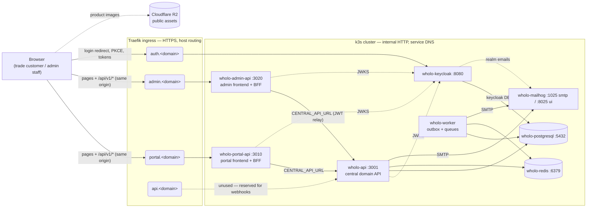

# URL map — public subdomains and intra-cluster calls

Rule of thumb: **browsers only ever see the four public hostnames; pods only
ever talk to each other via internal service DNS.** The two worlds meet only
at Traefik and inside the JWT.



Solid arrows = request traffic; dotted = auxiliary (JWKS fetches, images, mail).

## Public URLs (browser → Traefik ingress, HTTPS)

| Subdomain | Routes to (service) | Who calls it | Purpose |
|---|---|---|---|
| `portal.<domain>` | `wholo-portal-api:3010` | Trade customers' browsers | Portal pages + its BFF endpoints (`/api/v1/*`, same origin) |
| `admin.<domain>` | `wholo-admin-api:3020` | Distributor staff browsers | Admin pages + its BFF endpoints |
| `auth.<domain>` | `wholo-keycloak:8080` | Browsers (redirects from both frontends) | Keycloak login page, PKCE flow, token endpoint |
| `api.<domain>` | `wholo-api:3001` | *Nobody, currently* | **Not exposed on live** (no `ingress.hosts.api`, no DNS record) — BFFs proxy internally. Add the host + A record only if future webhooks (e.g. Xero) need it |

Asset images are served to the browser directly from R2 (`R2_PUBLIC_BASE_URL`),
outside the cluster.

## Intra-cluster calls (pod → pod, plain HTTP, K8s service DNS)

| From | To | Config key | Purpose |
|---|---|---|---|
| portal-api | `http://wholo-api:3001` | `CENTRAL_API_URL` | All domain logic (BFF proxies, ADR-026/044) |
| admin-api | `http://wholo-api:3001` | `CENTRAL_API_URL` | Same, with JWT relay (ADR-046) |
| api, portal-api, admin-api | `http://wholo-keycloak:8080` | `KEYCLOAK_URL` | JWKS fetch to validate browser JWTs |
| api, worker | `wholo-postgresql:5432`, `wholo-redis:6379`, `wholo-mailhog:1025` | `DATABASE_URL`, `REDIS_URL`, `SMTP_HOST` | DB, queues/outbox, mail |
| keycloak | `wholo-postgresql:5432`, `wholo-mailhog:1025` | `KC_DB_URL`, realm `smtpServer` | Its own `keycloak` DB; verification emails |

## Crossover points (public names inside config — the ones that bite)

1. **`auth.<domain>` is baked into the frontend JS bundles at image build
   time** (GitHub var `LIVE_KEYCLOAK_URL` → `NEXT_PUBLIC_KEYCLOAK_URL`).
   Wrong value = rebuild images; Helm cannot fix it.
2. **`auth.<domain>` is Keycloak's identity** (`keycloak.hostname` →
   `KC_HOSTNAME`) and becomes the `iss` claim in every token. BFFs validate
   against the internal JWKS URL — this works because the JWT strategies do
   not check issuer.
3. **`portal./admin.<domain>` are baked into the Keycloak realm on first
   boot** (`keycloak.portalClientUrl`/`adminClientUrl` → client
   `redirectUris`/`webOrigins`). Changing later = Keycloak console, not Helm.
4. **`portal./admin.<domain>` go into emails** (`api.portalUrl`/`adminUrl`)
   — recipient-clickable links; must be public names, never service DNS.

## Login flow (where the subdomains interlock)

```mermaid
sequenceDiagram
    participant B as Browser
    participant P as portal.&lt;domain&gt;<br/>(portal-api pod)
    participant K as auth.&lt;domain&gt;<br/>(keycloak pod)
    participant C as wholo-api:3001<br/>(internal)

    B->>P: GET / (page + JS bundle)
    Note over B: bundle contains NEXT_PUBLIC_KEYCLOAK_URL<br/>= https://auth.&lt;domain&gt; (baked at image build)
    B->>K: redirect: /realms/wholo/...auth?client_id=wholo-portal
    Note over K: redirect_uri must match realm client<br/>redirectUris (baked at realm import)
    K-->>B: login page, then code → tokens (iss = https://auth.&lt;domain&gt;/realms/wholo)
    B->>P: /api/v1/* with Bearer JWT
    P->>K: fetch JWKS via http://wholo-keycloak:8080 (internal, no issuer check)
    P->>C: proxied call, JWT relayed
    C->>K: validates JWT the same way (internal JWKS)
```

## Changing the domain

The values in `values.live.yaml` (the `ingress.hosts.*` + the URL trio:
`api.portalUrl`/`adminUrl`, `keycloak.adminClientUrl`/`portalClientUrl`,
`keycloak.hostname`), plus the `LIVE_KEYCLOAK_URL` repo variable — then
rebuild images and wipe the namespace so the realm re-imports with the new
URLs (import is first-boot-only).
