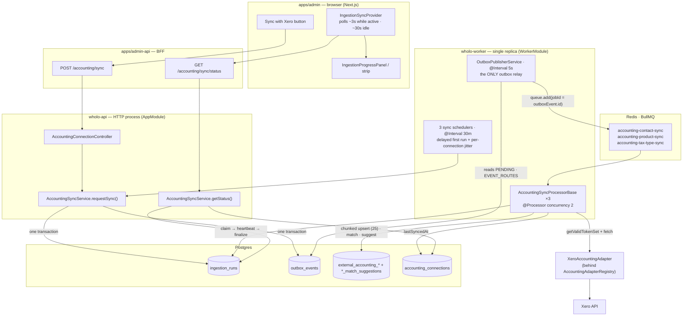

# Ingestion pipeline (outbox → queue → worker)

How an external system's data is pulled into Wholo. Accounting (Xero) is the first
and only implementation today; the run-tracking, outbox, queue and worker layers
are source-agnostic (delivery / stock will reuse them — see ADR-061).

## Component purpose

| Component | Where | Purpose |
|---|---|---|
| **"Sync with Xero" button** | `apps/admin/src/components/integrations/SyncWithProviderButton.tsx` | Manual trigger. One button fires all three resource syncs. Renders a disabled "Syncing…" state while a run is active. |
| **IngestionSyncProvider** | `apps/admin/src/lib/ingestion-sync-context.tsx`, mounted in `(app)/layout.tsx` | Polls the status endpoint on an escalating interval (fast while syncing, slow when idle); holds run state above the page so it survives navigation. Exposes `isSyncing` / `runs` / `hasEverSynced` / `triggerSync` / `reloadSignal`. |
| **IngestionProgressPanel** | `apps/admin/src/components/integrations/IngestionProgressPanel.tsx` | Presentational. `full` variant replaces the tabs/listing (manual + first-ever run); `strip` variant sits above the retained listing (background scheduled run). |
| **admin-api BFF** | `apps/admin-api/src/accounting/` | Auth + distributor-scoping. Rewrites `/accounting/*` → `/distributors/:id/accounting/*` and proxies to wholo-api. No business logic. |
| **AccountingConnectionController** | `apps/api/src/accounting/accounting-connection.controller.ts` | `POST …/sync` (trigger, `MANUAL`), `GET …/sync/status` (poll). Distributor-guarded. |
| **AccountingSyncService** | `apps/api/src/accounting/sync/accounting-sync.service.ts` | The one accounting↔ingestion seam. `requestSync`: in one `$transaction`, upsert an `IngestionRun` (QUEUED) **and** write an `Accounting*SyncRequested` outbox event (payload `{ runId }`) per resource type. `getStatus`: the ≤3 run rows + `lastSucceededAt`. |
| **Sync schedulers ×3** | `apps/api/src/accounting/accounting-*-sync.scheduler.ts` (worker-only) | Automatic trigger. `@Interval` 30 min, one per resource type; delayed first run (~90s) + per-connection jitter so a deploy doesn't enqueue every org at once. Write the *same* run row + outbox event as the manual path (`trigger = SCHEDULED`). |
| **IngestionRunService** | `apps/api/src/ingestion/ingestion-run.service.ts` | Source-agnostic run lifecycle: `requestRun` (tx-bound upsert/dedupe/escalate), `claim` (conditional `QUEUED → PROCESSING`, stale reclaim after 5 min), `setTotal` / `heartbeat` / `finalizeSuccess` / `finalizeFailure`. No accounting imports. |
| **outbox_events** | Postgres | Durable "please do this" record, written in the same tx as the state change (ADR-034). Decouples the trigger from queue availability. |
| **ingestion_runs** | Postgres | One row per `(sourceType, sourceRef, resourceType)`, reused each run. Status + progress counts + timestamps. The single source of truth for "is a sync running / has one ever completed" (ADR-061). |
| **OutboxPublisherService** | `apps/api/src/outbox/` (worker-only) | The one relay. Every 5s, reads `PENDING` outbox rows, fans out per `EVENT_ROUTES`, `queue.add` with `jobId = outboxEvent.id` (idempotent), marks `PUBLISHED`. **Must be single-instance** — two relays would double-enqueue. |
| **BullMQ queues** | Redis | One work queue per concern (ADR-047). Jobs locked to one worker; retried `attempts: 3` with 30s exponential backoff. |
| **AccountingSyncProcessorBase ×3** | `apps/api/src/accounting-*-sync/` (worker-only) | The pull pipeline. `claim` the run → fetch all records via the adapter → chunked (25-wide) upsert into the cache table, heartbeating progress → match against unmapped Wholo entities → write match suggestions (never auto-link) → `finalize` the run + set `connection.lastSyncedAt`. `@Processor` concurrency 2. |
| **XeroAccountingAdapter** | `apps/api/src/accounting/adapters/` | The only code that imports `xero-node`. Maps Xero models → provider-neutral DTOs, handles Xero pagination + token quirks. Selected via `AccountingAdapterRegistry` — a second provider is one more adapter class. |
| **external_accounting_* / *_match_suggestions** | Postgres | Local cache of the external records + the matcher's suggestions for the distributor to review/confirm. Mappings are only ever written by explicit user action. |
| **wholo-worker** | k8s deployment (same image as wholo-api, `node dist/worker.js`) | Runs the relay + schedulers + all processors. Pinned to **1 replica** (single relay + single scheduler). To scale sync throughput later: split the processors into their own multi-replica deployment (ADR-047) — the conditional-update `claim()` makes that safe. |
